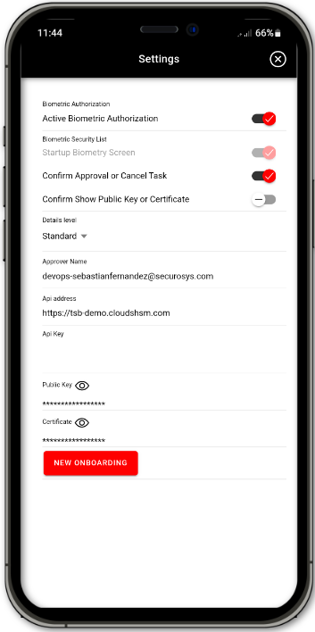
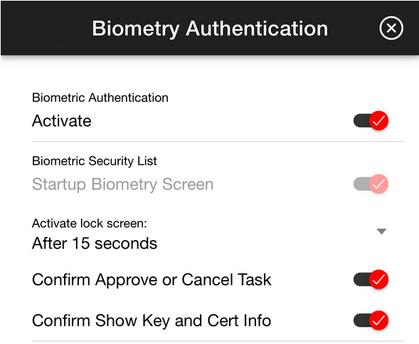
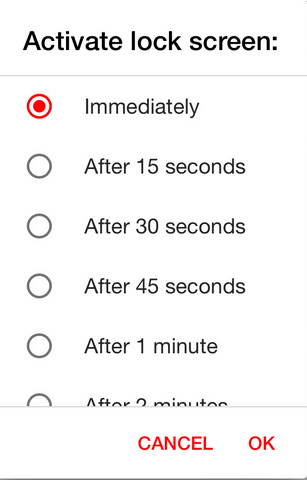
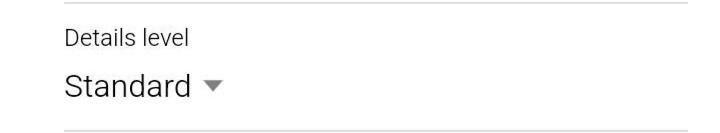
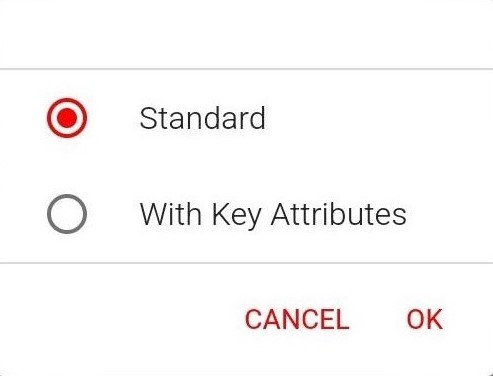
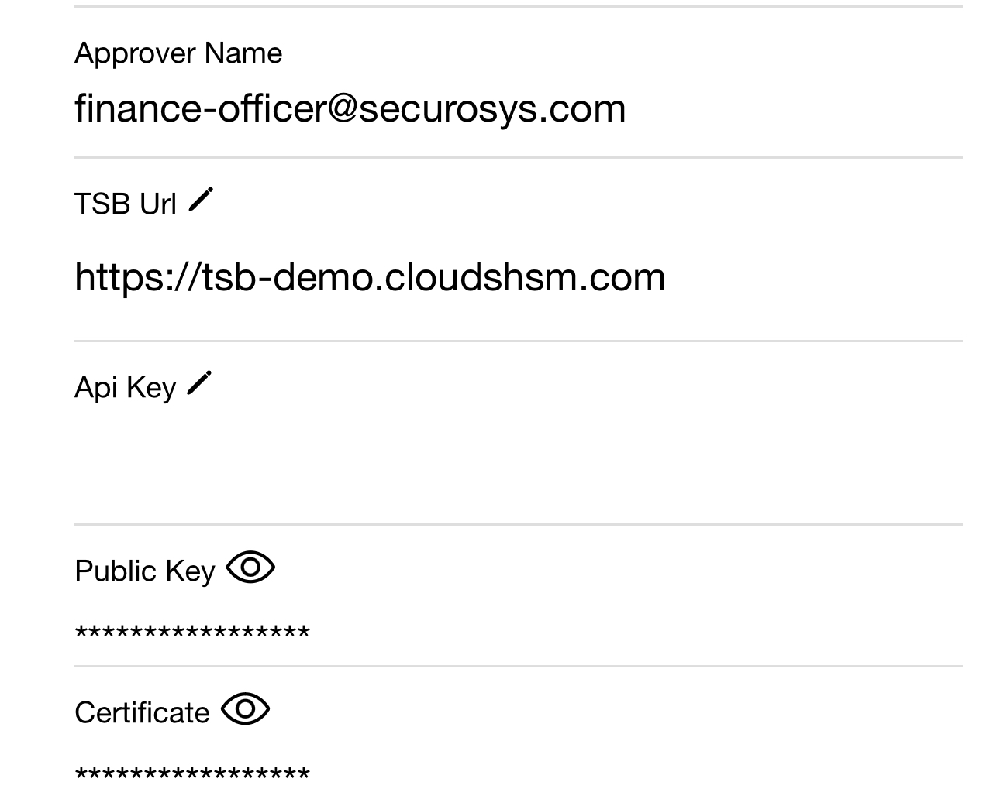

import Tabs from '@theme/Tabs';
import TabItem from '@theme/TabItem';

# Application Settings 

After a successful registration, clicking the  **button** in the top right corner of the main application menu will lead the user to the **Settings** menu.

Within the **Settings** menu, it's possible to:
- Configure [Details Level](#details-level-setting) information,
- Obtain the currently registered [Approver Information](#approver-information) such as the Approver Name, TSB URL and more,
- Start a [New Registration](#new-registration) procedure. 

Clicking on the  **button** in the top right corner of the main application menu will open the [Biometry Settings](#biometry-settings).

Each configurable setting is described in more detail in the chapters below.

       

## Biometry Settings

Biometric Authorization can be activated to be required at the start of the application. Only possible if biometric authorization is already in use for the device (takes the device biometrics). 

To enable, click the button next to the **Active Biometric Authorization**.

After enabling the biometric authorization it is possible to more granularly define which operations require the biometric authorization.

  

Biometric Security Details

|Biometric Security Options| Description |
|---|---|
|**Startup Biometry Screen**| With active biometric authorization set to enabled it is required to authenticate at the startup of the application. This operation cannot be disabled without disabling Active Biometric Authorization.|
|**Activate Lock Screen**| Clicking on the setting will open a selection box with multiple choices. Please choose the time after which you would like the application to require login with the biometry authentication again.  |
|**Confirm Approval or Denial of a Task**| When enabled, biometric authorization is required when approving or cancling either an operational or key management approval task.|
|**Confirm Show Public Key or Certificate**| When enabled, biometric authorization is required when clicking on the  **button** to show the Public Key or Certificate of the registered approver.|

## Details Level Setting

This setting defines the level of which the **DETAILS Tab** shows when opening an approval task menu. For more information on the **Details Tab** , please see [Tutorials - 1. Authorization App](/AuthorizationApp/Tutorials/AuthorizationApp/operational-tasks#details-tab).

By clicking on the **Details Level Setting** a window will open to specify a setting for the details level. 
- To configure a details level setting simply click on the desired setting and click **OK** to confirm. This will close the window and begin a task fetching process. 
- Clicking anywhere outside the details level window or on the **Cancel** button will cancel the setting configuration.

  

Details Level Description

|Details Level|Description|
|---|---|
|**Standard** | This is the default option. It will only show the details such as the payload, payloadType, signKeyName, signatureAlgorithm and the signatureType.|
|**With Key Attributes** | With this setting is enabled a  **button** will be added to the key details in the **DETAILS Tab** of the approval task menu. Clicking the  **button** will show the Key Attributes in `xml` format. All other shown details about the task will remain the same as with **Standard** level.   **NOTE**: This setting can slow down the task fetching process.|

 

## Approver Information

Within the Settings menu the registered Approver information can be found. 
              

Approver Information Description

|Approver Information|Description|
|---|---|
|**Approver Name**| Shows the name of the registered Approver. Can only be changed by going through the **New Registration** procedure..|
|**API Address**| URL link to the [Transaction Security Broker](/tsb/Tutorials/TransactionSecurityBroker/transaction-security-broker) the application is connecting to. Can only be changed by going through the **New Registration** procedure.|
|**API KEY** | **Optional** API Key required for access to a specific Approval REST API endpoint. See [Transaction Security Broker](/tsb/Tutorials/TransactionSecurityBroker/transaction-security-broker)|
|**Public Key**| Shows the **Public Key** of the registered approver. Tied to the Approver and is only changed when registering a new Approver. See [New Registration](#new-registration) for more information.   1. To show the Public key press the  **button**.   2. If biometric authorization is required to show the public key, authorize yourself.   3. The public key is shown.   4. Optionally you can copy the public key to clipboard by pressing the button **COPY TO CLIPBOARD**.|
|**Certificate**| Shows the **Certificate** of the registered approver. Tied to the Approver and is only changed when registering a new Approver. See [New Registration](#new-registration) for more information. 1. To show the certificate press the  **button**.   2. If biometric authorization is required to show the certificate, authorize yourself.   3. The certificate is shown.   4. Optionally you can copy the certificate to clipboard by pressing the button below **COPY TO CLIPBOARD**|

## New Registration

In cases when certain settings have to be changed or when a new Approver must be registered the **New Registration** procedure can be used. 

:::warning
Pressing the button will immediately lead you to the new onboarding/registration procedure. It is possible to cancel the procedure by exiting and closing the application or by clicking the "back button" on your android device.
:::

1. To Register a new Approver click on the   **Button**.
2. This will lead the user to the same registration screen required at the application setup.
    - When Registering a new Approver visit [Register Your Approver](/AuthorizationApp/Installation/auth-user-register) for an in-depth guide.
    - When going through with the new Registration with the same Approver as before, please see chapter [Tutorial - Restore Approver](/AuthorizationApp/Tutorials/ApproverManagment/Miscellaneous/restore_approver).