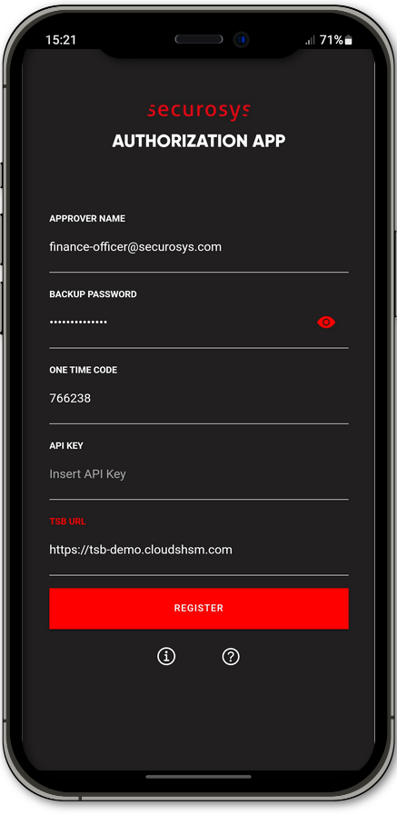

import Tabs from '@theme/Tabs';
import TabItem from '@theme/TabItem';

# Register your Approver

:::tip Prerequisites
Before registering the Approver, he must be created by the Approver Manager using the REST-API: [Create Approver](/tsb/Tutorials/TransactionSecurityBroker/PrimusAuthorizationApp/approver-mangement-api#create-approver-key). 
:::



After a successful [Installation](./installation.md) of the _Securosys Authorization App_, when opening the App for the first time, the **Register** screen will open.

It is not possible to use the features provided by the _Securosys Authorization App_ before going through the registration procedure. This procedure uses your Approver credentials to establish a secure connection between your device and the [Transaction Security Broker (TSB)](/tsb/overview) which is integrated with the Primus HSM.

Follow the steps below to complete the registration procedure:

1. Insert your **Approver credentials** in the input fields. These credentials are given to you by your Approver Manager.
    - For more information, check the examples in the **Input Fields Description** below.
3. When all credentials have been input correctly, press the ```Register``` button.

After a successful registration, it is possible to use the _Securosys Authorization App_. 


<br/><br/><br/><br/><br/><br/><br/><br/><br/>

<details>
<summary>Input Fields Description</summary>
|Input Field|Description|Example Input|
|---|---|---|
|Approver Name| Insert your autorization user name, required.|finance-officer@securosys.com|
|Backup Password| The password the approver was created with, required. <br/>Make sure to remember the `backup password` as it can be reused when registering on a new phone.| BckpPass123!|
|One Time Code| One time code required for the registration process. If the code was already used in a previous registration, please contact your HSM Administrator to issue a new one. This field is required for the registration.|123456|
|API Key| **Optional** API-Key required for access to a specific REST API endpoint. Can be left blank if none provided. | ~ |
|TSB URL| Provide the full URL link to the Transaction Security Broker. Do not omit the `http` or `https://` when inserting the URL. This field is required for the registration.| https://tsb-demo.cloudshsm.com|
</details>


For more information about how to configure the settings of the app, please see chapter [Settings](./Settings.md). 

For more information about the _Securosys Authorization App_ features and their step by step guide, please see chapter [Tutorial](/AuthorizationApp/Tutorials/AuthorizationApp/operational-tasks).

