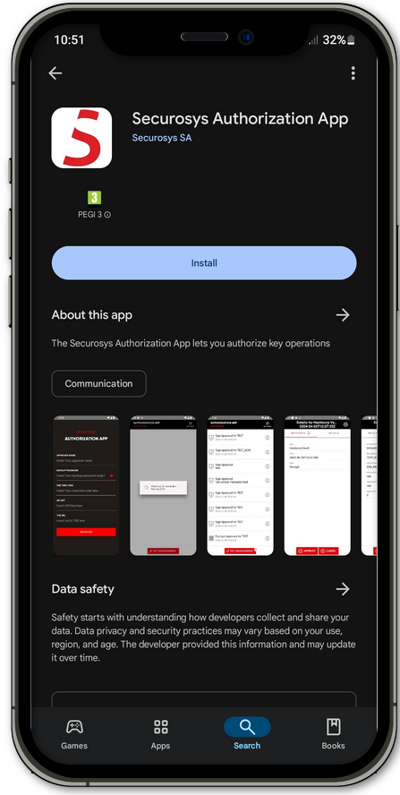
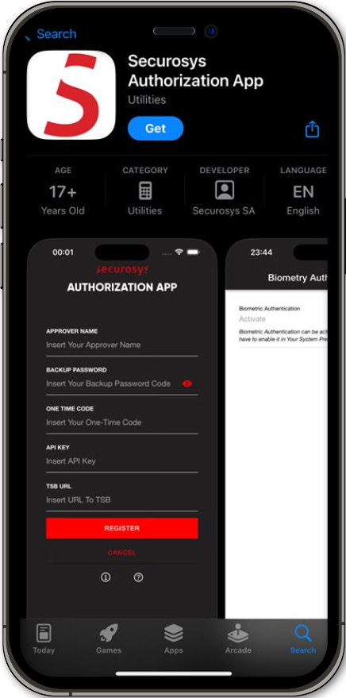

import Tabs from '@theme/Tabs';
import TabItem from '@theme/TabItem';

# Installing Securosys Authorization App

In this section, we will outline a comprehensive guide outlining the steps necessary to download, install the [Securosys Authorization App](https://play.google.com/store/apps/details?id=com.securosys.authorization.app) on your mobile device.

<Tabs groupId="purchase-channel">
<TabItem value="Android" label={<><Icon icon="fa-brands fa-android" size="lg" />&nbsp;&nbsp;Android</>} default>

The installation process is automatically initiated with the download of the [Securosys Authorization App from the Google Play Store](https://play.google.com/store/apps/details?id=com.securosys.authorization.app). 

Please follow the steps below to download & install the Securosys Authorization App:
1. Open the Google Play Store.
2. Search for _Securosys Authorization App_ and click on the listed application. Optionally follow the link to download the [Securosys Authorization App](https://play.google.com/store/apps/details?id=com.securosys.authorization.app&pli=1). 
3. Click **Install**. This will start the process of downloading and installing the Securosys Authorization App.
4. After a successful installation, the _Securosys Authorization App_ should be seen on your mobile devices main menu.

To start using the _Securosys Authorization App_, please follow the chapter [Register your Approver](./auth-user-register).

      
</TabItem>
<TabItem value="iOS" label={<><Icon icon="fa-brands fa-apple" size="lg" />&nbsp;&nbsp;iOS</>}>

The installation process is automatically initiated with the download of the [Securosys Authorization App from the Apple App Store](https://apps.apple.com/si/app/securosys-authorization-app/id6736693044). 

Please follow the steps below to download & install the Securosys Authorization App:
1. Open the Apple App Store.
2. Search for _Securosys Authorization App_ and click on the listed application. Optionally follow the link to download the [Securosys Authorization App](https://play.google.com/store/apps/details?id=com.securosys.authorization.app&pli=1).
3. Click **GET**. This will start the process of downloading and installing the Securosys Authorization App.
3. After a successful installation, the _Securosys Authorization App_ should be seen on your mobile devices main menu.

To start using the _Securosys Authorization App_, please follow the chapter [Register your Approver](./auth-user-register).

      

</TabItem>
</Tabs>

