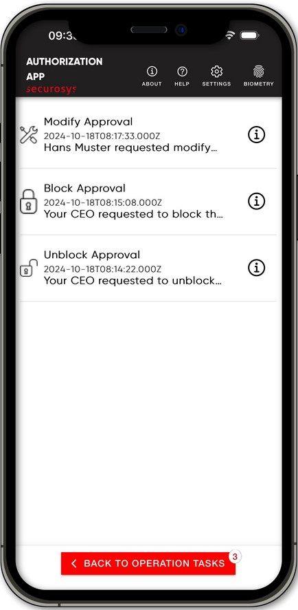
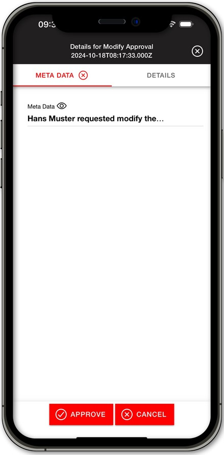
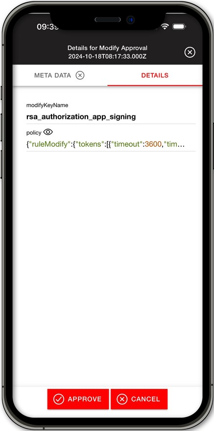

import Tabs from '@theme/Tabs';
import TabItem from '@theme/TabItem';

# Key Management Tasks

After a successful registration, the **Key Management Tasks List** is shown as the main page. To navigate to the Key Management Task List, click on the **Key Management** button located on the bottom of the _Securosys Authorization App_. 

When a key management approval task is pending in the Key Management Task List, the  **button** will show the amount of pending tasks for authorization.

:::info Approver Required
The key management tasks are performed by an [Approver](/AuthorizationApp/Concepts/role_description) with key management policy enabled. 
:::

## Key Management Task List
The Key Management Task List shows a list of pending key management approval tasks to be authorized by the Approver. These tasks include:
- **Block** Approval (Fraudulent transaction prevention, revocation, access control key block)
- **Unblock** Approval (restoring suspended operations, unblocking data access key)
- **Modify** Approval (Key-Policy modification)

When an approval task is fetched, it is shown in the key management task list. 

Click on the a **task** to proceed to the [Key Management Task Menu](#key-management-task-menu).

           

## Key Management Task Menu

When opening the desired key management task the **META DATA** tab will open at first. On the **task menu** there are two different tabs, **META DATA** and **DETAILS**. You can leave the task menu by clicking the  **button** in the top right.

### Metadata Tab
The **META DATA** tab shows the metadata which was added to the key management task. The metadata can be configured to include many things. In our example this is the application name and the cores. If no metadata is provided with the task, the tab will be grayed out.

Pressing on the **META DATA** tab opens a window if a signature was provided with it. If no signature provided a window stating **No signature provided** will open. Press anywhere to close the window.

               

### Details Tab
Clicking on the **DETAILS** tab will show the details provided with the operation task. Depending on the detail level, details about the operation task are shown. By default the Standard setting is chosen and will show the details such as `unblockKeyName` and more. 

If the `With Key Attributes` detail level setting is enabled, the key in the key management task details, will have a  **button** present. Clicking the  **button** will open the Key Attributes of the key used for the task Clicking in `xml` format. Please see Key Attributes for more information.

The detail level can be configured in the settings menu of the Securosys Authorization App.

               

## Approve or Cancel

After reviewing the Metadata and the Details of the key management task the Approver can choose to either **Approve** or **Cancel** the key management task. To do so follow the next steps:

1. Click on the  **button** to approve the operational task or on the  **button** to cancel it. 
2. After clicking on either button a confirmation window will open to confirm with the Approver of the choice. 

3. Select **Yes** to confirm or **No** to cancel the approval or denial of the key management task.

4. A successful approval or denial the App will prompt the Approver with a notification. 

## Refresh or Fetch
Tasks are fetched automatically in the background, even if the app is not open. To manually refresh the operational task list, drag down the blank space in the middle of the **key management task list**. This will prompt a loading process which checks for all approval tasks. 

