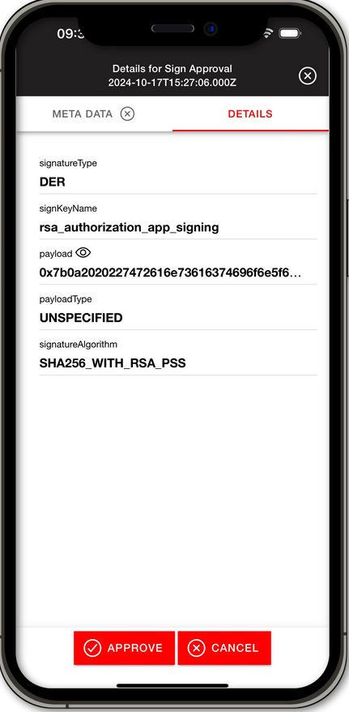

import Tabs from '@theme/Tabs';
import TabItem from '@theme/TabItem';

# Operational Tasks

After a successful registration, the Operational Tasks List is shown as the main page. In this menu, the approver will have a list of operational tasks to approve or cancel.

## Operational Task List

The Operational Task List shows a list of tasks in queue to be approved or denied by the approver user. Tasks are fetched every 15 minutes and notified in the standard notification bar. When an approval task is fetched, it appears in the operational task list which includes:
- Sign Approval
- Encrypt Approval
- Decrypt Approval
- Wrap Approval
- Unwrap Approval
- Generate Self-Signed Certificate Approval
- Sign a Certificate Request

Click on the a **task** to proceed to the **[Operational Task](#operational-task-menu)** menu.

        

## Operational Task Menu 

When opening the desired operational task, the **META DATA** tab will open at first. On the **task menu**, there are two different tabs: **META DATA** and **DETAILS**. You can leave the task menu by clicking the  **button** in the top right corner.

### Metadata Tab
The **META DATA** tab shows the metadata - the description of the authorization task - which was added to the task.  The metadata is specified by the [Business Application](/AuthorizationApp/Concepts/role_description), specifiying the meta-data in `.json` format.  If no metadata is provided with the task, the tab will be grayed out.

          

### Details Tab

Clicking on the **DETAILS** tab will show the details provided with the operation task. Depending on the detail level, details about the operation task are shown. By default the [standard setting](/AuthorizationApp/Installation/Settings#details-level-setting) is chosen and will show the `payload`, `payloadType`, `signKeyName`, `signatureAlgorithm`, `signatureType` and more operational task details. 

With the `With Key Attributes` [Details Level Setting](/AuthorizationApp/Installation/Settings#details-level-setting) enabled, the key in the operational task details, will have a  **button** present. Clicking the  **button** will open the Key Attributes of the key used for the task Clicking in `xml` format. 

You can leave the Key Attributes details by clicking the  in the top right.

The detail level can be configured in the settings menu of the Securosys Authorization App. For more information visit the [Settings - Details Level Setting](/AuthorizationApp/Installation/Settings#details-level-setting) section. 

          

## Approve or Cancel

After reviewing the Metadata and the Details of the operational task, the Approver can choose to either **Approve** or **Cancel** the operational task. To do so, follow the next steps:

1. Click on the  **button** to approve the operational task or on the  **button** to cancel it. 
2. After clicking on either button, a confirmation window will open to confirm with the Approver of the choice. 

3. Select **Yes** to confirm or **No** to cancel the approval or denial of the operational task.

4. A successful approval or denial the App will prompt the Approver with a notification. 

## Refresh or Fetch
Tasks are automatically fetched in the background every 15 minutes, even if the app is not open.

To manually refresh the operational task list, drag down the blank space in the middle of the **operational task list**. This will prompt a loading process which checks for all approval tasks. 

