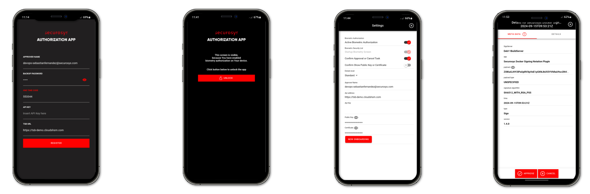
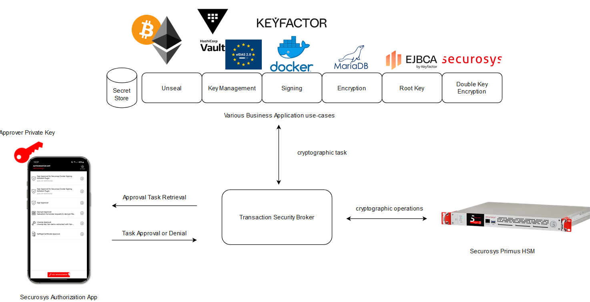

import Tabs from '@theme/Tabs';
import TabItem from '@theme/TabItem';

# What is Securosys Authorization App?

The Securosys Authorization App is a lightweight mobile application designed for scenarios where stakeholders need to authorize cryptographic operations, such as signing, decryption, and unsealing, and key modifications.

The Authorization App works with Securosys **Hardware Security Modules (HSMs)**, both [CloudHSM](/cloudhsm/overview/) and on-premises Primus HSM. With its quick and simple deployment process and the available integrations, the app can be rolled out to approvers within minutes, allowing for the smooth implementation of **multi-authorization schemes**.

The application leverages one of the unique features of Securosys Primus HSMs - [Smart Key Attribute](https://www.securosys.com/securosys-smart-key-attributes-enabling-true-multi-authorization-rules-and-more-for-private-key-usage)(SKA) keys - which allows for highly customizable policies for authorizing operations and transactions, as well as manage key blocking/unblocking and policy adjustments with ease. Policies can be set to require single-user, or multi-quorum approvals before a task request can be approved, implement security protocols that activate based on time-lock settings, and much more. Smart Key Attributes leverage the **N out of M** quorum concept, ensuring that operations are approved only after the required number of stakeholders provide their authorization.

The Securosys Authorization App supports a broad range of use cases and enables true Multi-Authorization within your Application landscape. These use cases include but are not limited to authorization of blockchain transactions, database decryption, code signing, PKI root key operations or enforcement of sole control for signature services in accordance with eIDAS (the European standard for electronic identification, authentication, and trust services), and much more. 
        

The Authorization App integrates with the Securosys [Transaction Security Broker (TSB)](/tsb/overview), which facilitates communication through a REST API, coordinates approval collection, and manages internal states. Additionally, the TSB links the Authorization App to the Securosys Primus HSM - either on-premises or in [CloudHSM](https://docs-dev.securosys.com/cloudhsm/overview) - where keys with Smart-Key-Attribute (SKA) enablement are securely managed, and authorization policies are enforced.

## Multi-Authorization Setup

The multi-authorization workflow relies on public/private key pairs and certificates issued for each Approver (users of the Authorization App). These approver certificates are then linked to key policies within the SKA (Smart-Key-Attribute) scheme during key creation.

To enable the use of the Authorization App, the following steps are required:

1. **Creation of Approver Key Pairs and Certificates**: The _Approver Manager_ generates private/public key pairs and certificates for each Approver on the HSM through [REST API](/tsb/Tutorials/TransactionSecurityBroker/PrimusAuthorizationApp/approver-mangement-api#create-approver-key) calls.
2. **Initiate the Authorization App**: To set up the Authorization App, the approver's private key is loaded into the app. The _Approver Manager_ provides a one-time onboarding code (OTC) and additional configuration details to complete the setup process.
3. **Policy based Key Generation**: The business application generates an SKA-enabled key on the HSM, embedding the approver certificates into the key policy to meet the specified quorum requirements.
4. **Approve Cryptographic requests**: The business application starts a transaction using the SKA key. Before the transaction proceeds, the SKA policy is checked, and approvers receive a prompt in the Authorization App to approve or reject it. The transaction is executed on the HSM only if all approval conditions set by the SKA policy are met.

This setup meets the needs of enterprises by offering centralized management of Approvers, seamless certificate issuance, an efficient onboarding process, and robust capabilities for backing up and restoring approver certificates, ensuring security, scalability, and operational efficiency for organizations.

## Capabilities

The Authorization App enables users to approve or reject SKA-key tasks at both the key usage level for cryptographic operations and key management activities

- Authorization of cryptographic operation **key usage** tasks such as:
    - **Sign** (Blockchain transaction signing, Document Signing, Certificate Signing, ...)
    - **Decrypt** (Unseal, Database decryption, Docker Decryption)
    - **Unwrap Key** (Secure import, iot device key unwrapping)

- Autorization of **key management** tasks such as:
    - **Block key** (Fraudulent transaction prevention, revocation, access control key block) 
    - **Unblock key** (restoring suspended operations, unblocking data access key)
    - **Modify Key** (Key-Policy modification)

The SKA feature inherently allows for the definition of individual policies and approver quorums, tailored to key usage, blocking, unblocking, and policy modifications. See [Smart Key Attributes](https://docs.securosys.ch/tsb/Tutorials/TransactionSecurityBroker/smart-key-attributes) for more granular information.

## Target Audience

This document is intended for the users of the Securosys Authorization App as well as Administrators familiar with Securosys Hardware Security Modules and Transaction Security Broker. 

## Support Contact

If you encounter a problem while installing or configuring the Securosys Authorization App, please ensure that you have read the
referenced documentation. If you cannot resolve the issue, please
contact Securosys Customer Support. 

For specific inquiries and inquiries on customizing the Securosys Authorization App to fit your business needs, please feel free to open a ticket on our [Securosys Support Portal](https://support.securosys.com).

## What's Next

For a smooth start with the Securosys Authorization App:
- Consult the [Quickstart](/AuthorizationApp/quickstart) chapter to setup up the Authorization App.
- For more granularity and step by step guide, visit the tutorial section:
    - [1. Authorization App](/AuthorizationApp/Tutorials/AuthorizationApp/operational-tasks)
    - [2. Approver Management](/AuthorizationApp/Tutorials/ApproverManagment/create_approver)
    - [3. Create and Approve Requests](/AuthorizationApp/Tutorials/create-and-approve-requests)
- See the various [Use Cases](/AuthorizationApp/Use-Cases/application_integration#docker-security) for the Securosys Authorization App.

