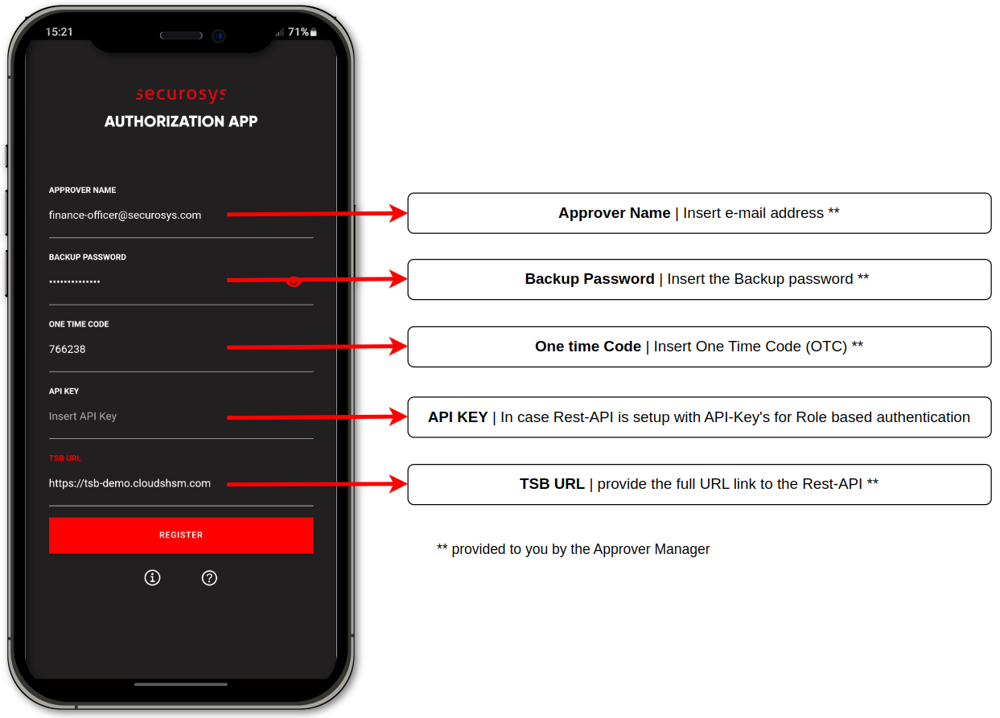

import Tabs from '@theme/Tabs';
import TabItem from '@theme/TabItem';

# Get Started with the Authorization App

The quickstart section provides a comprehensive guide outlining the steps necessary to Download, Install and configure the Securosys Authorization App on your device.

## Prerequisites

Before continuing with the Securosys Authorization App on your device, ensure that your HSM infrastructure is prepared beforehand. Depending on your infrastructure make sure to adhere to the following prerequisites, based on your environment: **HSM on-premises** or **CloudHSM**
<Tabs groupId="purchase-channel">
<TabItem value="cloud" label="Cloud">    
- **CloudHSM - TSBaaS:** 
  - Rest-API access with `TSB_ENGINE` license installed (available in [CloudHSM ECO, SBX and PLATINUM](/cloudhsm/Packages/overview#service-package-comparison) services)
<details>
<summary>Check `TSB_ENGINE` License Information</summary>

If your subscription supports the Securosys Authorization App, the following license flags should appear:

**GET** /v1/licenseInfo
```js {5,6}	
{
  "clientFlags": [    
    ...
    "KEY_AUTH",
    "REST_API",
    "TSB_ENGINE",    
    ...
  ]
}
```
</details>
</TabItem>
<TabItem value="on-premises" label="On-premises" default>
- **Primus HSM:** [Set up and configured](/tsb/Installation/hsm-device-setup-tsb) successfully, including:
  - Device setup completed with the initial wizard
  - `Root Key Store` installed and configured
  - Enabled security features: `Client API access`, `Key Auth`, `JCE`, `Rest-API`, `TSB Workflow Engine`
  - Created at least one user
- **Transaction Security Broker (REST API):** Successfully [deployed and configured](/tsb/Quickstart/docker-quickstart) the TSB Docker container with the `TSB_ENGINE` license
</TabItem>
<TabItem value="testing" label="Testing Environment">
For testing purposes, you can create a 90-day free trial partition on the Securosys Cloud platform by visiting [https://cloud.securosys.com/](https://cloud.securosys.com/). <br/>
This trial partition provides a secure, isolated environment where you can explore and test various functionalities of Securosys products without committing to a paid license. The cloud-based environment replicates the full feature set available in production, allowing you to evaluate API integration capabilities. This trial setup is ideal for development, experimentation, or simply gaining hands-on experience with Securosys services.
</TabItem>
</Tabs>

For more granularity please see chapter [Prerequisites](/AuthorizationApp/Concepts/Prerequisites).

## Downloading and Installing Securosys Authorization App

:::info Approver Required
The registration procedure is performed by the role of an [Approver](/AuthorizationApp/Concepts/role_description). <br/>
  - The user which has to download the Securosys Authorization App on the mobile phone.
:::

To start using the Securosys Authorization App, [Download](/AuthorizationApp/downloads) and install the latest version on your smartphone.
For more granular information and detailed step by step guide, please follow the chapter [Installation](/AuthorizationApp/Installation/installation.md).

## Create Approver

:::info Approver Manager Required
The Approver creation procedure is performed by the role of an [Approver Manager](/AuthorizationApp/Concepts/role_description).<br/>
  - Personnel responsible for creating and managing the entire pool of Approver's.
:::

An Approver must first be created before the approver can use the Securosys Authorization App and authorize tasks.

Refer to the REST API curl endpoint below to create an Approver.

<details>
<summary>Example Create Approver</summary>

**POST**: [/v1/approverManagement/create](https://tsb-demo.cloudshsm.com/swagger-ui/index.html?configUrl=/v3/api-docs/swagger-config#/Approver%20Management/create)

<Tabs groupId="device-setup">
  <TabItem value="swagger" label="Swagger">
    ```js
{
  "approverName": "finance-officer@securosys.com",
  "algorithm": "RSA",
  "keySize": 2048,
  "backupPassword": "6se1Qbsi3bJshe",
  "validity": 3650
}
```

**Response:** Response is a `oneTimeCode` to be sent to the **approver** to fetch the approver-key
```js
{
  "oneTimeCode": "410447"
}
```
</TabItem>
<TabItem value="curl" label="CURL">
```js
curl -X PUT  -H "Content-Type: application/json" \
 https://tsb-demo.cloudshsm.com/v1/approverManagement/create -d \
'{
  "approverName": "finance-officer@securosys.com",
  "algorithm": "RSA",
  "keySize": 2048,
  "backupPassword": "6se1Qbsi3bJshe",
  "validity": 3650
}'
```


**Response:** Response is a `oneTimeCode` to be sent to the **approver** to fetch the approver-key
```js
{
  "oneTimeCode": "410447"
}
```

:::note API-KEY
In case of using API-KEY's add the following header to the CURL-Command: `-H "X-API-KEY: tsb-x-token_07..."`
:::
    </TabItem>
</Tabs>
</details>

Next, please provide the following information to the user with the role **Approver**:

- **Approver Name** (from above request)
- **Backup Password** (from above request)
- **One Time Code** (from above _response_)
- **API Key** (optional)
- **TSB URL** (the rest-api url)

With these information the Approver can now Register their App.

:::tip Onbarding-Status

You can verify the onboarding status of the Approver, see chapter [Tutorial - Approver Management - Verify Onboarding Status](/AuthorizationApp/Tutorials/ApproverManagment/verify_onboarding_status) for more information.

:::

For more granularity, please see chapter [Tutorial - Approver Management - Create Approver](/AuthorizationApp/Tutorials/ApproverManagment/create_approver).

## Register Approver

:::info Approver Required
The registration procedure is performed by the role of an [Approver](/AuthorizationApp/Concepts/role_description).
:::

Register as Approver on the Securosys Authorization App by inserting the required credentials provided by your Approver Manager from the previous chapter [Create Approver](#create-approver).



For more granular information about the registration credentials and detailed step by step guide to the registration process, please follow the chapter [Installation](/AuthorizationApp/Installation/auth-user-register).

## Create Policy based Key with multi-authorization

:::info Approver Manager Required
The key creation procedure is performed by the role of an [Approver Manager](/AuthorizationApp/Concepts/role_description).
:::

By assigning SKA policies to keys, Approvers are granted the ability to authorize approval tasks.

For more detailed information about SKA keys please see:
- [How to create a policy-based Key](/tsb/Tutorials/TransactionSecurityBroker/samples/step-by-step/create-policy-based-key) and set up the onboarded Approvers' `certificate`.
- [How to create a sign request](/tsb/Tutorials/TransactionSecurityBroker/samples/multi-authorization-samples) which has to be approved with the Securosys Authorization App.

## Using Securosys Authorization App

The Securosys Authorization App allows for authorization of operational and key management tasks where the authorization of an Approver is required as part of a Smart Key Attribute key access policy. 

For more granular information and detailed step by step guide, please follow the [Tutorial](/AuthorizationApp/Tutorials/AuthorizationApp/operational-tasks) chapter. There you will find usecases such as:

- Obtaining the Public Key or Certificate
- Approving or Cancling Operation Tasks
- Approving or Cancling Key Management Tasks
- New Onboarding
- Configuring Active Biometric Authorization

There are various usecases for the Securosys Authorization App. See [Usecases](/AuthorizationApp/Use-Cases/application_integration) for more use case examples and their documentation.