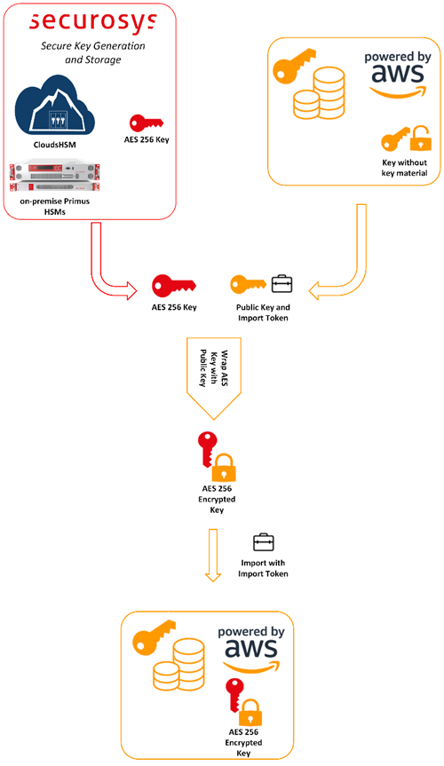

import Tabs from '@theme/Tabs';
import TabItem from '@theme/TabItem';

# Bring Your Own Key (BYOK) for AWS

AWS Key Management Service (AWS KMS) is a managed service that makes it easy for you to create and control the cryptographic keys that are used to protect your data across your applications and more than 100 AWS services. Use AWS KMS to encrypt data across your AWS workloads, digitally sign data, encrypt within your applications using AWS Encryption SDK, and generate and verify message authentication codes (MACs). AWS KMS uses hardware security modules (HSM) to protect and validate your AWS KMS keys.

Securosys CloudHSM is a Hardware Security Module (HSM) available as cloud service, without having to worry about time consuming things like evaluation, setup, operation, redundancy, and maintenance of the HSM infrastructure, and is scalable according to your needs. The redundant cluster architecture, providing different redundant regions up to redundant world-wide cluster, integrates perfectly to bring your own key to AWS key management service.

AWS KMS bring your own key (BYOK) allows more control over the creation, lifecycle, security and durability of your keys.
This document describes how to easily integrate Securosys CloudHSM (HSM as a Service) or on-premises Primus HSM cluster with AWS KMS BYOK, enabling the advantages of secure key generation and storage on the HSM, and to comply with regulatory requirements.

## Target Audience

This document is intended for Securosys Primus HSM or CloudHSM
administrators and IT professionals. For Configuration and administration of AWS services it is required to be already familiar with AWS account and AWS KMS administration.

For on-premises HSM deployed operation administrative skills are
required for Securosys Primus HSMs.

## Support Contact

If you encounter a problem while installing/configuring the provider or
integrating the HSM, make sure that you have read the
referenced documentation. If you cannot resolve the issue, please
contact Securosys Customer Support. For specific requests regarding
Securosys AWS Bring your own key, the Securosys
Support Portal is reachable under https://support.securosys.com.

## What's Next - Configure with Primus Tools

For a smooth start with the AWS Bring Your Own Key:
- Consult the [Quickstart](/aws-byok/Quickstart.md) page for a comprehensive task listing.
- For detailed instructions, read and follow the [Installation](/aws-byok/Installation/Prerequisites) guide.
- Initiate the usage by reading and following the [Tutorial](/aws-byok/Tutorials/Create-KMS-key) section.