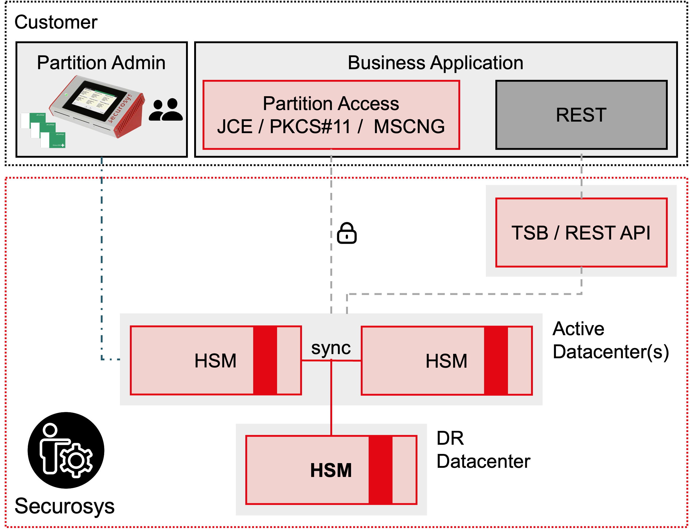
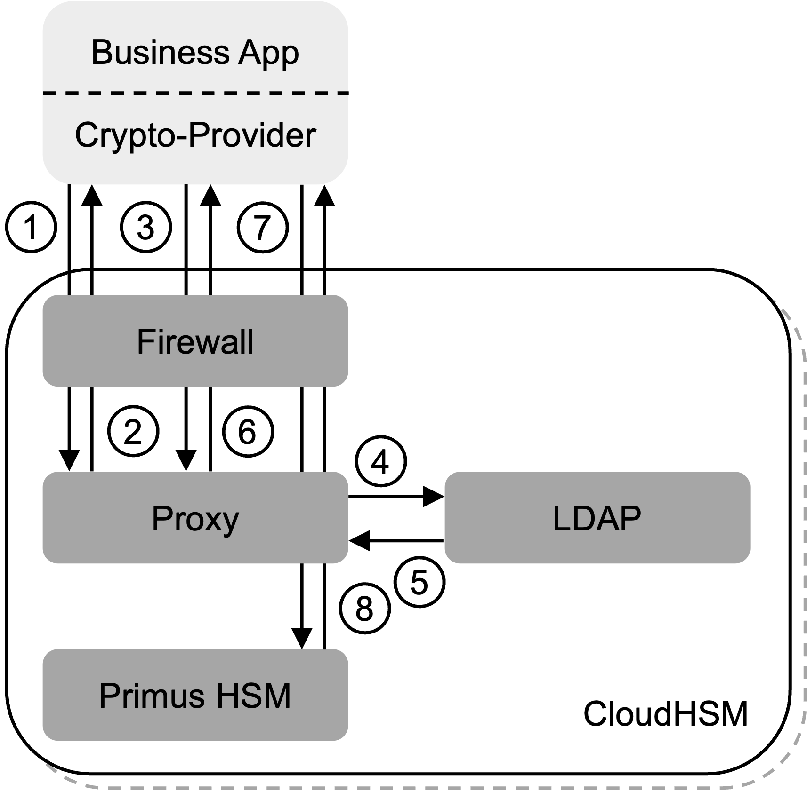

# Client Access

CloudHSM provides secure and reliable access to your cryptographic resources, enabling subscribers to leverage the power of hardware-based security for their critical applications. Whether subscribers choose a [Primus API Provider](client_access#primus-api-providers) for direct connectivity or the [RESTful API](client_access#transaction-security-broker-as-a-service-tsbaas-and-rest-as-a-service-restaas) option for remote access, CloudHSM ensures the highest levels of security and availability.

<figure class="image">
  
  <figcaption>CloudHSM simplified System Overview</figcaption>
</figure>

## Primus API Providers

To connect to a partition on CloudHSM, subscribers need to install the Primus API Provider, which serves as a bridge between subscribers application servers and the HSMs. A Primus API Provider is available for the following programming interfaces:

- **Java Cryptographic Extension:** Integrates seamlessly with Java applications using JCE/JCA interfaces for secure cryptographic operations.
- **Microsoft CNG:** Facilitate secure cryptographic operations in Microsoft .NET applications using the Microsoft CNG interface.
- **PKCS#11:** Support PKCS#11-compliant applications, ensuring compatibility and interoperability.

Between the Primus API Provider (client-side software component) and the HSM in the CloudHSM service, a secure AES-256-GCM end-to end encrypted connection is established. The authentication takes place in two phases with distinct credentials. First, the subscriber is authenticated on the gateway. In this step, access can optionally be limited to only whitelisted client IP addresses. It is only after this step when end-to-end encrypted communication to the HSM is granted by the gateway.

**Connection establishment sequence:**

1. The API Provider sends _Hello_ to HSM (randomly selected from Reverse-Proxy list obtained from DNS)
2. Reverse-Proxy requests service authentication
3. Crypto-Provider answers _Hello_ with service credentials
4. Reverse-Proxy sends request authorization to directory service
5. Directory service grants authorization
6. Reverse-Proxy sends _Hello_ authentication responds, mutual authentication to Reverse-Proxy
7. The API Provider sends _Hello_ to HSM
8. HSM sends _Hello_ authentication response, mutual authentication to HSM

<figure class="image">
  
  <figcaption>Connection Overview</figcaption>
</figure>

:::note
The connection between the Primus API Provider and the HSM in the CloudHSM service is encrypted end-to-end. The encryption is not terminated or interrupted for the service authentication by the reverse-proxy.
:::

## Transaction Security Broker as a Service (TSBaaS) and REST as a Service (RESTaaS)

**TSBaaS** and **RESTaaS** are supplementary services to CloudHSM. Besides communicating with the service using the native HSM APIs, **RESTaaS** provides a [REST API](../../tsb/overview) middleware that is managed by Securosys. In addition to the [REST API](../../tsb/overview), **TSBaaS** provides a [workflow engine for multi-authorization schemes](../../tsb/Tutorials/TransactionSecurityBroker/transaction-security-broker) based on the HSM enforced [Smart Key Attribute (SKA) feature](/tsb/Tutorials/TransactionSecurityBroker/smart-key-attributes). **TSBaaS** is managed by Securosys.

The REST API is provided as a middleware in front of the CloudHSM managed HSM service. For CloudHSM subscribers the usage of this middleware is completely transparent, as it is fully managed by Securosys.

In difference to the other APIs, the communication to the REST middleware is protected by TLS and access is authenticated and authorized using a JSON Web Token (bearer token) issued to the subscriber in a multi-tenant TSBaaS setup, or alternatively through mutual TLS for a dedicated TSBaaS instance.

The REST middleware is operated as a shared container for the shared HSM as a service packages. On request the middleware can also be deployed in dedicated pods.
