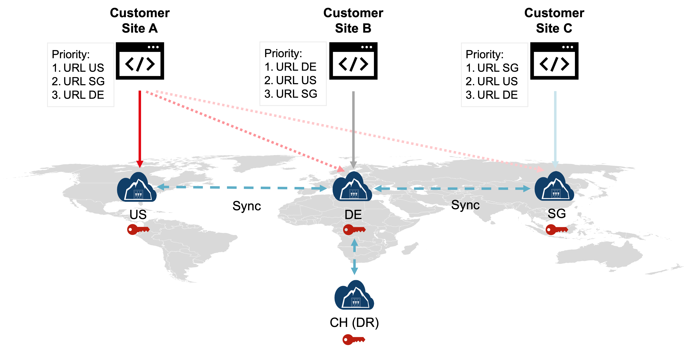

# Cluster Synchronization

The CloudHSM service employs a sophisticated architecture built around synchronized Hardware Security Modules (HSMs) for High Availability. These HSMs work together to safeguard your sensitive data and ensure seamless operations. Depending on the [service package](../Packages/overview) chosen, such as the [CloudHSM Economy (ECO) Global Cluster](../Packages/economy.md), your key data can be replicated up to four times across [different geographical locations](/cloudhsm/Packages/overview). This creates an additional layer of protection against any potential hardware failures or outages, offering exceptional redundancy and peace of mind.

### Automated Key Synchronization

One of the key advantages of CloudHSM is its automated key synchronization. Subscribers don’t need to manually update keys or manage complex configurations. The service handles everything behind the scenes, ensuring that subscribers’ keys are always consistent and readily available across all synchronized HSMs. This not only simplifies the subscriber's workload but also minimizes the risk of human error, further enhancing security.

### Key Addition and Master HSM Role

Adding new encryption keys within a partition requires the master HSM of the cluster to be operational. This master HSM plays a crucial role in coordinating key distribution and maintaining data integrity. While temporary unavailability of the master HSM won't impact existing keys or ongoing cryptographic operations, it will prevent the generation of new keys until the master HSM comes back online.

### Global Deployment and Key Replication

One of the advantages of this architecture is that it enables global enterprises to deploy their applications across different regions, as illustrated in the scenario below. Each application instance can interact with its preferred CloudHSM cluster instance, and keys created by one instance are automatically replicated to other sites. This ensures that keys are available for use in any region, significantly optimizing latency to the CloudHSM service.

<figure class="image">
  
  <figcaption>CloudHSM Economy (ECO) in a global cluster deployment scenario</figcaption>
</figure>

 In this scenario, the CloudHSM [Global Cluster](../Packages/economy.md) minimizes latency and enhances redundancy. Data is replicated across multiple data centers, providing protection against data loss and reducing the likelihood of local network issues. Additionally, each application instance can be configured to failover to secondary sites, as the Primus API providers support both random failover and priority-based failover configurations.