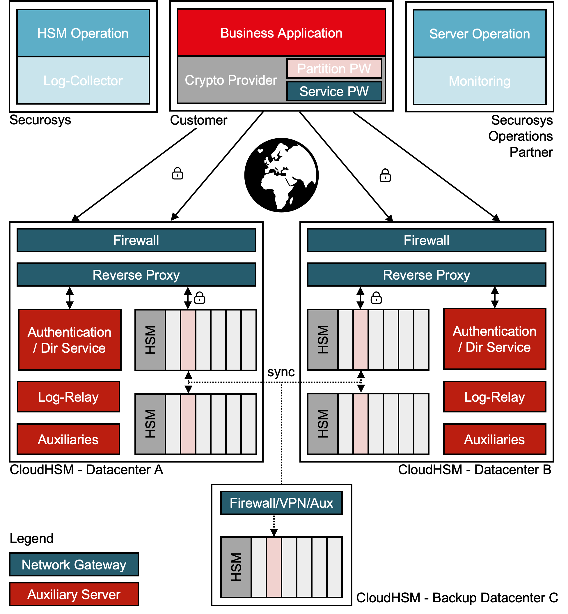

# Overview

The CloudHSM service encompasses various components on the data center side, including Network Gateway, Authentication Service, and Hardware Security Modules (HSMs). To fortify operational resilience, these elements are strategically deployed across geographically separated data center locations. Additionally, for Business Continuity purposes, Securosys maintains a third data center situated in the Swiss Alps within a decommissioned military bunker. It is noteworthy that the overarching operations of the CloudHSM service are centrally conducted by Securosys from its headquarters located in Switzerland.

In the CloudHSM architecture, subscribers are granted exclusive access to one or more partitions within a dedicated, or depending on the selected [service package](../Packages/overview), multi-tennant HSM cluster. This tailored access ensures a personalized and secure environment for subscribers to manage and utilize cryptographic assets as per their unique requirements.

Access to the HSM cluster is exclusively via the internet, and only authenticated subscribers are granted entry. Subscribers can establish secure access to their partitions on CloudHSM by installing a [cryptographic API provider](client_access#primus-api-providers) on their application servers or by utilizing the [RESTful API](client_access#transaction-security-broker-as-a-service-tsbaas-and-rest-as-a-service-restaas) option. The [Primus API Provider](client_access#primus-api-providers) handles secure data transmission and automatic failover, ensuring uninterrupted access to sensitive data. Subscribers receive access and usage rights to the Primus API provider as part of their subscription package.

With CloudHSM, subscribers always maintain absolute control over the creation, management, and utilization of cryptographic keys and functions. Only the subscriber has access to their user space and key data. Securosys assumes responsibility for the operation, monitoring, and maintenance of the CloudHSM service infrastructure and the underlying HSM cluster.

<figure class="image">
  
  <figcaption>CloudHSM Architecture Overview</figcaption>
</figure>
