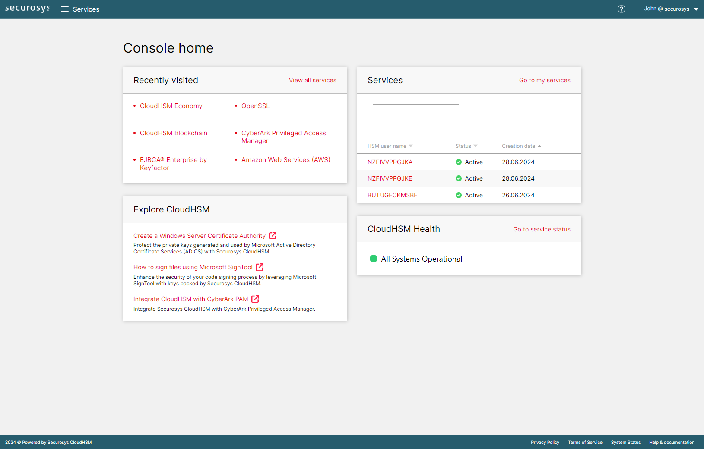

# Home page

From the Cloud Console [home page](https://cloud.securosys.com/home), you have access to:

- the pages recently visited
- your [list of services]
- the most recent tutorials
- the [system health](https://status.cloudshsm.com/)

### Preview

