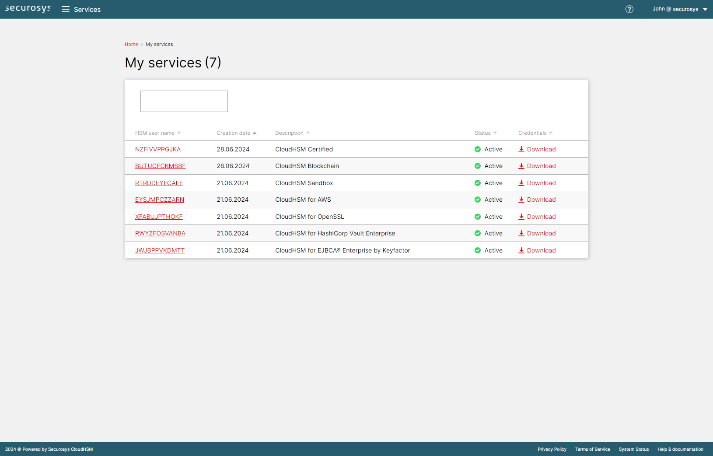

# Service Page

The page [My Services](https://cloud.securosys.com/my-services) shows all the services linked to your company account, listed with the following information:

| Column | Value |
| ------ | ----------- |
| HSM user name  | The unique identifier of your service |
| Creation date | The date your service has been created |
| Description | The category name of your service |
| Status | The current state of this service <table> <tr> <td>**Status:**</td> <td>**Meaning:**</td> </tr> <tr> <td>Active</td> <td>The service is active and fully operational.</td> </tr> <tr> <td>In progress</td> <td>The service has been requested recently and is being activated.</td> </tr> <tr> <td>Disabled</td> <td>The service isn't active</td> </tr> </table>|
| Credentials | Button to download the credentials of your service |

### Preview

