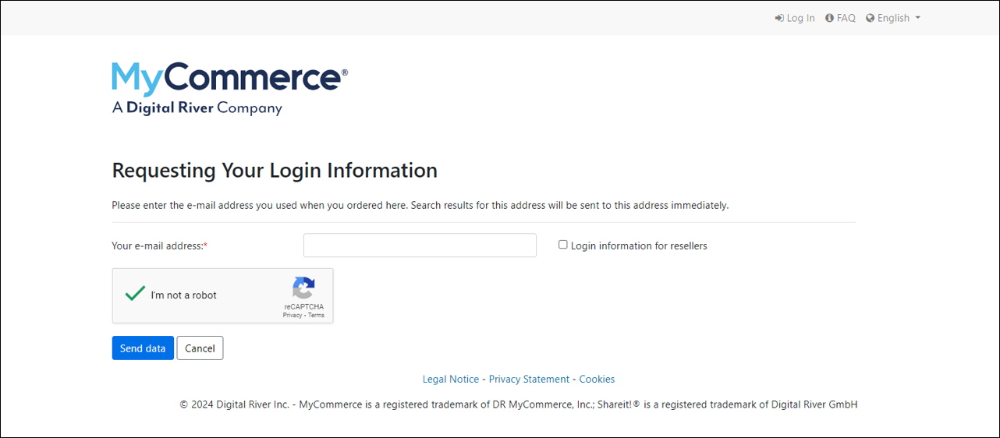
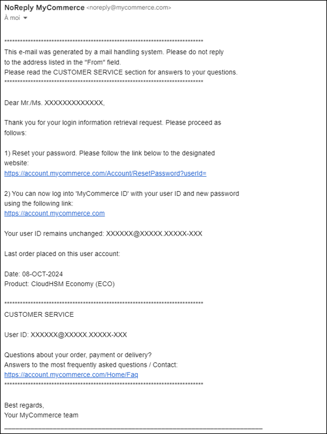
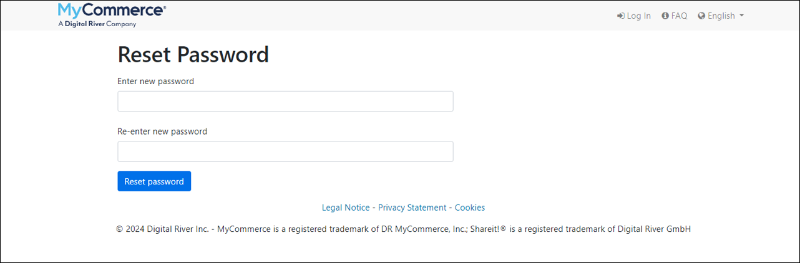
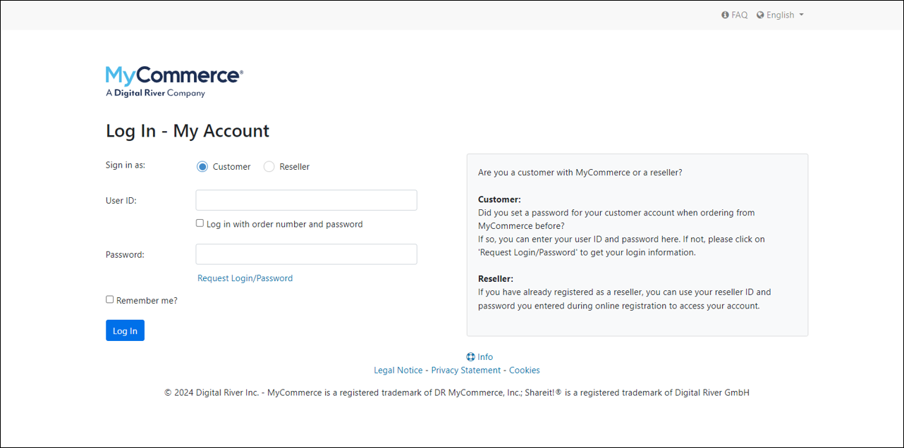
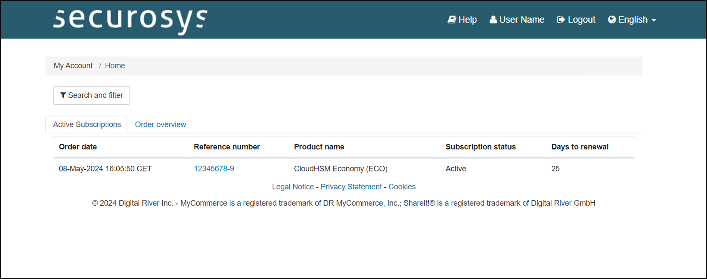
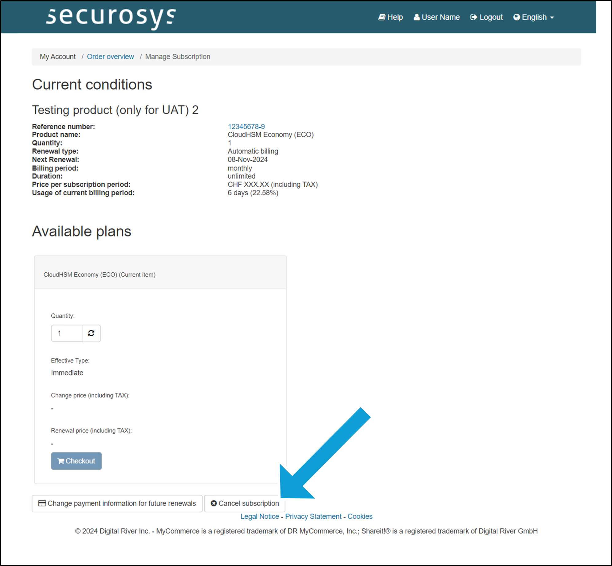
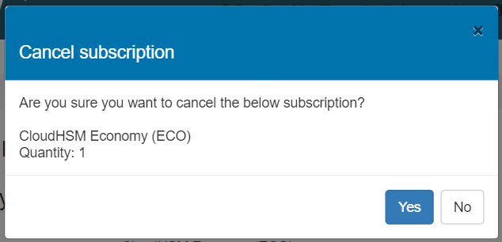
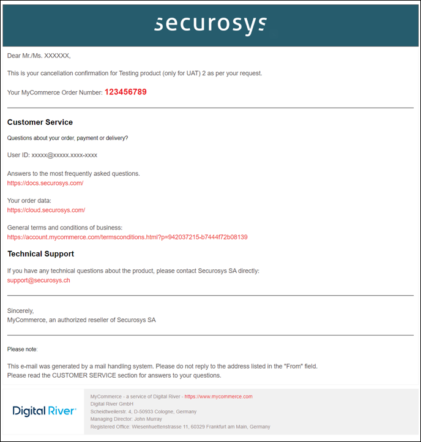

import Tabs from '@theme/Tabs';
import TabItem from '@theme/TabItem';

# Terminating a CloudHSM Service

Terminating a Securosys CloudHSM Service involves permanently deleting all cryptographic materials across associated partitions and revoking client access to the service.

This process requires completing **two key steps**:

1) **Technical Decommissioning**: Delete the HSM, keys, partitions, and any associated technical resources.
    -  For detailed instructions, please refer to **[this tutorial](/cloudhsm/Tutorial/termination)**.
2) **Subscription Cancellation**: Cancel the SaaS subscription, manage billing, and close the contract. Proceed with the following steps:

## CloudHSM Subscription Cancellation: Step-by-Step

:::danger Have you completed Step 1?
Before proceeding with the subscription cancellation, make sure you have completed [Step 1 (Technical Decommissioning)](/cloudhsm/Tutorial/termination) to retrieve your keys and other essential data. Cancelling the subscription will automatically destroy all cryptographic material on any associated partitions and revoke access for any clients connected to the service.
:::

To cancel a monthly subscription, follow these steps:

### 1) [Request your _MyCommerce_ login information](https://account.mycommerce.com/Account/ForgotPassword):

- Enter the email address of the account used for the billing. Most likely the same as to [login](../Accounts/login.md).



You will receive an email with a link to choose a new password:



### 2) Choose a new password:

Click on the link in the email and choose a new password.



### 3) [Login](https://account.mycommerce.com/):

Login to your MyCommerce account with your login & password.



### 4) Select the subscription to cancel:

In the list of active subscriptions, select the one you would like to cancel.



### 5) Click on ```Cancel subscription```:

at the bottom of the page



### 6) Confirm the cancellation:



### 7) Cancellation confirmation email

Once the subscription is cancelled, you will receive a confirmation email. **No further action needed**.



:::info Need help?

Contact us on the [Support Portal](https://support.securosys.com) (login required)
:::