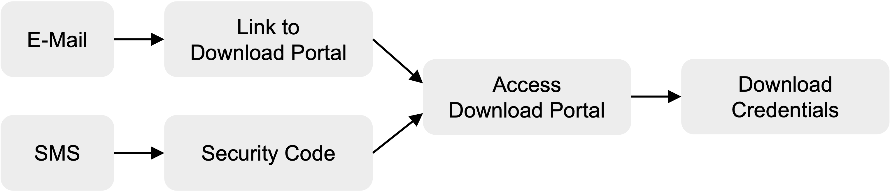

import Tabs from '@theme/Tabs';
import TabItem from '@theme/TabItem';

# How to retrieve the HSM Credentials?

This guide applies to both CloudHSM:
- Dedicated
- Shared, with a single partition

<Tabs groupId="purchase-channel">
<TabItem value="offline" label="via Sales" default>

### Download the HSM Service Credentials

The provisioning of the HSM credentials must be performed by the **privileged support user** and include the following steps:
1) Check your mailbox and look for one (or more) email with a [SecureSafe](https://www.securesafe.com/en/) link.
1) Check your text messages on your mobile phone and look for one (ore more) password(s) (SecureCode).
1) Use the password to download the HSM Service Credentials file(s) from SecureSafe.

<figure class="image">
  
  <figcaption>CloudHSM Service Credentials Provisioning</figcaption>
</figure>

### Description of the Service Credentials

You will receive one or two sets of credentials depending on your subcription type:

- HSM Standard
- HSM with Multi-Tenant TSBaaS

<Tabs>
  <TabItem value="Standard">
You will receive 2 sets of credentials, in 2 separate emails:
1) **Service** User credentials
1) **Technical** User credentials

Both credentials apply to CloudHSM Sandbox (SBX), Economy (ECO), Certified (ECO-CC) and Platinum subscriptions.

### 1. What are the Service User Credentials?

The **Service-User** credentials are used to authenticate the CloudHSM subscriber on the service level. After successful authentication, the network gateway proxy permits the session to pass through to the HSM cluster.

The Service-User credential file contains the name and password to authenticate with reverse proxies.

 ```yml title="<company>_<svc>_service_<user>_<date>.txt"
Service User Name: ...              # Reverse proxy Service-User name
Service User Password: ...          # Reverse proxy Service-User password
HSM User Name: ...                  # Reference to HSM user/partition name
```

:::info
During [step 5: Setup API Provider](./setup_instructions.md), the Service-User credentials are referred to as "Proxy-User"/"Proxy-Password".
:::

---
### 2. What are the Technical User Credentials?

The **Technical-User** credentials are used when connecting for the first time with your HSM cluster partition. This setup password will be disposed of and replaced with a **user secret**.

The user secret will never be revealed on display.

:::info
During [step 5: Setup API Provider](./setup_instructions.md), the Technical-User credentials are referred to as "HSM-User"/"HSM-Password".
:::

The Technical-User credential file contains the name and setup password to access the HSM partition and PKCS#11 secret:

 ```yml title="<company>_<svc>_hsm_<user>_<date>.txt"
HSM User Name: ...                  # HSM user/partition name
HSM User Setup Password: ...        # HSM user/partition initial password
PKCS#11 password : ...              # if PKCS#11 API ordered
```

:::danger Limited lifetime
The Technical-User `HSM Setup Password` has a limited lifetime of **7 days**:
- from the **first usage**, for CloudHSM Economy (ECO), Sandbox (SBX) and Platinum
- from the **date of issuance**, for CloudHSM Economy Certified (ECO-CC)

If you are not able to setup your application and connect to the HSM cluster within that time, please [create a support ticket](https://support.securosys.com) to renew the HSM Setup Password.

:::
  </TabItem>
  <TabItem value="Multi-Tenant TSBaaS">

You will receive 1 single set of credentials with a **JWT Token**.

### What is the JSON Web Token?

The **JSON Web Token (JWT)** serves as an authentication mechanism for CloudHSM subscribers within the multi-tenant TSBaaS environment. It enables secure communication with the CloudHSM partition via [Transaction Security Broker (REST-API)](/tsb/overview).

The credential file contains a JSON Web Token to authenticate on Transaction Security Broker (TSB) and RESTful-API.

 ```txt title="<organization>_<svc>_jwt_<user>_<date>.txt"
- Details for Restful-API & Transaction Security Broker:
    API-Endpoint: https://<service-url>.cloudshsm.com
    JWT-TOKEN: ...

    Documentation available at: https://<service-url>.cloudshsm.com/swagger-ui/index.html
    - Select the 'Authorize' button and insert the JWT token if you wish to try out some commands on the Swagger-UI.
    - You may also test connectivity using the following curl command:
      curl -X GET 'https://sbx-rest-api.cloudshsm.com/v1/versionInfo' -H 'Authorization: Bearer <YOUR_JWT_TOKEN_HERE>
```

  </TabItem>
<TabItem value="Dedicated TSBaaS">

This authentication is based on mutual TLS (mTLS) and follows [this process](/tsb/Installation/https-setup/mtls-configuration), in close cooperation between the Securosys Support Team and you.

  </TabItem>
</Tabs>
</TabItem>

<TabItem value="online" label="Online" default>

### Download the HSM Service Credentials

1) Log into [Cloud Console](https://cloud.securosys.com/login).
1) Go to [MyServices page](https://cloud.securosys.com/my-services).
  Your service should appear in the list with the status <span style={{ fontWeight: 'bold', color: 'green' }}>Active</span>.
1) Click on the ```Download``` button in the last column. A pop-up opens.
1) Copy/paste you **6-character PIN code**. This was sent via email during the [subscription](subscribe.md#1-create-a-tenant).
1) Click on the ```Download``` button to retrieve the HSM Service credentials file.

The HSM Service credentials file will contain:

```txt title="<organization>_<svc>_credentials_<user>_<date>.txt"
- Details  for Native-API (JCE, PKCS#11, MS CNG) 
    HSM User Name: ...                  # HSM user/partition name
    HSM User Setup Password: ...        # HSM user/partition initial password
    Service (Proxy) User Name: ...      # Reverse proxy Service-User name
    Service (Proxy) User Password: ...  # Reverse proxy Service-User password
    PKCS#11 password : ...              # if PKCS#11 API ordered

- Details for Restful-API & Transaction Security Broker: 
    JWT-TOKEN for Restful-API & Transaction Security Broker: ...
```

:::info Optional HSM Credentials
Not all the HSM credentials provided are required for your service subscription.
:::

</TabItem>
</Tabs>

Continue with the **[step 4: Setup the API Provider](./setup_instructions.md)**.

---

:::tip need help ?

Check the [troublehsooting](./troubleshooting) section or contact our support team for further assistance:
+ [Create a ticket (login required)](https://support.securosys.com)
+ [Send an email](mailto:support@securosys.com)
:::