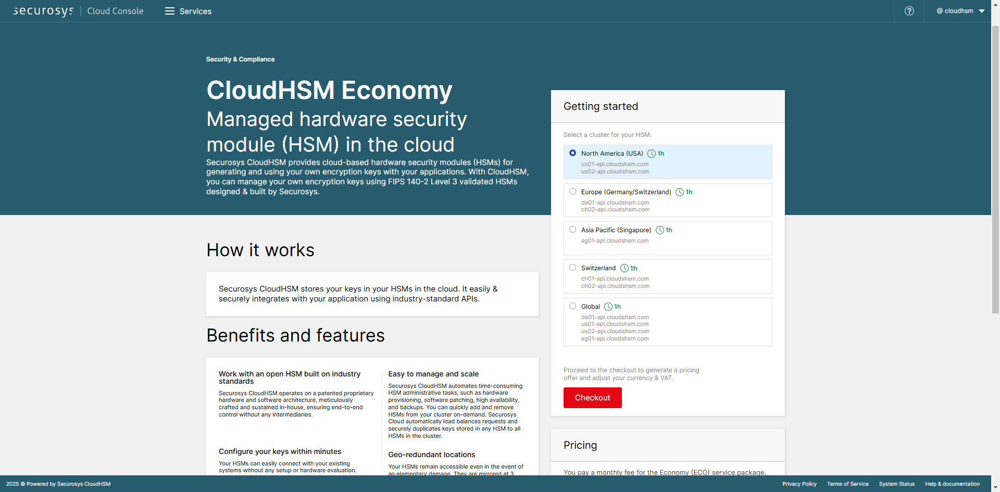

import Tabs from '@theme/Tabs';
import TabItem from '@theme/TabItem';
import Link from '@docusaurus/Link';

# How to subscribe to CloudHSM?

You can subscribe to **CloudHSM** services either online or through in-person sales. The onboarding procedure varies depending on the purchase channel.

<Tabs groupId="purchase-channel">
<TabItem value="offline" label="via Sales" default>

## 1. Purchase order

Contact the [Securosys Sales team](https://www.securosys.com/en/contact) to submit a purchase order.

## 2. Download the  _Service Order_ Form

[Download](../GettingStarted/resources/doc/Securosys_CloudHSM_ServiceOrderForm_FO-E09.pdf)  the _Service Order Form_

## 2. Fill out the _Service Order Form_ form

Fill out the form with the configuration parameters and options you need for your CloudHSM service:

- Enter the `offer reference`.
- Select the `service start date`. The service activation can take up to 72 hours.
---
**Service Package Parameters**
- `HSMaaS`: Select the [Service Package](/cloudhsm/category/service-packages) from the drop-down list.
- `TSBaaS/RESTaaS`: If applicable, select the [TSBaaS and RESTaaS](/cloudhsm/Architecture/client_access#transaction-security-broker-as-a-service-tsbaas-and-rest-as-a-service-restaas).
- `API Provider(s)`: Select the [API Provider](/cloudhsm/Packages/overview.md#api-integration-options).
- `Optional features`: If applicable, select the HSM features
   - [Smart Key Attributes (SKA)](/cloudhsm/Overview/features.md#smart-key-attributes-ska).
   - [Cryptocurrencies](/cloudhsm/Overview/features.md#cryptocurrencies).
   - [Partition Remote Administration](/cloudhsm/Overview/features.md#hsm-partition-remote-administration).
   
---
**Contacts** 

- `Purchase contact`: Enter your information
- `Registered Support User(s)`:
   - List the users who must have access to the [Support Portal](https://support.securosys.com). These users will be allowed to create support tickets and/or receive HSM service credentials.
   - For each user, assign a role. [List of user roles available](https://support.securosys.com/external/knowledge-base/article/12).

:::info Privileged User

Since the provisioning of HSM service credentials requires a TAN sent via SMS, the Privileged Users must provide a **mobile phone number**. 
:::
---
**Security Policy Settings**

- `IP ACL`: Enter the list of IP-addresses to be whitelisted. The access to the HSM is restricted to a list of specific whitelisted source IP addresses.

Unless they are operated as a dedicated instance, the IP whitelisting is exclusively available for the native APIs, e.g., JCE, MS-CNG and PKCS11, and not on supplementary services for TSB and REST.
- `Key import`, `Key export`, `Key invalidation`, `Session Objects`, `Partition Read-Only`, `Object Destruction` and `Object Usage`: Select the the various [Partition Security Policy Settings](../Tutorial/parameter_descriptions#partition-security-policy-settings).
---
**Decanus Terminal** (optional)

- `Delivery Address`: If you ordered the physical device _Decanus Terminal_, provide the delivery address details for the shipment:
   1. Company Name
   2. Full Address (Street/No., ZIP Code, City, County, Country)
   3. Contact Name
   4. Phone number
- Provide any `additional information` if required.

## 3. Return the _Service Order Form_

Complete, sign and email the form to your Securosys sales representative.

</TabItem>
<TabItem value="online" label="Online">

## 1. Create a tenant

On _Cloud Console_, log into your tenant or create a new one:

- [Sign up](https://cloud.securosys.com/sign-up)
- [Log in](https://cloud.securosys.com/login)

More info: [How to create a tenant?](../CloudConsole/Accounts/createanaccount.md)

## 2. Select the service and the cluster

Browse the different CloudHSM service packages available and reach the page.
On the right-hand side of the screen, select the cluster you want for your service.
Clusters differ from a service to another.

<figure class="image">
  
  <figcaption>Cloud Console - CloudHSM configuration</figcaption>
</figure>

## 3. Checkout & payment

Click on `Checkout` to proceed to the checkout page, complete your information:
- VAT number if needed
- payment information

Click on `Subscribe` at the bottom of the page.

## 4. Order confirmation

Once your order is confirmed, you will receive several emails:
1) One or several emails from Digital River MyCommerce (the Merchant of Record, on behalf of Securosys), with the invoice attached in .pdf format.
1) One email from Securosys "Service newly created", with a 6-digit PIN code.

</TabItem>
</Tabs>

Continue with [Step 2. Support account](supportaccount).

:::tip need help ?
Contact our support team for further assistance:
+ [Create a ticket (login required)](https://support.securosys.com)
+ [Send an email](mailto:support@securosys.com)
:::