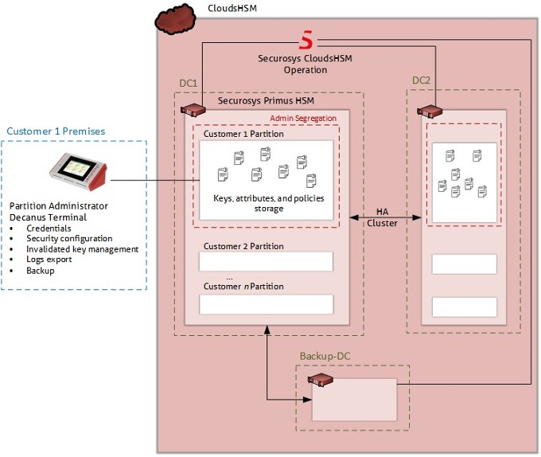

# Features & Options

## Features

### Secure HSM Access

Securosys CloudHSM implements security measures on the communication layer, subscriber authentication and authorization, roles, physical access, patching, monitoring, and so on. Here, the focus is on secure access to the communication interface.

Between the [Primus API Provider](../Architecture/client_access#primus-api-providers) (client-side software component) and the HSM in the Securosys CloudHSM service, a secure AES-256-GCM encrypted connection is established. The authentication takes place in two phases:
1. You are authenticated at the gateway, with optional access restrictions to only whitelisted client IP addresses.
2. Once authenticated, the gateway allows end-to-end encrypted communication to the HSM.

Alternatively, when using the [REST API](../Architecture/client_access#transaction-security-broker-as-a-service-tsbaas-and-rest-as-a-service-restaas), communication is secured by TLS. The access is authenticated and authorized using a **JSON Web Token** (bearer token) issued to you in a multi-tenant TSBaaS setup, or alternatively through mutual TLS for a dedicated TSBaaS instance.

### Secure Storage and Control of Key Usage

Securosys CloudHSM provides features to protect keys from [export](../Tutorial/parameter_descriptions#key-export), [import](../Tutorial/parameter_descriptions#key-import), or [deletion](../Tutorial/parameter_descriptions#key-invalidation) at the level required by your use case. Typically, keys are generated within the HSM but of course, they can also be imported if required by your security policy. However, they are controlled by specific [partition security policy settings](../Tutorial/parameter_descriptions#partition-security-policy-settings) on the HSM partition. Any interaction with the keys can only be performed by you through the cryptographic API.

Key exportability is controlled by two parameters: first, whether the individual key was marked as exportable during its creation, and second, if the [partition security policy](../Tutorial/parameter_descriptions#partition-security-policy-settings) has been set to allow [key export](../Tutorial/parameter_descriptions#key-export).

Depending on the requirements, deletion of keys can be prevented by setting the [partition security policy](../Tutorial/parameter_descriptions#partition-security-policy-settings) to [read-only](../Tutorial/parameter_descriptions#partition-read-only) or by using the [Key Invalidation](../Tutorial/parameter_descriptions#key-invalidation) mode, which is a unique feature of the Primus HSMs. When using [Key Invalidation](./features#key-invalidation), a key deleted via the API is only marked as invalidated but remains stored in the HSM until deleted by the Security Officers. Key Invalidation is a very effective measure to protect against accidental key deletion and to enforce the principle of multistage control.

### Cryptographic Agility and Set of Algorithms

Among many cryptographic schemes, Securosys CloudHSM supports symmetric (AES, 3DES, Camellia, ChaCha, Poly1305), asymmetric (RSA, ECC, Diffie-Hellman), and hashing (SHA-2, SHA-3) cryptographic algorithms.

[View the list of algorithms and functions](Supported_Algorithms_and_Functions.md).

The underlying hardware, _Primus HSMs_ guarantees full crypto agility due to its dynamic architecture. Should quantum computers render any of the supported algorithms obsolete, a quantum-computer-safe algorithm can be installed through a firmware/software upgrade. Several [PQC algorithms](#post-quantum-cryptographic-pqc-algorithms) are already supported.

### Operation & Roles

Any activity on the Securosys CloudHSM service is permanently logged and monitored. Whenever possible, your metadata is anonymized. Alerts are triggered based on certain system conditions or specific activities and can be followed up immediately.

The operation of the HSMs and the associated administrational roles (Security Officer) are handled by true experts of Securosys. Every Security Officer is deeply experienced in HSM operation and has passed a thorough background check. The Security-Officer role is strictly activated adhering to the four-eyes principle and an “air-gapped” second factor.

Compared to other solutions where administration is fully automated, Securosys CloudHSM is better protected against cyberattacks on the HSM administration pane. Special attention has been paid to the segregation of duties in the HSM operation, like customer onboarding, HSM partition configuration, backup/restore, firmware update, etc. They all involve different roles and require up to six eyes to be enabled.

Securosys CloudHSM gives you the option to manage your own HSM partition remotely with the physical device [Decanus Terminal](#hsm-partition-remote-administration).

### Backup and Business Continuity

With Securosys CloudHSM, the data is synchronized between all the HSMs within the cluster, thus offering a high degree of redundancy, which renders backups less important. With Securosys CloudHSM, Securosys takes daily backups of HSM partition data for services with HSMs deployed at the Business Continuity (backup) site for operational purposes. Such backups can only be restored to the original HSM cluster and have a retention period of 10 days. As a precautionary measure for certain maintenance tasks, Securosys also may take specific backups. Such backups follow the six-eyes principle and are taken manually. The backups are not held in online storage and as such are never exposed to internal networks; Instead, they are written to USB thumb drives and stored in a safe.

Alternatively, you can create your own backup on a USB thumb drive with the physical device [Decanus Terminal](#hsm-partition-remote-administration).

Moreover, Securosys CloudHSM has defined business continuity plans and offers different [exit options](../Tutorial/termination.md), such as a migration of the key material to an on-premise HSM.

### Application Integration, Flexibility, and Skills

Securosys CloudHSM provides a wide selection of Application Program Interfaces. It can be used with almost any business application ranging from Identity Access Management, Public Key Infrastructure, strong authentication, database encryption, electronic signature to raw data encryption, and blockchain validation.

- [JCA/JCE](../../jce/overview)
- [MS CNG](../../mscng/overview)
- [PKCS#11](../../pkcs/overview)
- [OpenSSL](../../openssl/overview)
- [REST](../../tsb/overview)

### Key Attestation

The Primus HSMs in CloudHSM feature a dedicated keystore, protecting a factory installed root certificate and root key. The device then creates its own intermediary (device) key and its certificate is signed by the root key. The intermediary key is then used to sign attestation and timestamp key created for each partition. Thus, providing proof to you or any trust service provider that your keys are hold securely inside a CloudHSM partition. The [PrimusHSM Root Certificate for Key-Attestation](https://support.securosys.com/external/knowledge-base/article/147) for all CloudHSM service packages is published on the Securosys Support Portal, along with detailed instructions for the attestation verification process in the [Audit and Attestation](https://support.securosys.com/external/knowledge-base/article/64) application note.

### Key Invalidation

Key invalidation creates a shadow copy, trash bin, of the key when the key is deleted. This prevents accidental deletion of valuable keys from the API. The Security Officer role in charge of the partition can then in a manual step delete the invalidated keys, or in case of an erroneous deletion reactivate the individual key(s).

[View Key Invalidation tutorial](../Tutorial/parameter_descriptions#key-invalidation)

## Options

In addition to the default [features](./features#features) available out-of-the-box, Securosys CloudHSM also offers a range of customizable options.

### Smart Key Attributes (SKA)

Smart Key Attributes (SKA) is a set of **7** customizable rules and attributes for private keys, giving you additional control over how your keys are used and secured.

The rules can contain any combination of quorums, time constraints, etc. To bring the concept of SKA closer to you, just think of a PKI where you wish to apply a specific condition when using the CA root key. With SKA, you would for example attribute a rule to the CA root key that this key may only be used if 3 out of 5 supervisors (e.g. representatives of different departments identified by their public keys) approve the operation within a given timeframe.

[Learn more about Smart Key Attributes (SKA) and Transaction Security Broker (TSB)](/tsb/Tutorials/TransactionSecurityBroker/smart-key-attributes).

### Transaction Security Broker (TSB)

The integration of the [Smart Key Attributes (SKA)](./features#smart-key-attributes-ska) workflow is alleviated with the Transaction Security Broker (TSB) service. The TSB orchestrates the approval collection from the supervisors (approval clients) for any transaction calls from the subscribers application based on the ruleset on the key object. The interaction between the subscriber application, the TSB and approval clients, respectively, is accomplished via an industry-standard [REST API](/tsb/overview).

[Learn more about Transaction Security Broker (TSB)](/tsb/Tutorials/TransactionSecurityBroker/transaction-security-broker).

### Cryptocurrencies

Securosys CloudHSM supports several blockchain algorithms, with features tailored to meet the specific needs of various **cryptocurrencies**. It includes support for popular currencies such as Ethereum (ETH), Bitcoin (BTC), Cardano (ADA), Ripple, IOTA, and others. Additionally, the system supports [key derivation](../../tsb/Concepts/key/Derivation/KeyDerivation) on asymmetric keys through a built-in BIP 32 mechanism, promoting secure and efficient key management.

[View the list of supported cryptocurrencies](/tsb/Tutorials/Blockchain/supported-currency)

Moreover, the direct secure address generation, achieved through the hash of the public key, stands out as a distinctive feature that provides additional [Post-Quantum Cryptography (PQC)](#post-quantum-cryptographic-pqc-algorithms) protection within the HSM environment, enhancing the overall security posture for cryptographic operations.

### Post-Quantum Cryptographic (PQC) Algorithms

Securosys CloudHSM offers robust support for cutting-edge Post-Quantum Cryptographic (PQC) algorithms, ensuring enhanced security in the face of evolving threats. Among the supported algorithms are CRYSTALS-Dilithium, CRYSTALS-Kyber, and SPHINCS+, providing advanced encryption capabilities that align with the latest security standards and protocols.

[View the list of PQC algorithms](Supported_Algorithms_and_Functions.md#pqc-algorithms-as-from-release-31-onwards-coming-soon).

### HSM Partition Remote Administration

CloudHSM services require certain administrative tasks to manage the HSM partition and its security settings, which can be performed in two scenarios:

- By default, Securosys Partition Security Officers (PSOs) manage the CloudHSM services on your behalf.
- Alternatively, you can perform these tasks independently, without any interference from Securosys.

The physical device [Decanus Terminal's](https://www.securosys.com/en/product/decanus-remote-control-terminal) covers this use case, giving you full control over the HSM partition, including: 
- Resetting credentials
- Changing the partition’s security configuration
- Management of invalidated keys
- Exporting logs
- Partition backup/restore

The Partition Security Officer (PSO) role can alternatively be activated by one or two-out-of-m persons.

For full autonomy, you can even prevent Securosys from intervening (e.g., password reset) on your HSM partition. Please note that this action entails taking over full responsibility for the risk of losing Partition Security Officer (PSO) access credentials.

<figure class="image">
  
  <figcaption>HSM Partition Remote Administration</figcaption>
</figure>

### Timestamp Service

The Timestamp Service enables the generation of timestamps in compliance with the **RFC3161** as required by standard [**ETSI EN 319 422**](./compliance). It covers the necessary operations to support timestamping services, allowing users to create tamper-proof records of the time and date when a document or transaction was signed.

:::tip Getting started

+ [Try CloudHSM for free for 90 days](https://cloud.securosys.com/cloudhsm)
+ [Contact sales](https://www.securosys.com/en/contact)
:::