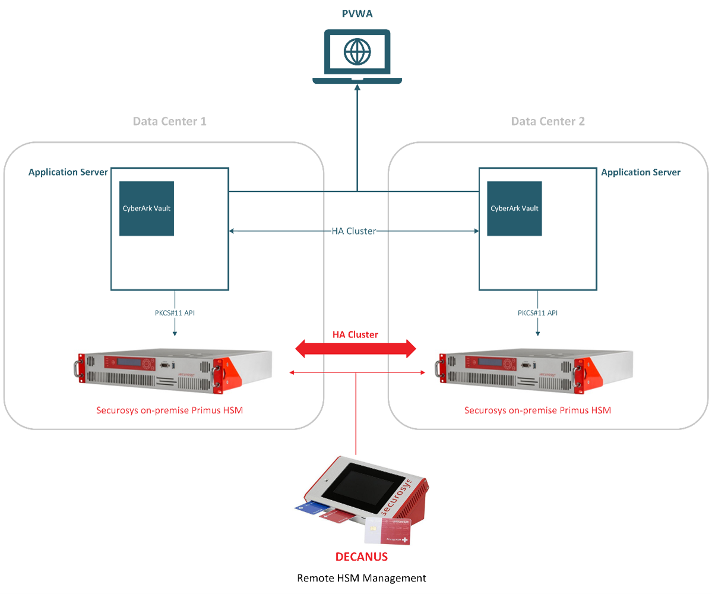

import Tabs from '@theme/Tabs';
import TabItem from '@theme/TabItem';

# CyberArk Privileged Access Manager
### HSM integration guide

This document describes how to easily integrate Securosys HSM, [cloud](/cloudhsm/overview/) (HSM as a service) or on-premises, with CyberArk Privileged Access Manager (CyberArk Digital Vault).

CyberArk's Privileged Access Manager - Self-Hosted is a full life-cycle solution for managing the most privileged accounts and SSH keys in the enterprise. It enables organizations to secure, provision, manage, control and monitor all activities associated with all types of privileged identities, such as:

- Administrator on a Windows server,
- Root on a UNIX server,
- Embedded passwords found in applications and scripts.

Integrating Securosys [CloudHSM](/cloudhsm/overview/) or Primus HSM with CyberArk PAM solution provides an array of benefits including:
- Highest-grade secure hardware storage, protection and True-RNG key generation,
- Full life cycle management of all keys stored on your HSM or HSM partition,

## Target Audience

This document is intended for Securosys Primus HSM or CloudHSM
administrators and IT professionals in charge of the CyberArk PAM administration. Installation of the Securosys Primus PKCS#11 Provider
requires that you are already familiar with Microsoft Windows Server administration.

For on-premises HSM deployed operation administrative skills are
required for Securosys Primus HSMs.

## Getting started with CyberArk PAM & HSM

For a smooth start integrating your Cyberark PAM Vault using the Primus PKCS#11 Provider:
- Consult the [Quick Start Guide](./quickstart.md)) for a comprehensive task listing.
- For detailed instructions, read and follow the [Installation guide](/cyberark/category/installation).
- Secure CyberArk Vault Server Keys using CloudHSM or Primus HSM following the [Tutorial](/cyberark/category/tutorial/) section.