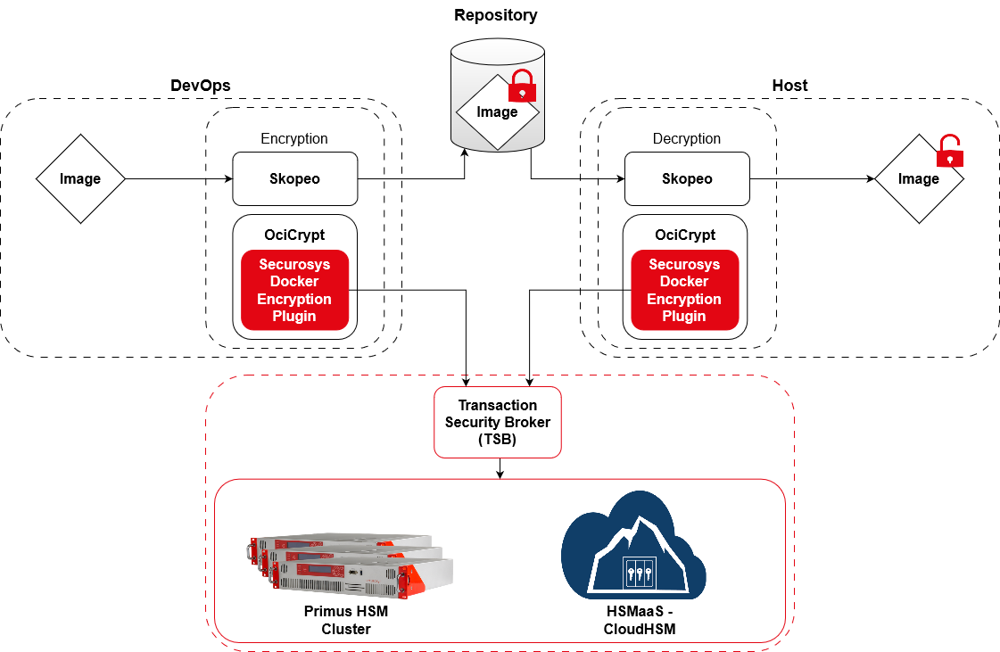

# Skopeo Container Encryption

## Securosys Docker Image Encryption Plugin

High assurance environments such as financial, federal government, or
medical industries have strict requirements in terms of protecting the
confidentiality of container workloads. To protect these workloads, you
can use encryption technologies to secure the confidentiality of
workloads and fulfill workload compliance controls (such as those
described in [NIST Special Publication 800-53](https://nvlpubs.nist.gov/nistpubs/SpecialPublications/NIST.SP.800-53r4.pdf)).

The OCIcrypt library is the OCI image spec implementation of container
image encryption. More details of the spec can be found in the OCI
repository. The purpose of this library is to encode spec structures and
constants as well as to provide a consistent implementation of image
encryption across container runtimes and build tools. Consumers of
OCIcrypt are:

-   containerd/imgcrypt

-   cri-o

-   skopeo

The Securosys Docker Image Encryption Plugin is published and tested for
Skopeo, but it might similarly be used with containerd/imgcrypt, cri-o.
Skopeo serves as a valuable tool for container image management,
offering a lightweight and efficient means of copying, inspecting, and
manipulating container images across different registries and
environments, ultimately enhancing container orchestration and
deployment processes.

The Securosys Docker Image Encryption Plugin connects the OCIcrypt and
Skopeo with the Transaction Security Broker, which in turn communicates
directly with the HSM. This way, the keys can be generated and stored in
the safe and hardware-protected environment of the Securosys HSM.

<figure class="image">
  
  <figcaption>Figure: Securosys Docker Image encryption workflow</figcaption>
</figure>

