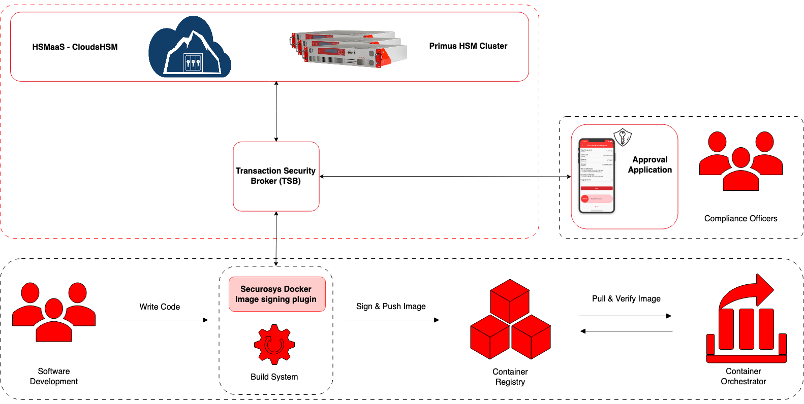

# Docker Image Signing Plugin
### HSM Integration guide

With the growing use of containers, it’s essential to strengthen software supply-chain security by ensuring that the container images we run on Kubernetes clusters are trusted. We do this by **signing** the container images.

The _Notary_ is a set of specifications and tools intended to provide a cross-industry standard for securing software supply chains by using authentic container images and other OCI artifacts. _Notary Project_ is also the name of the GitHub organization that has multiple prominent subprojects like Notation, Notary Project specifications, and Notary. Very often we use the name Notary Project to refer to all the above as well as the community that drives the specifications and the implementations. You can find more information on [Notary Project documentation](https://notaryproject.dev/docs/).

_Notation_ is a Command Line Interface (CLI) project to add signatures as standard items in the Open Container Initiative (OCI) registry ecosystem, and to build a set of simple tooling for signing and verifying these signatures. This scheme is similar to checking git commit signatures, although the signatures are generic and can be used for additional purposes. Notation (aka Notary v2 / Docker Content Trust v2) is the most current implementation of the [Notary Project Specifications](https://notaryproject.dev/docs/). 

The **Securosys Docker Signing Notation Plugin** is a binary plugin required to connect the Notation CLI to use the benefits of the Transaction Security Broker (TSB) and Primus HSMs to generate, store and apply the keys in a secure hardware environment.

Optionally, with [Smart Key Attributes (SKA)](/tsb/Tutorials/TransactionSecurityBroker/smart-key-attributes) and the workflow engine part of the [Transaction Security Broker (TSB)](/tsb/Tutorials/TransactionSecurityBroker/transaction-security-broker), you can implement and orchestrate signature approvals by multiple parties, like the CISO, the development management, the product management, etc., via approval apps.

_Figure 1: Securosys Docker Signing Plugin workflow with Notation_

---

## Getting Started with Docker Signing & HSM

- [Quick start guide](../quickstart.md)
- [Prerequisites](../Installation/prerequisites).
- [Installation](/docker_signing/Installation/Plugin-Installation/RecommendedOption)

:::note

This guide assumes the operating system used is Linux Ubuntu 22.

:::

:::tip Free trial

Try Docker Signing for free with Securosys CloudHSM
- [What is CloudHSM?](/cloudhsm/overview/)
- [Create an account](https://cloud.securosys.com/cloudhsm)
:::