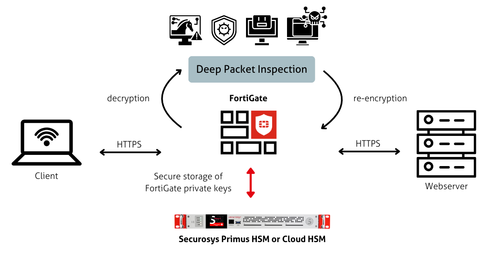

import Tabs from '@theme/Tabs';
import TabItem from '@theme/TabItem';

# Fortinet FortiGate
### HSM Integration Guide

The integration of Securosys HSMs with **Fortinet FortiGate Next Generation Firewall (NGFW)** enhances security by offloading critical cryptographic key data to a tamper-resistant environment.

The Hardware Security Module (HSM) securely generates, stores, and manages private keys. During SSL/TLS inspection short-lived server certificates are issued using these protected keys on the HSM to decrypt the SSL/TLS encrypted traffic. After inspection and any necessary security remediation by FortiGate, the traffic is re-encrypted before being transmitted to its destination. This approach ensures that private keys used remain secure and are never exposed outside the HSM, thereby significantly reducing the risk of key compromise and bolstering the overall integrity of the security architecture.

Securosys Hardware Security Modules (HSMs) are available as:
- on-premises solutions (Primus HSM) or
- cloud service (CloudHSM). [CloudHSM](/cloudhsm/overview/) minimizes customers’ time for evaluation, setup, operation, redundancy, and maintenance of the HSM infrastructure. Moreover, it is scalable according to customer needs.

<figure className="image">
  
  <figcaption>
  FortiGate Securosys Primus HSM integration via built-in PKCS#11 Provider
  </figcaption>
</figure>

The **Fortinet FortiGate** firewalls have the Primus HSM PKCS#11 Provider built-in allowing to integrate easily Securosys on-premises Primus HSMs or CloudHSM (HSM as a service), enabling the following key benefits:
- **Secure Key Generation and Storage**

    Ensuring the security of cryptographic keys is critical for any organization. Securosys Primus HSM and CloudHSM provide high-entropy, hardware-based true random number generation and tamper-resistant environment. While FortiGate has built-in key generation and storage capabilities, offloading this task to Securosys HSMs further enhances the security of the SSL/TLS inspection process.

- **Compliance with Security Standards**

    Being compliant with regulatory requirements such as PCI-DSS, HIPAA, and GDPR demands rigorous control over cryptographic key management. Integrating FortiGate with Securosys Primus HSM or CloudHSM enables centralized management of keys and certificates on FIPS 140-2 Level 3 and Common Criteria EAL4+ certified hardware. This integration helps mitigate risks associated with key compromise and mismanagement, ensuring adherence to these stringent regulations.

## Target Audience
This document is intended for Securosys Primus HSM or CloudHSM users and administrators and IT professionals in charge of FortiGate administration. 

For on-premises HSM deployed operation administrative skills are required for Securosys Primus HSMs.

## Support Contact

If you encounter a problem while installing/configuring the PKCS#11 provider or
integrating the HSM with FortiGate, make sure that you have read the
referenced documentation. If you cannot resolve the issue, please
contact Securosys Customer Support. For specific requests regarding
Securosys integration with Fortigate, the Securosys
Support Portal is reachable under https://support.securosys.com.

## Getting Started with FortiGate & Securosy HSMs

For a smooth start integrating your Primus HSM with FortiGate:
- Consult the [Quickstart](/fortigate/quickstart) section for a comprehensive task listing.
- For detailed installation and configuration instructions, follow the [Installation](/fortigate/Installation/prerequisites) section.
- Try [Securosys CloudHSM](https://cloud.securosys.com/cloudhsm/) for free.

