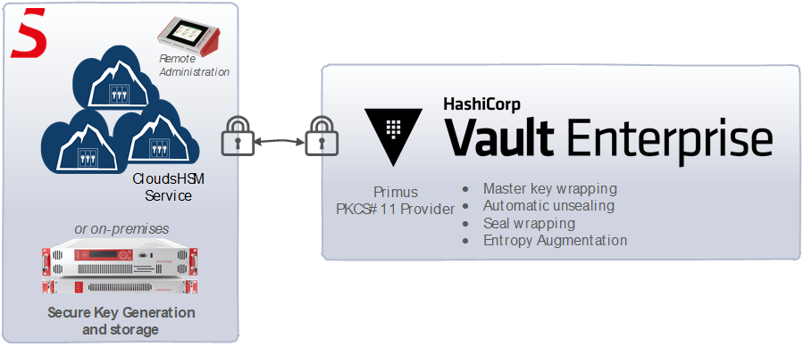

import Tabs from '@theme/Tabs';
import TabItem from '@theme/TabItem';

# HashiCorp Vault Entreprise & Hardware Security Module (HSM)

This document describes how to easily integrate Securosys [CloudHSM](../../cloudhsm/overview) (HSM as a service) or on-premises Primus HSM cluster with **HashiCorp Vault Enterprise**, enabling the advantages of Automatic Unsealing using the wrapped master key stored on the HSM, and to comply with regulatory requirements. 

HashiCorp Vault Enterprise HSM support allows: 
- Master key wrapping
- Automatic unsealing
- Seal wrapping
- Entropy augmentation

## Target Audience

This document is intended for Securosys Primus HSM or [CloudHSM](../../cloudhsm/overview)
administrators and IT professionals in charge of the **HashiCorp Vault Enterprise** administration.

The installation of the Securosys [Primus PKCS#11 Provider](../pkcs/overview) requires that you are already familiar with Windows or Linux administration.

For on-premises HSM deployed operation, administrative skills are required for Securosys Primus HSMs.

## Support Contact

If you encounter a problem while installing/configuring the PKCS#11 provider or
integrating the HSM with the plugins, make sure that you have read the
referenced documentation. If you cannot resolve the issue, please
contact Securosys Customer Support. For specific requests regarding
HashiCorp Vault Enterprise, the Securosys
Support Portal is reachable under https://support.securosys.com.

## What's Next

For a smooth start integrating your **HashiCorp Vault Enterprise** using the [Primus PKCS#11 Provider](../pkcs/overview):
- Consult the [Quickstart guide](./quickstart) for a comprehensive task listing.
- For detailed installation and configuration instructions, follow the [Installation](/hc-vault-enterprise/category/installation) section.
