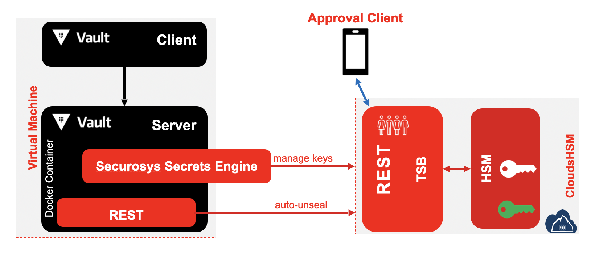

# Securosys' Secrets Engine Plugin

Most enterprises today have credentials scattered across their organizations. Passwords, API keys, and other credentials are often stored in **plain text**, application source code, configuration files, and various other locations, making their management quite challenging. Additionally, many of these credentials are stored in plain text, which increases the potential for **malicious attacks**.

**HashiCorp Vault** takes all of these credentials and centralizes them so that they are defined in one location, which reduces unwanted exposure to credentials. However, Vault takes it a few steps further by making sure users, apps, and systems are authenticated and explicitly authorized to access resources, while also providing an audit trail that captures and preserves a history of clients' actions.

**Securosys' Secrets Engine** is a plugin dedicated to Hashicorp Vault, compatible with both [ Community](../../hc_vault/overview) and [Enterprise](../../hc-vault-enterprise/overview) versions. The plugin uses the benefits from Transaction Security Broker (TSB) and _Primus HSMs_ to generate, store and apply the keys and make cryptographics operations with them.

Since HashiCorp Vault doesn't store the data sent to the Secrets Engine plugin, it can be viewed as **Encryption-as-a-Service**.

The **Secrets Engine plugin** comes with the following features:
- sign and verify data
- encrypt and decrypt data
- wrap and unwrap key
- supports Smart Key Attribute (SKA) workflow
- supports Key rotation
- supports integration for MariaDB database encryption

_Figure 1:Securosys Secrets Engine workflow with Hashicorp Vault Integration_
