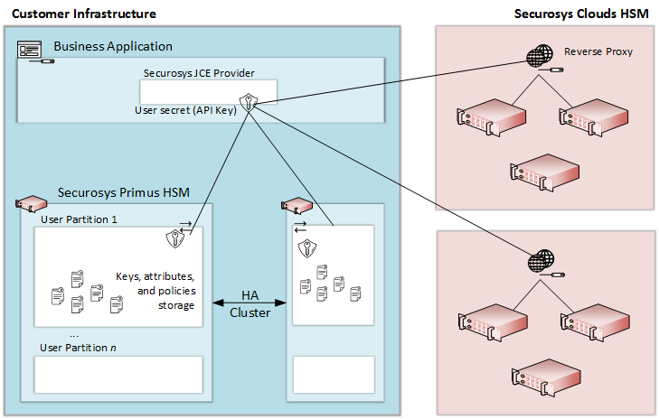

import Tabs from '@theme/Tabs';
import TabItem from '@theme/TabItem';

# Securosys JCE/JCA API Provider
### HSM Integration guide

The integration of Java Cryptography Extension (JCE) and Java Cryptography Architecture (JCA) with Securosys PrimusHSM provides a robust and secure solution for cryptographic operations within **Java applications**. 

This integration allows seamless communication with Primus HSM clusters and CloudHSM, ensuring the highest level of protection for key management and cryptographic processes.

## Key Features

|||
|---|---|
|Versatile Integration|JCE/JCA seamlessly integrates with PrimusHSM, offering a flexible and language-agnostic solution for Java applications.|
|Secure Cryptographic Operations|Enable cryptographic functionalities such as signing and encryption with the utmost security, leveraging the power of PrimusHSM.|
|Confidentiality and Integrity|Ensure the confidentiality and integrity of sensitive data by harnessing the capabilities of Hardware Security Modules.|
|Integration Workflow|Direct Connection to HSM Partition (User): Deploy JCE/JCA within your Java application to establish a secure and direct connection to a single HSM partition, allowing for cryptographic operations.|
|Flexible 1:n Configuration|Support a 1:n configuration where one JCE/JCA interface (Java application) connects with multiple HSMs or partitions.|

## Architecture
The following diagram explains at a high level the basic concepts of using our HSM in your own cluster or in our CloudHSM service.

<figure class="image">
  
  <figcaption>Note: JCE connection must be enabled both for the device and the user partition (enabled by default in the Dev Program).</figcaption>
</figure>

## Use Case
The documentation provides copy, paste sample codes on incorporating JCE/JCA functionalities, including:

- Key generation
- Signing payloads using the keys created
- TLS establishing SSL secure sockets (secure transport layer)
- PKCS12
- Certificate handling
- Integrated Encryption Scheme
- CryptoCurrency

This integration empowers your Java applications with robust cryptographic capabilities, ensuring the highest standards of security for your data.

## Getting started with JCE/JCA Provider

Start by using the guidelines provided in [this guide](./quickstart.md) to set up your initial connections. The guide offers step-by-step instructions for configuring connections in both on-premises and cloud environments, making the process straightforward.