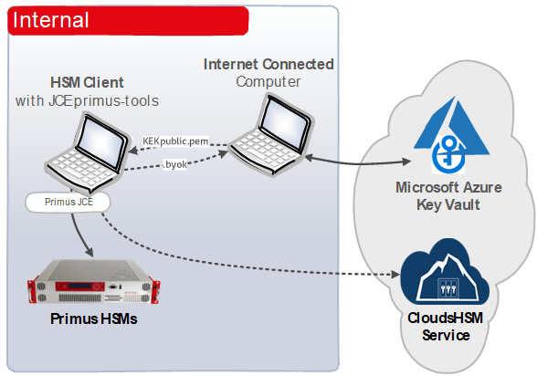

import Tabs from '@theme/Tabs';
import TabItem from '@theme/TabItem';

# Azure Bring Your Own Key (BYOK)
### HSM Integration guide

Azure Key Vault is a managed service that enables you to safeguard cryptographic keys and other secrets used by cloud applications and services. With Azure Key Vault, you can easily create, store, and control access to keys used to encrypt your data, as well as secrets such as passwords, API keys, and certificates. Azure Key Vault seamlessly integrates with Azure services and provides a secure and centralized solution for key management.

Azure BYOK (Bring Your Own Key) empowers you with greater control over the lifecycle, security, and durability of your keys. This integration guide illustrates the straightforward process of integrating Securosys CloudHSM (HSM as a Service) or on-premises Primus HSM cluster with Azure Key Vault BYOK. By leveraging secure key generation and storage on the HSM, you can enhance the security of your data and meet regulatory requirements with ease.

Securosys CloudHSM is a Hardware Security Module (HSM) available as cloud service, without having to worry about time consuming things like evaluation, setup, operation, redundancy, and maintenance of the HSM infrastructure, and is scalable according to your needs. The redundant cluster architecture, providing different redundant regions up to redundant worldwide cluster, integrates perfectly to bring your own key to Azure Key Vault.

This document describes how to easily integrate Securosys CloudHSM (HSM as a Service) or on-premises Primus HSM cluster with Azure Key Vault BYOK, enabling the advantages of secure key generation and storage on the HSM, and to comply with regulatory requirements.

## Target Audience

This document is intended for Securosys Primus HSM or CloudHSM
administrators and IT professionals. The Azure BYOK Procedure 
requires that you are already familiar with Microsoft Azure.

For on-premises HSM deployed operation administrative skills are
required for Securosys Primus HSMs.

## Support Contact

If you encounter a problem while installing/configuring the provider or integration, make sure that you have read the
referenced documentation. If you cannot resolve the issue, please
contact Securosys Customer Support. For specific requests regarding
Securosys Azure BYOK, the Securosys
Support Portal is reachable under https://support.securosys.com.

## What's Next

For a smooth start with Azure Bring Your Own Key procedure:
- Consult the [Quickstart](/microsoft-byok/Quickstart.md) page for a comprehensive task listing.
- For detailed instructions, read and follow the [Installation](/microsoft-byok/Installation/Prerequisites) guide.
- Initiate the usage by reading and following the [Tutorial](/microsoft-byok/Tutorials/Generate-KEK) section.