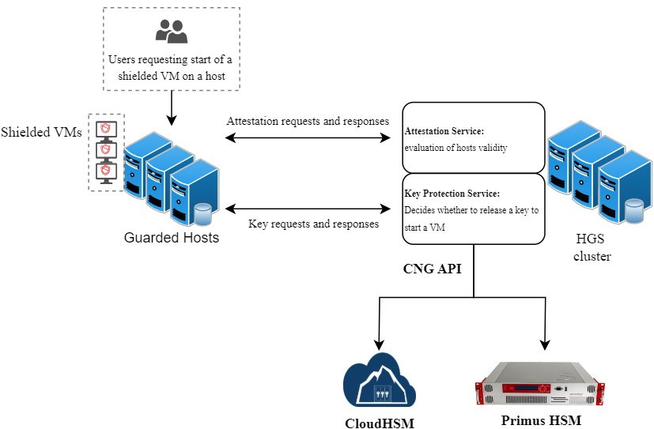

import Tabs from '@theme/Tabs';
import TabItem from '@theme/TabItem';

# Microsoft Host Guardian Service
### HSM Integration Guide

This document describes how to secure private keys used by the **Microsoft Host Guardian** by using the Securosys Primus HSM or Securosys CloudHSM service.

The [Microsoft Host Guardian Service (HGS)](https://learn.microsoft.com/en-us/windows-server/security/guarded-fabric-shielded-vm/guarded-fabric-manage-hgs) is the centerpiece of the guarded fabric solution. It is responsible for ensuring that Hyper-V hosts in the fabric are known to the hoster or enterprise and running trusted software and for managing the keys used to start up shielded VMs.

Securosys Primus HSMs safeguard the keys used to encrypt and sign protected virtual machines (VMs). These keys are securely stored in an encrypted format on the Host Guardian Server (HGS). Guarded Hosts provide a trusted environment to create and run Shielded VMs. The HGS verifies the trustworthiness of a Guarded Host before releasing the decryption key necessary to unlock the VM.

The decryption key is only released when the HGS confirms that the VM is in a verified clean state and has not been tampered with. This verification relies on a certificate issued by the HGS, attesting to the VM’s integrity.

The Primus HSMs are built to securely generate and store true random cryptographic keys, providing a central, certified secure storage. They also control and regulate access to the keys and the related cryptographic functionality. The Primus HSM combined with HGS meets or exceeds the best practice security requirements and is one step ahead of fulfilling your compliance demands by providing:
- Hardware-based secure generation of true random cryptographic keys,
- Central and highly secure storage of cryptographic keys,
- Load balancing and fail-over by clustering the HSMs,
- Controlled and regulated access to the keys,
- Hardware acceleration of cryptographic operations such as encryption, authentication, and digital signatures, relieving the host server of processor intensive computations,
- Scalable performance at manageable cost.

All certificate issuance and validation processes occur within the protected confines of the HSM. Private keys are never accessible outside the HSM.
The Primus HSM can easily be integrated in a Microsoft Windows system by installing the [Primus CNG Provider](../../mscng/overview). This enables all Windows servers and clients to generate and store their private keys and certificates securely in the HSMs, and perform all related cryptographic functionality, like signing or certificate validation, hardware accelerated on the Primus HSM.

## Attestation Workflow for Running Shielded VMs on HGS

The general workflow for running Shielded Virtual Machines on Guarded hosts:
1. A user requests the Guarded Host to run the Shielded VM. The Guarded Host requests for a key.
2. The HGS initially doubts the legitimacy of the host.
3. The Guarded Host provides health data established during its initial setup.  
4. The HGS validates the host's health and issues a certificate.  
5. The Guarded Host sends a follow-up request with the certificate.  
6. The HGS delivers the encrypted key to the Guarded Host, enabling the VM to operate.

## Target Audience

This document is intended for Securosys Primus HSM or Microsoft administrators and IT professionals in charge of the Microsoft Windows Host Guardian Service administration. This guide requires that you are already familiar with Microsoft Windows Server as well as Host Guardian Service and Hyper-V administration.

For on-premises HSM deployed operation administrative skills are required for Securosys Primus HSMs.

## Support Contact

If you encounter a problem while installing/configuring the provider or
integrating the HSM with Microsoft SignTool, make sure that you have read the
referenced documentation. If you cannot resolve the issue, please
contact Securosys Customer Support. For specific requests regarding
Securosys integration, the Securosys
Support Portal is reachable under https://support.securosys.com.

## What's Next

For a smooth start integrating your Primus HSM with Microsoft HGS using the Primus CNG/KSP Provider:
- Consult the [Quick Start](./Quickstart.md) for a comprehensive task listing.
- For detailed instructions, read and follow the [Installation](/ms-hgs/Installation/Installation.md) guide.