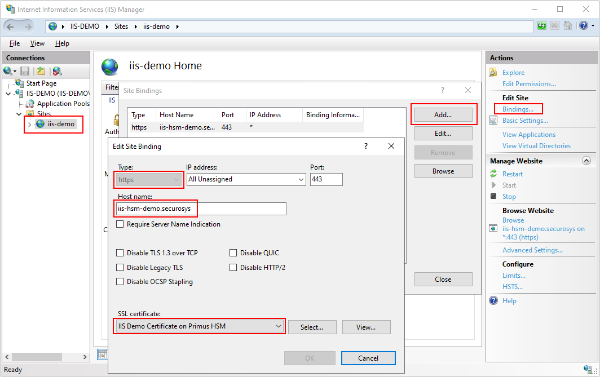

import Tabs from '@theme/Tabs';
import TabItem from '@theme/TabItem';

# Binding Certificate Using IIS Web Server

To bind the certificate with a secure IIS Web Server:
- Open IIS Manager, press `Windows` key + `R`, then type `inetmgr`
  - Alternatively, press `Windows` key and type `iis`
- Under Sites on the left-hand side, select the desired Web site, e.g. `test`
- On the right-hand side of the IIS Manager, click **Bindings...**
- In the Site Bindings window, click **Add**
- Provide the following details:
  - Type: **https**
  - IP address: Machine running IIS
  - Host Name: Provide a valid host name where the application should resolve to
  - SSL certificate: Select the certificate from the dropdown list (option uses Cert Friendly Name)
- Click OK, open a browser and go to your website URL, e.g. `https://iis-hsm-demo.securosys`

