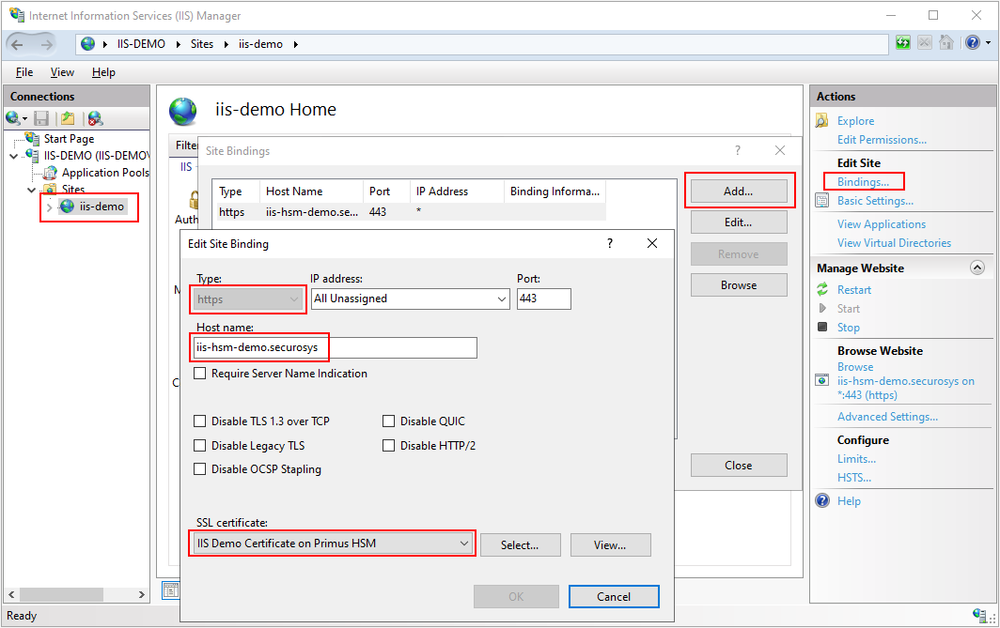

# Getting Started with Microsoft IIS
### HSM Integration Guide

The quickstart section provides a comprehensive guide outlining the steps necessary to integrate Microsoft IIS with **Hardware Security Modules (HSMs)**, on-premises or CloudHSM.

For more detailed instructions consult the [Installation](/ms-iis/category/installation) and [Tutorial](/ms-iis/category/tutorial) sections.

# Prerequisites

Make sure to adhere to the below listed hardware and software prerequisites before starting work. For more details, please visit the [Prerequisites](/ms-pki-adcs/Installation/Prerequisites) page.

:::note
The Primus HSM must be configured and licensed to work with CNG API. With the CloudHSM ECO and SBX service this requirement is met and therefore no additional action is required.
:::

### Download and Configuring Primus CNG Provider
Download and configure the [Primus CNG/KSP HSM Provider](/mscng/overview).


### Generate Certificate
#### Using Microsoft ADCS
[Microsoft ADCS](/ms-pki-adcs/Tutorials/Standalone-Root-Ca/Setup-Overview) requires template definitions - prepare your `.inf` file and run
```powershell
certreq.exe –new iis-certrequest.inf iis-certrequest.req
```
Submit the signing request to your MS ADCS by running.
```powershell
certreq.exe -submit -attrib “CertificateTemplate:WebServerHSM3” iis-certrequest.req
```
#### Using a public certificate, signed by an official public CA
Adjust your `.inf` file and run (same command as for ADCS)
```powershell
certreq.exe -new iis-certrequest.inf iis-certrequest.csr
```
Submit the Signing Request to your CA of Choice.

:::note
A breakdown of all the steps and details instructions are provided on the [IIS Generating and Installing Certificate](/ms-iis/Installation/Installation-Overview) page.
:::
### Install Signed Certificate
Once you have signed your certificate, install it on your server by running.
```powershell
certreq.exe –accept -machine <certificateFilename.cer>
```
### Bind Certificate to Application via IIS
In IIS, create your Application, add bindings, set the type to https and select the SSL certificate you created.



For a breakdown of the steps, you can visit our Tutorial page on [Binding Certificate Using IIS Web Server](/ms-iis/Tutorials/Binding-app).