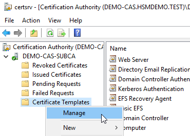
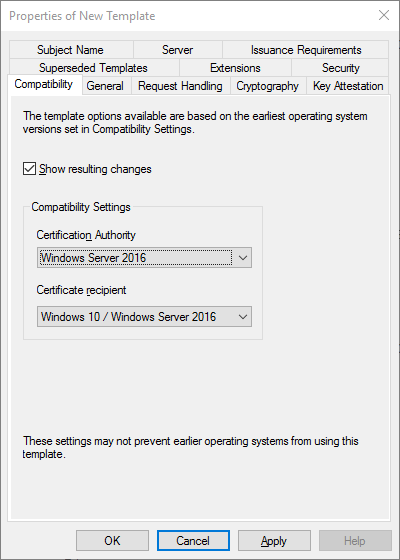
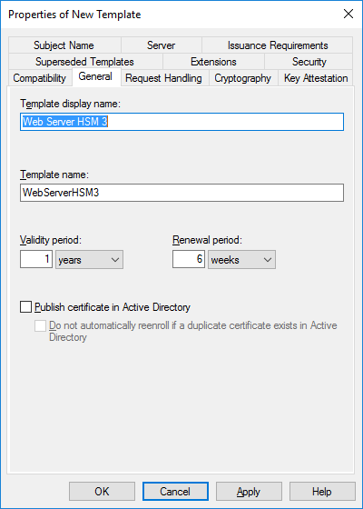
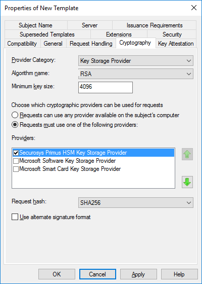
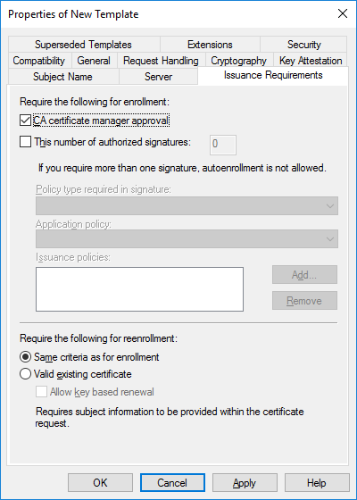
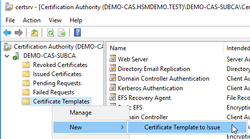
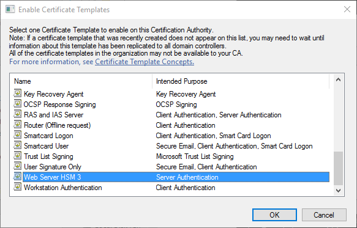
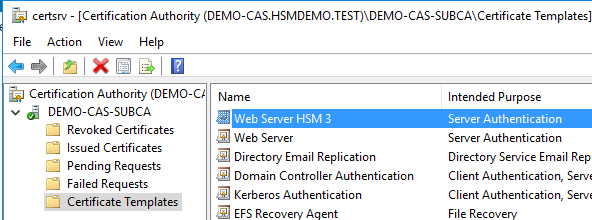

# Deploying Certificate Templates

As a starting point, Microsoft AD CS (Enterprise CA) provides several certificate templates, stored in Active Directory. These templates predefine common properties to apply (e.g. CNG provider, key length, validity, auto-enrollment, etc.) and are also used to define the enrollment policy on the CA.

An **Enterprise CA** can only issue certificates based upon the templates it is configured to use. When requesting a certificate, a client can just specify the template name in the request and the CA will build the certificate based upon the requestor’s information in Active Directory and the properties defined in the template. Version 3 templates are required to support the CNG (HSM). 

Once the CA infrastructure ready, continue by adapting and deploying the essential certificate templates.

## Modifying the Certificate Request Templates

- On the subordinate CA server, open the CA console (certsrv), right-click Certificate Templates and select Manage. 

- Choose your target template, right-click and select **`Duplicate Template`**. Modify the definitions according your needs (**`Compatibility`**, **`General settings`**, **`Cryptography`**). The following is a sample template definition, using Securosys HSM as Key Storage Provider. 

:::note
CNG requires compatibility settings for at least Windows Server 2016 or higher.
:::

- Then publish the modified templates for issuing certificates. This is done from Certificate Templates folder of CA console. Right-click **`Certificate Templates`**, click **`Certificate Template to Issue`** and select the templates to publish, then click **`OK`**. The steps are depicted below:

