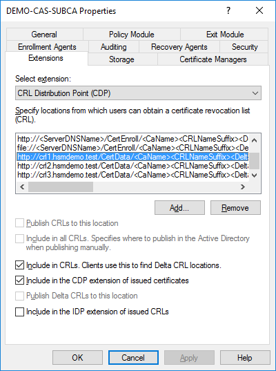
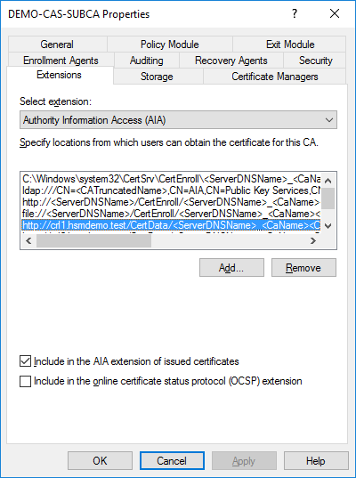
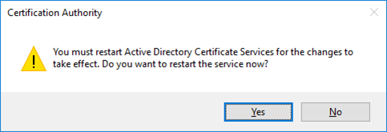

# Adapting Publication Points

For more flexibility, use DNS names, pointing to the Sub-CA, the IIS web-server and an external web-server.

To adapt the publication points, follow the steps below:
- In **`certsrv`**, in the **`Explorer`** pane, click our **`SUBCA`**, then in the Action menu, click **`Properties`**
- Click the **`Extensions`** tab and add the CRL distribution points for the SUBCA according the ROOTCA.
```sh
http://crl1.hsmdemo.test/CertData/<CaName><CRLNameSuffix><DeltaCRLAllowed>.crl
http://crl2.hsmdemo.test/CertData/<CaName><CRLNameSuffix><DeltaCRLAllowed>.crl
http://crl3.hsmdemo.test/CertData/<CaName><CRLNameSuffix><DeltaCRLAllowed>.crl
```
- Also add a new location for AIA pointing to our domain controller with an optional setting as:
```sh
http://crl1.hsmdemo.test/CertData/<ServerDNSName>_<CaName><CertificateName>.crt 
http://crl3.hsmdemo.test/CertData/<ServerDNSName>_<CaName><CertificateName>.crt 
```






- Restart the AD CS service.



