# Setting up the AD CS Role

## 1. Install the AD CS Role 
Select the following AD CS Role Services to install the Certification Authority (and Certification Authority Web Enrollment in case you want to run the web server on this machine).

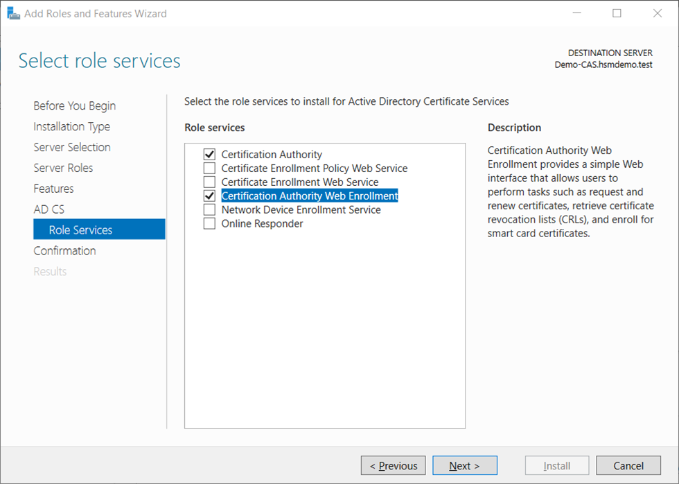

## 2. Configure the AD CS Role
- Login as **Domain Administrator** (or dedicated CA administrator) to configure the Enterprise Subordinate CA.

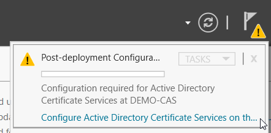
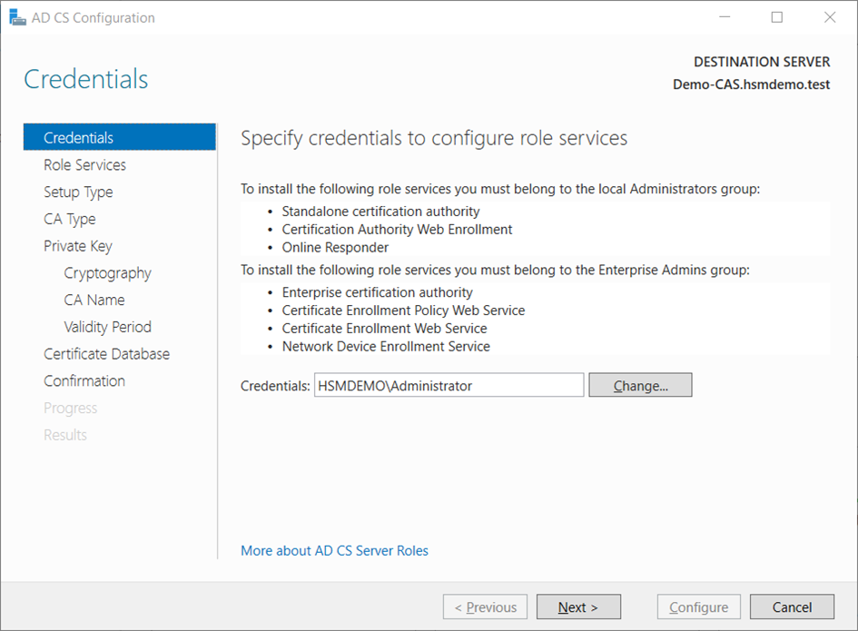

- On the **`Role Services`** window, select **`Certification Authority`** (and **`Certification Authority Web Enrollment`** in case you want to run the web server on the same machine). Click **`Next`**.

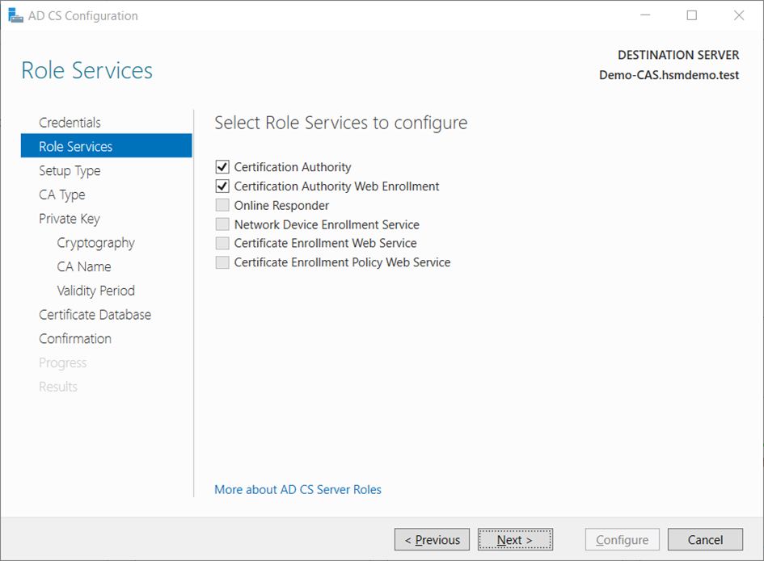

- On the **`Setup Type`** window, select the appropriate CA setup type for your requirements, in our case the **`Enterprise CA`**. Click **`Next`**. 

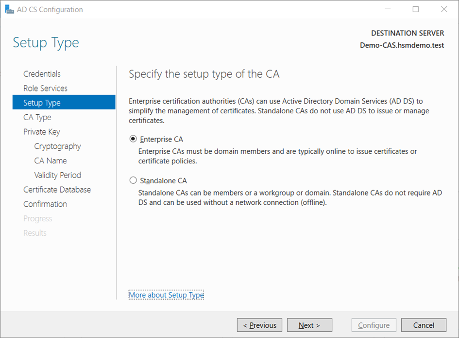

- On the **`CA Type`** window, select **`Subordinate CA`**. Click **`Next`**. 

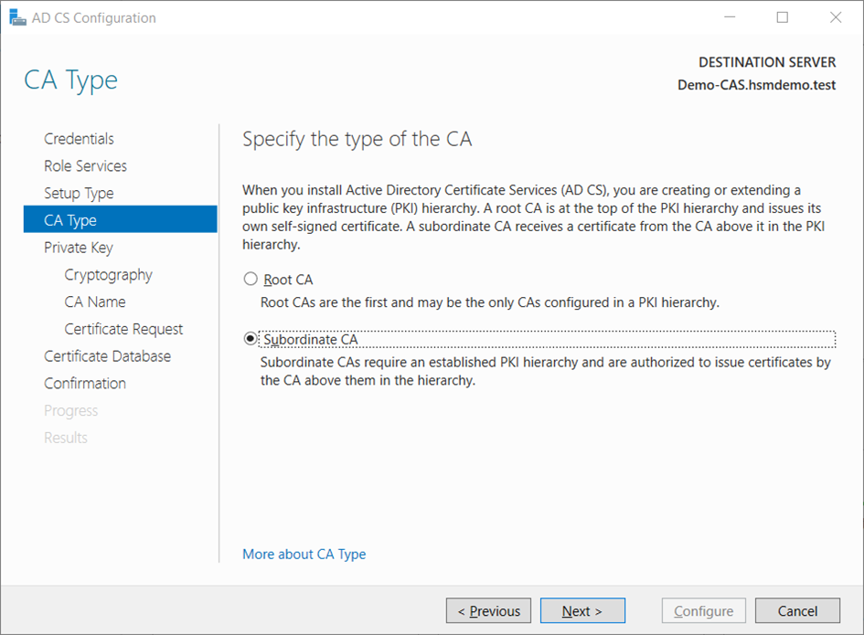

- On the **`Private Key`** window, leave the default selection to **`Create a new private key`** selected. Click **`Next`**.

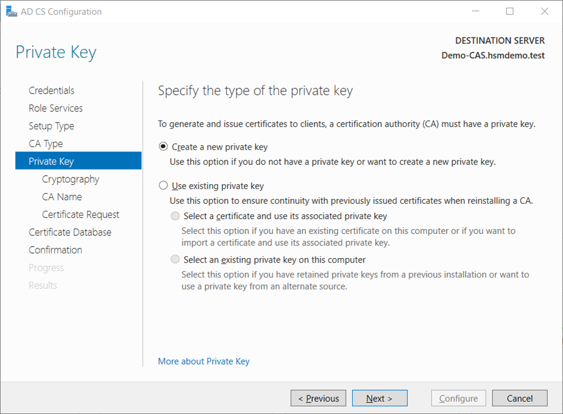

- On the **`Cryptography for CA`** window, select the **`RSA#Securosys Primus HSM Key Storage Provider`** along with the key type, key length and suitable hash algorithm. Please consider that some older devices and applications do only support key lengths up to 2048 bit. Then click **`Next`**.

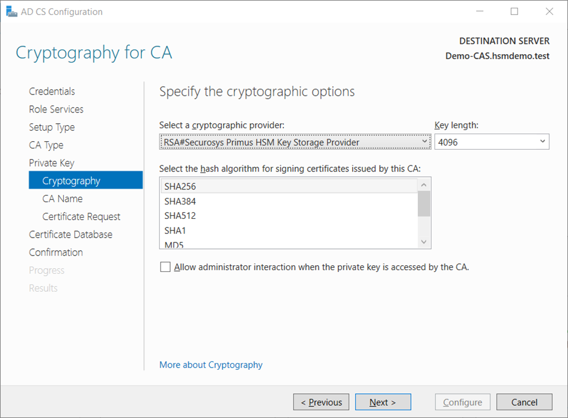

- On the **`CA Name`** window, give the appropriate CA name and click **`Next`**.

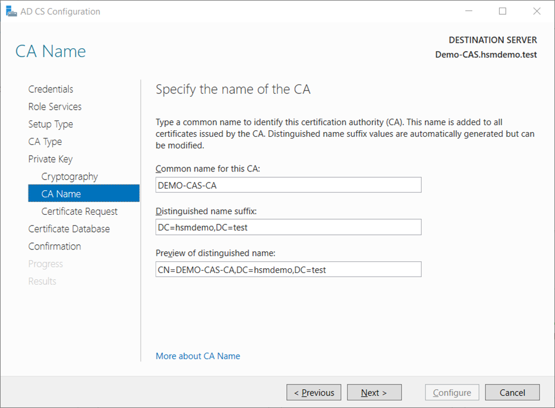

:::note 
You should not use the name of the computer nor FQDN. 
:::

- On the **`Certificate Request`** window, select **`Save a certificate request to file on the target machine`** be-cause our Root CA is offline.

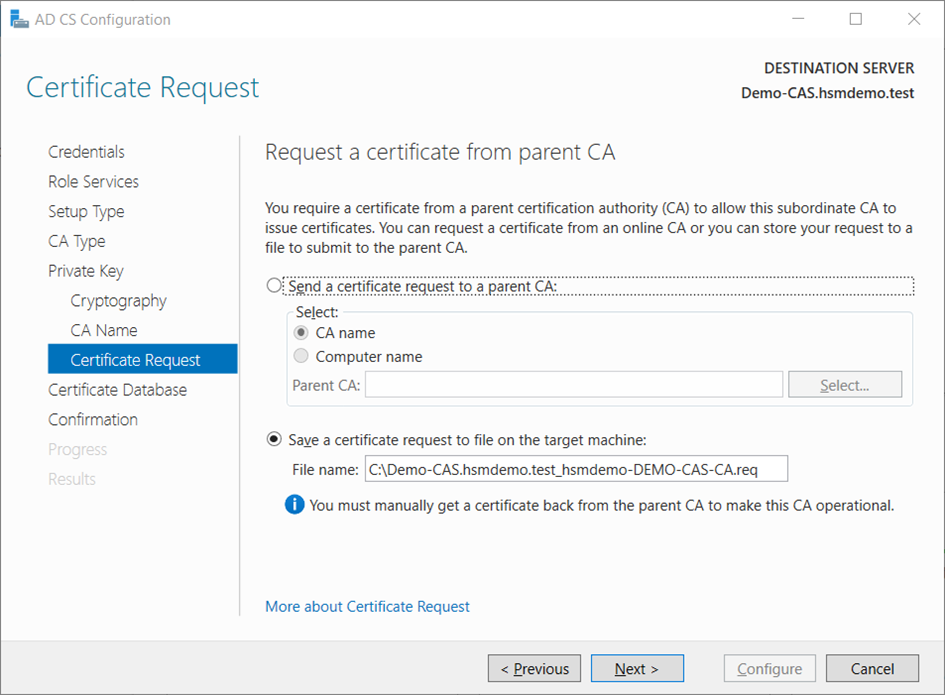

- On the **`CA Database`** window click **`Next`** to use the defaults. 
- Review your settings on the **`Confirmation`** window and click **`Configure`**.

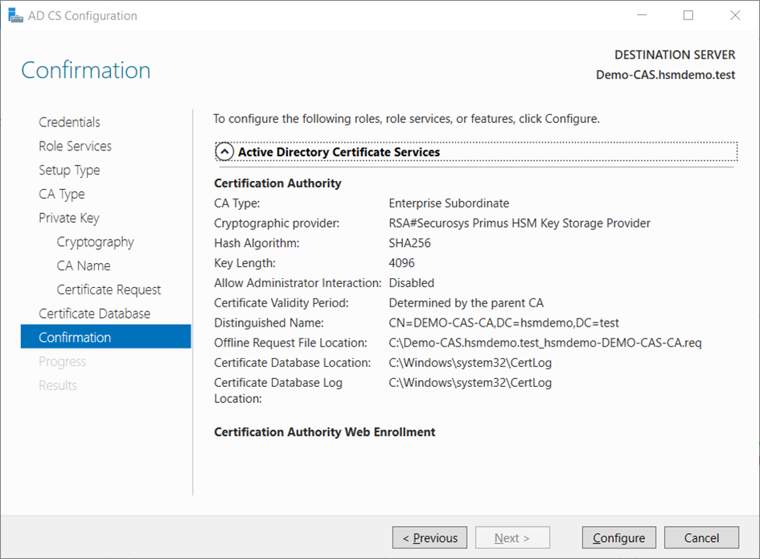

The request file to be signed by the Root CA is saved locally.

- On the **`Results`** window click **`Close`**.

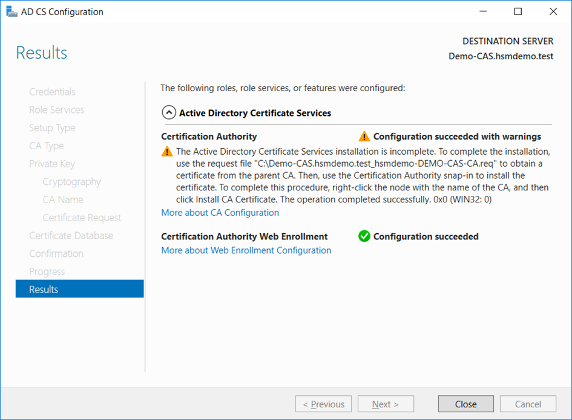

- On the subordinate CA, install the root CA certificate (**`.cer`**) in the local machine’s Trusted Root CA certificate store by right-clicking the file and then **`Install Certificate…`** 

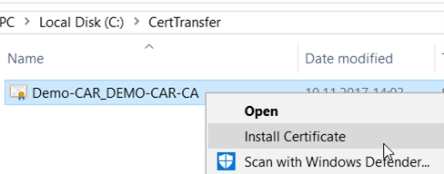
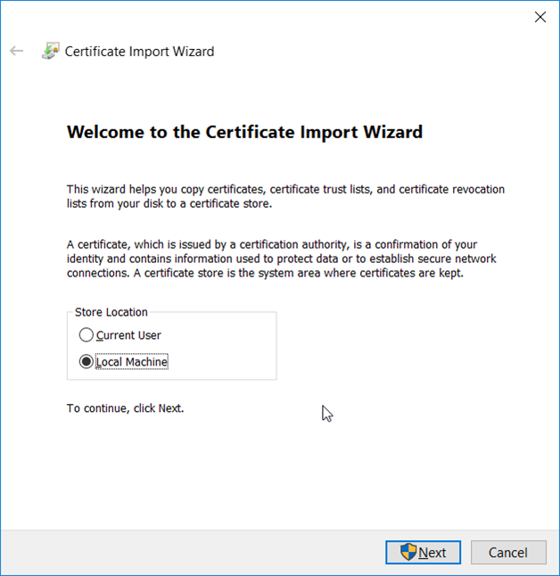
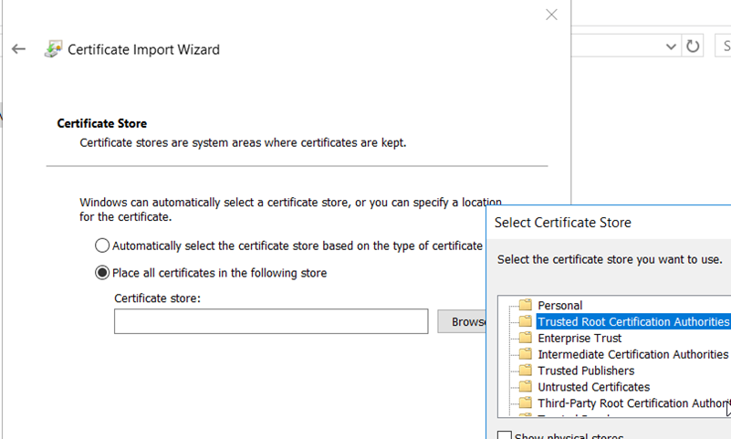
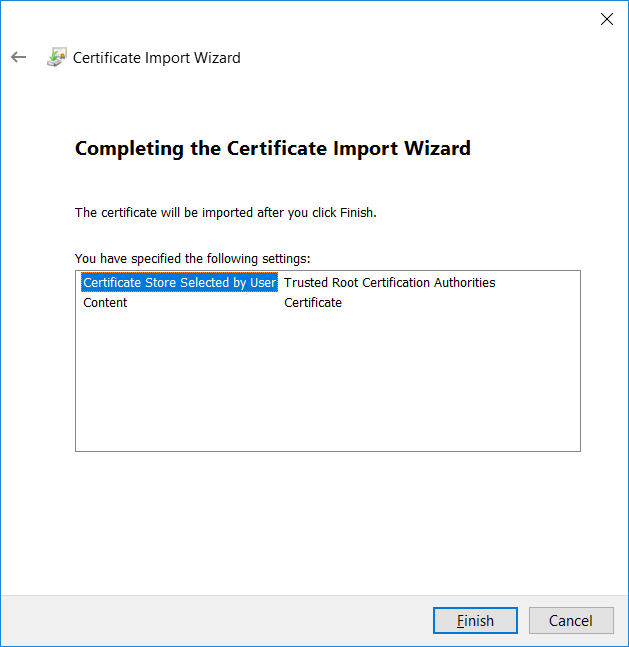

- In case of using CRL distribution by the IIS web-server, create the directory **`C:\inetpub\wwwroot\certdata`** on the web-server and copy the **`.crl`** and **`.crt`** files from the root CA server to the above folder.

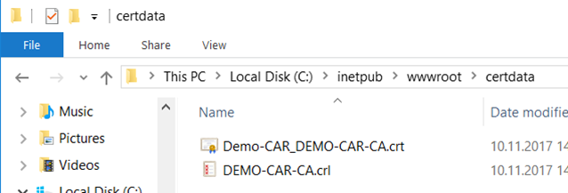

