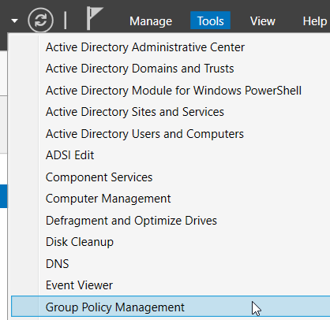

# Distributing Root CA Certificate to Domain
- At this time, distribute the root CA certificate to the domain by importing the root CA certificate into Trusted Root CA of Public Key Policies at an intended domain level GPO, and then the subordinate CA is in place. 
- Open **`Group Policy Management`**, then right-click **`Default Domain Policy`**, and then click **`Edit`**.

- In the **`Computer Configuration`** node, expand **`Policies`**, expand **`Windows Settings`**, expand **`Security Settings`**, expand **`Public Key Policies`**, right-click **`Trusted Root Certification Authorities`**, and then click **`Import...`**

- In the Certificate Import Wizard, click **`Next…`**
- Click **`Browse`** and select your root CA certificate:

- Click **`Open`** and continue with **`Next`**.

