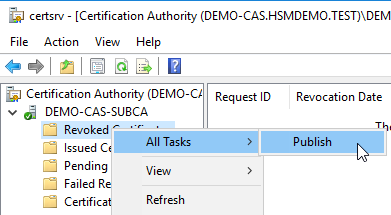
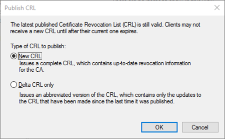

# Publish the Certificate Revocation List (CRL)

1) In **`certsrv`**, in the **`Explorer`** pane, expand our SUBCA
2) Right-click **`Revoked Certificates`**,
3) Point to **`All Task`**,
4) Click **`Publish`**. 
5) In the Publish CRL box, click **`OK`**.

