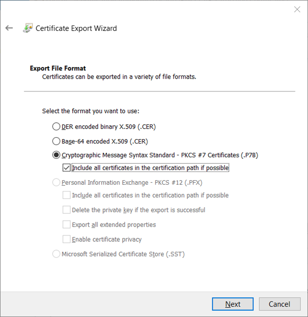

# Signing CSR with Root CA
Copy the subordinate CA’s request file **`.req`** from the subordinate CA to the root CA for acquiring a certificate in **`.p7b`** with complete certificate chain for the subordinate CA accordingly. On the root CA server, open the CA console to submit the request file, **`Demo-CAS.hsmdemo.test_hsmdemo-DEMO-CAS-CA.req`**, as shown below. 

- Once submitted, the request will be placed in the folder **`Pending Requests`**. 

- Right-click the pending request, select **`All Tasks`** and **`Issue`**. Once issued, the certificate will then be listed in the folder **`Issued Certificates`**.
- Select the issued certificate and click **`Open`**.

- On the **`Details`** tab select **`Copy to file `**

- In the Certificate Export Wizard click **`Next`**, on the **`Export File Format`** page select the **`.P7B`** format and check the **`Include all certificates in the certification path if possible`** check box, and click **`Next`**.

- Once the **`.p7b`** certificate is exported, open it and examine all certificates for establishing the trust as shown below.

- Finally, on the subordinate CA server, at this time the CA service is stopped. Use CA console to install the **`.p7b`** certificate followed by starting the CA service.

In case you get the error message **`Cannot verify certificate chain. …`** consult [Troubleshooting](/ms-pki-adcs/Tutorials/Troubleshooting/Helpful-Tools.md). Start the CA, if not started automatically.

- The following shows that once the CA service has successfully started, the icon is now with a green check mark.

