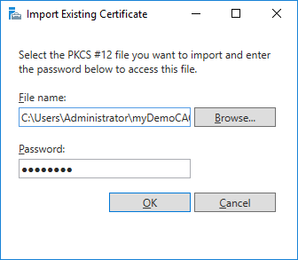

# Migrating an exportable Private Key
The procedure here assumes that you already have
- A current backup of AD CS **`certificate, private key, database, and registry settings`** (see [Backup AD CS](/ms-pki-adcs/Tutorials/Migrating-MPKI-to-HSM/Backup-ADCS.md))

```sh
certutil -backup myDemoCA KeepLog

reg export HKLM\SYSTEM\CurrentControlSet\services\CertSvc myDemoCA\myCAregistry.reg
```

- Re-/Installed AD CS on the new server (Add roles and features), but **not yet configured!**

# Configuring New AD CS instance
- Configure a new AD CS service and continue until you get to the **`Private Key`** section:
- Select **`Use existing private key`** and the option **`Select a certificate and use its associated private key`** and click **`Next`**


- Click **`Import`** in the **`AD CS Configuration`** window, select the PKCS#12 backup file containing the private key to import and select the imported certificate:


- Click **`Next`**, leave the default database and log file settings, click Next and click Configure.
- Open a Command Shell with administrator rights and stop the AD CS services by running the following command:
```sh
net stop certsvc

The Active Directory Certificate Services service is stopping.
The Active Directory Certificate Services service was stopped successfully.
```
- Restore the AD CS backup using the Restore wizard:




- Select both options, and indicate the directory where the backup is located. 


- Click **`Next`** and provide the password for the protected PKCS#12 container.
- Click **`Next`**, verify the information and click **`Finish`**.
- Click **`No`** as we will restart AD CS services later.


- Restore Registry Information: <br />
    Open the previously exported registry file in your preferred editor. <br />
    Locate **`CAServerName`** and change the value to your new Windows server name, e.g.:
``` "CAServerName"="W19SD-TEST" ```
- Save the file and run it to import the registry values.
- Restart AD CS services via GUI or use the command:
 ```sh
net start certsvc
```
- Consult chapter [Test and Cleanup](/ms-pki-adcs/Tutorials/Migrating-MPKI-to-HSM/Test&Cleanup) for final steps.
