# Migrating a not-exportbale Private Key
The procedure here assumes that you already have
- The private key on the Primus HSM/CloudHSM, not exportable (but modifiable).
- Re-/Installed AD CS on the new server (Add roles and features), but **not yet configured!**
- A current backup of AD CS database, certificate, and registry settings (similar to [Backup AD CS](/ms-pki-adcs/Tutorials/Migrating-MPKI-to-HSM/Backup-ADCS), but the private key cannot be exported, and the certificate is exported separately):

```sh
certutil -backupdb myDemoCA KeepLog

certutil -ca.cert myDemoCA.cer

reg export HKLM\SYSTEM\CurrentControlSet\services\CertSvc myDemoCA\myCAregistry.reg
```


# Renaming the Key Prefix for the new Server SID

As network attached HSM, the Primus HSM CNG/KSP Provider has to deal with keys used for different key scopes from different Windows machines organized in workgroups or domains, and from different user accounts. Accessibility of the different key spaces are handled by a so-called key prefix, a value based on Security Identifier (SID) and Relative Identifier (RID) of the machine or user account, depending on the key scope (machine or user key), the account type, and if the machine is standalone or domain-joined. 


Please consult the [Primus HSM CNG/KSP User Guide](/hsm/Installation/Setup/UserGuide/GetStarted/HSM-Setup-v2-11-1) for details and how to rename such key prefixes in case of migration to a new server.

- Open a **`Command Shell`** with administrator rights
- Determine the SID of your AD CS key with the **`ksputilcons`** tool (generated by the old server):
```sh
"\Program Files\Securosys\PrimusHsmKsp\ksputilcons.exe" enumkeys -a

Enumerating. Please wait .............

------------------------------------------------
Owner: S-1-5-21-4293965214-2831711143-3276927932
------------------------------------------------

+ Key name:                     myDemoCA
  Algorithm, size, type:        RSA, 2048 bit, PublicKey

+ Key name:                     myDemoCA
  Algorithm, size, type:        RSA, 2048 bit, PrivateKey
…
```
- Determine the SID of the new server by creating a test key and reading out the SID
```sh
"\Program Files\Securosys\PrimusHsmKsp\ksputilcons.exe" createtestkey -m

"\Program Files\Securosys\PrimusHsmKsp\ksputilcons.exe" enumkeys -a

Enumerating. Please wait ...............

----------------------------------------------------------
Owner: S-1-5-21-3441646867-1587263069-3547631177 (Machine)
----------------------------------------------------------

+ Key name:                     SecurosysPrimusHSM_CNGTestKey
  Algorithm, size, type:        RSA, 4096 bit, PublicKey

+ Key name:                     SecurosysPrimusHSM_CNGTestKey
  Algorithm, size, type:        RSA, 4096 bit, PrivateKey
```
- Rename the AD CS key pair key prefix with the following command option
```sh
ksputilcons chkeysowner <keyname> <oldowner> <newowner> [-v]
(see help option for details)
```
Example:
```sh
"\Program Files\Securosys\PrimusHsmKsp\ksputilcons.exe" chkeysowner myDemoCA S-1-5-21-4293965214-2831711143-3276927932 S-1-5-21-3441646867-1587263069-3547631177
```
- Check that the AD CS key pair is now visible from Windows using certutil:
```sh 
certutil -csp "Securosys Primus HSM Key Storage Provider" -key
Securosys Primus HSM Key Storage Provider:
  myDemoCA
  RSA
…
  myDemoCA
  RSA
```

## Configuring the New AD CS Instance
- Configure a new AD CS service and continue until you get to the **`Private Key`** section:

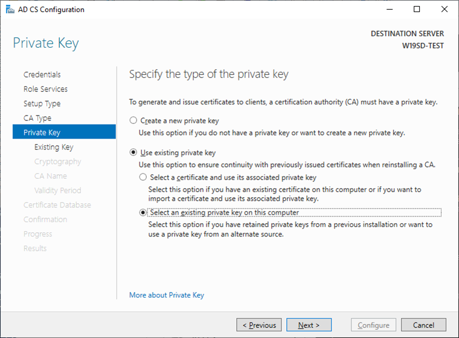

- Select **`Use existing private key`** and the option **`Select an existing private key on this computer`** and click **`Next`**.
- Click on **`Change`** to select another **`Key Storage Provider`**:

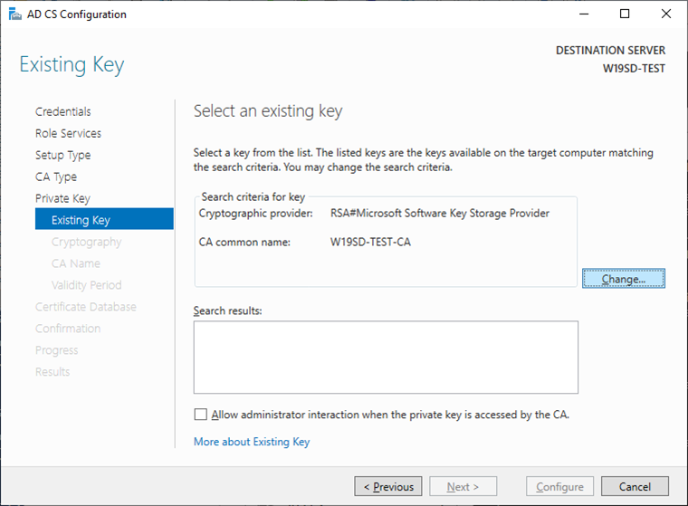

Select the appropriate Securosys Primus HSM Key Storage Provider and click **`Search`**:

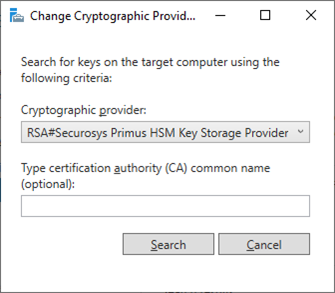

- Select your CA key and click **`Next`**.

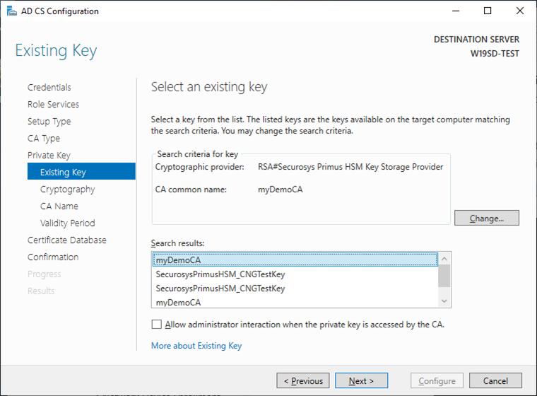

- Assign the Hash Algorithm that you used before (on the old server instance).

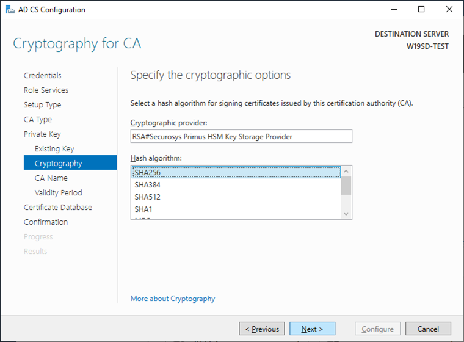

- Leave the original CA name and click **`Next`**.

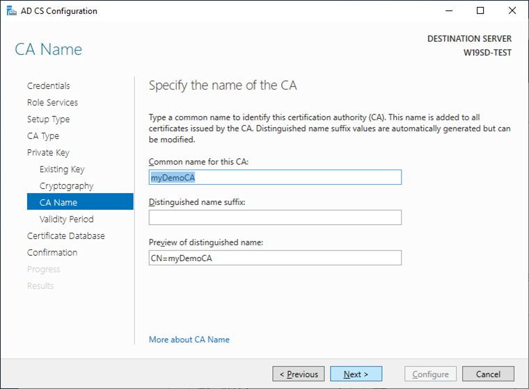

- Click **`Next`**, leave the default validity; <br />
click **`Next`**, leave the default database and log file settings; <br />
click **`Next`** and click **`Configure`**.
- Open **`Tools`**, **`Certificate Authority GUI`** and stop the AD CS services
(or via command **`net stop certsvc`**)

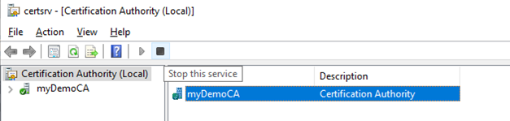

- Restore the AD CS backup using the Restore wizard:

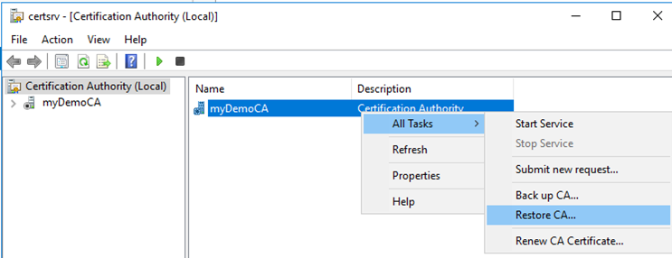

- Select only the option **`Certificate database…`** and indicate the directory containing the backup.

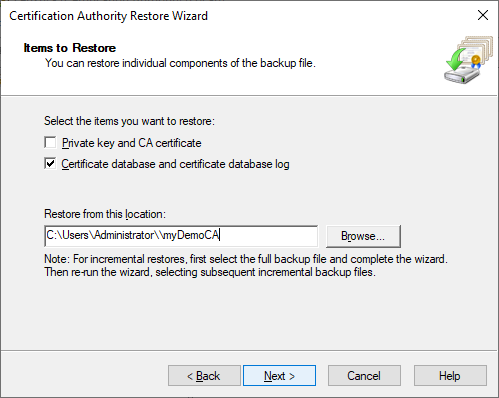

- Click **`Next`**, verify the information and click **`Finish`**.
- Click **`No`** as we will restart AD CS services later.

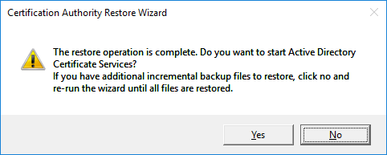

- Restore original Registry Information: <br />
    Open the previously exported registry file in your preferred editor. <br />
    Locate **`CAServerName`** and change the value to your new Windows server name
```sh
"CAServerName"="W19SD-TEST"
```
- Save the file and run it to import the registry values.
- Start the Local Machine Certificate Manager (**`Start`** then **`certlm.msc`**)
- Delete existing certificates with the name of your installed CA under <br />
    **`Personal – Certificates`** and <br />
    **`Trusted Root Certification Authorities – Certificates`**
- Import the original CA certificate under **`Trusted Root Certification Authorities – Certificates`**

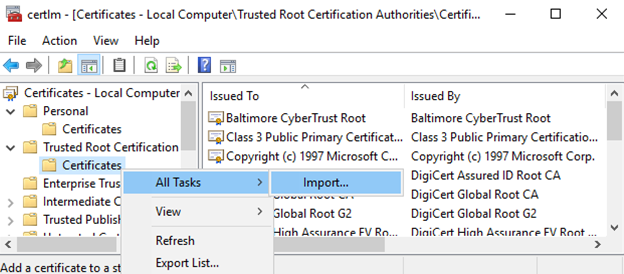

- Restart AD CS services via GUI.
- Consult chapter [Test and Cleanup](/ms-pki-adcs/Tutorials/Migrating-MPKI-to-HSM/Test&Cleanup)

## Further Steps
- Re-issue Certificate Templates
- Test your certification Authority functionality (CRL, OCSP, templates, …)
- …

If everything works correctly, the migration is completed. Cleanup all temporary files created during these migration steps (backup, export, registry files).
:::note
Ensure that you have removed (wiped) all the PKCS#12 backup or export files containing the CA key!
:::
