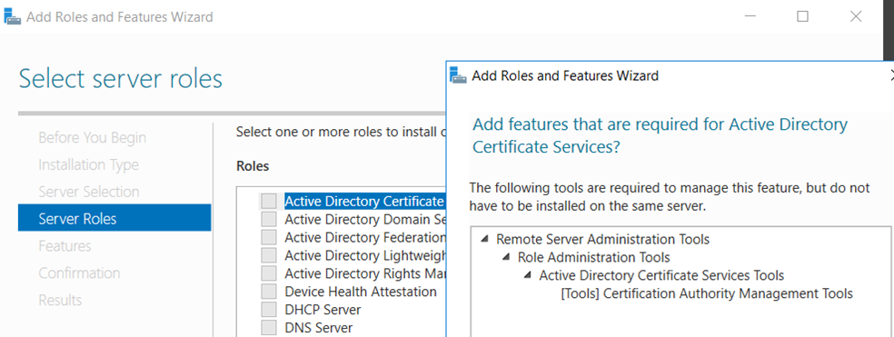

# Adding AD CS Role
We add the AD CS role to RootCA, on a non-domain joined stand-alone server.
- Click **`Start > Server Manager`** to open Server Manager.
- Click **`Manage`**, then click **`Add Roles & Features`**. The Before you begin window opens. Click **`Next`**
  

- On the Select installation type window, ensure the default selection of **`Role or Feature Based Installation`** is selected and click **`Next`**.
- On **`Server selection`**, select the server from the server pool and click **`Next`**.
- On the **`Select server roles`** window, select the **`Active Directory Certificate Services`** role. When prompted to install **`Remote Server Administration Tools`** click **`Add Features`**, then click **`Next`**.
 

- On the **`Select features`** window, click **`Next`**.
- On the **`Active Directory Certificate Services`** window, click **`Next`**.
- On the **`Select role services`** window, the **`Certification Authority role`** is selected by default. Click **`Next`**.
- On the **`Confirm installation selections`** window, verify the information and click **`Install`**.
