# Configuring Microsoft AD CS 

When the installation is complete, click **`Configure Active Directory Certificate Services`** on the destination server link. 

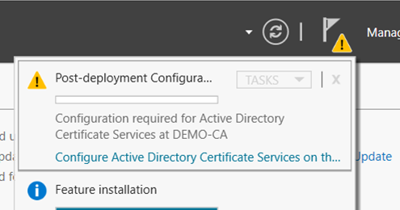

- On the **`Credentials`** window, ensure that **`Administrator's credentials`** are displayed in the **`Credentials`** box. If not, click **`Change`** and specify the appropriate credentials. Click **`Next`**.

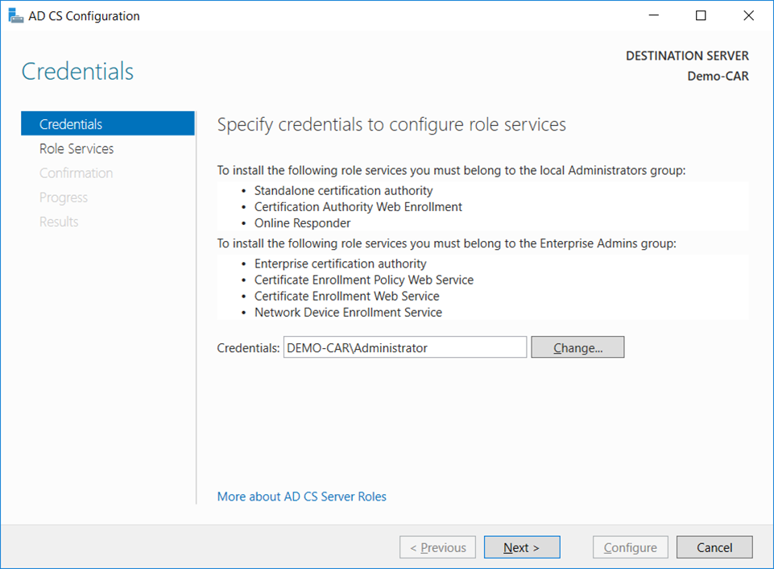

- On the **`Role Services`** window, select **`Certification Authority`**. This is the only available selection when the certification authority role is installed on the server. Click **`Next`**.

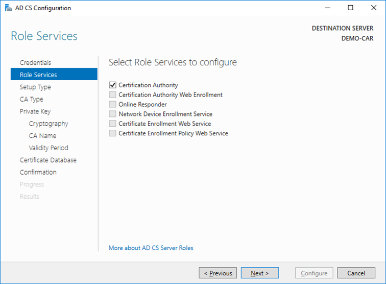

- On the **`Setup Type`** window, select the appropriate CA setup type for your requirements. Click **`Next`**.

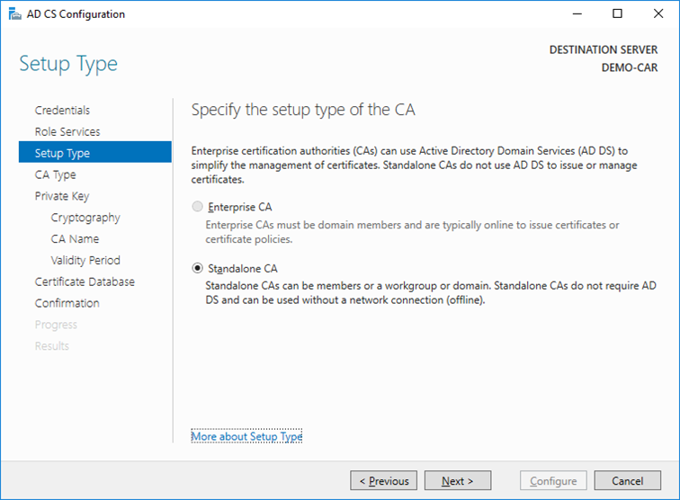

- On the **`CA Type`** window, **`Root CA`** is selected by default. Click **`Next`**.

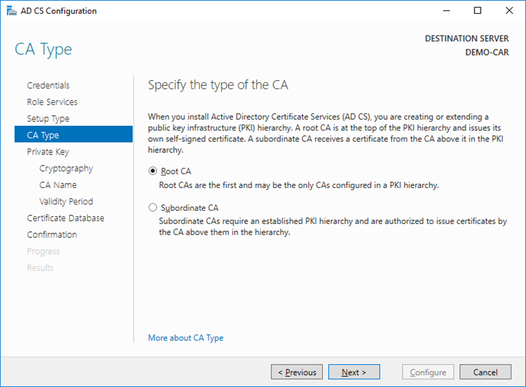

- On the **`Private Key`** window, leave the default selection to **`Create a new private key`** selected. In case you want to use existing keys, refer to chapter [Migrating Microsoft PKI to another Server Instance](/ms-pki-adcs/category/migrating-to-a-new-instance). Click **`Next`**.

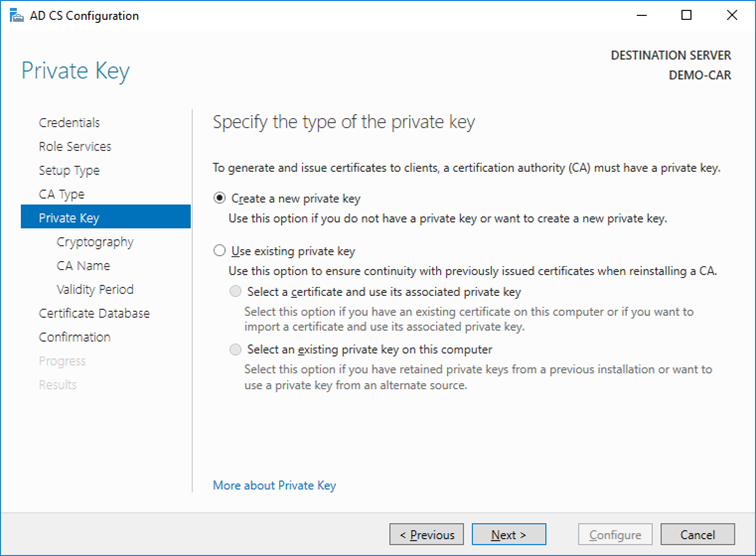

- On the **`Cryptography for CA window`**, select the **`RSA#Securosys Primus HSM Key Storage Provider`** along with the key type, key length and suitable hash algorithm. Please consider that some older devices and applications only support key lengths up to 2048 bits. Then click Next.

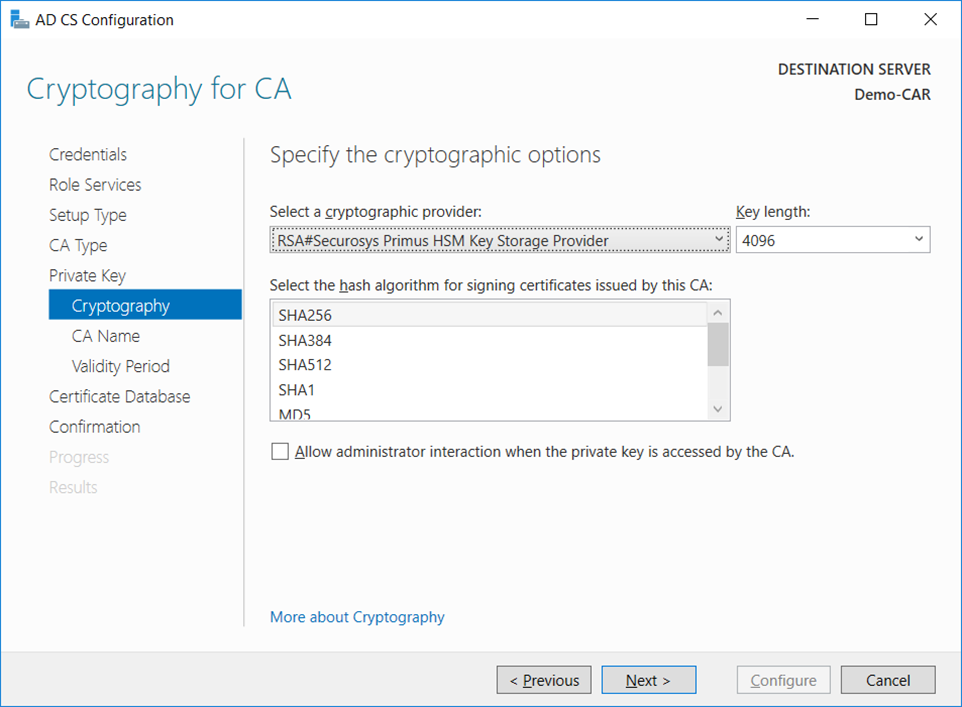

- On the **`CA Name`** window, give the appropriate CA name and click **`Next`**.

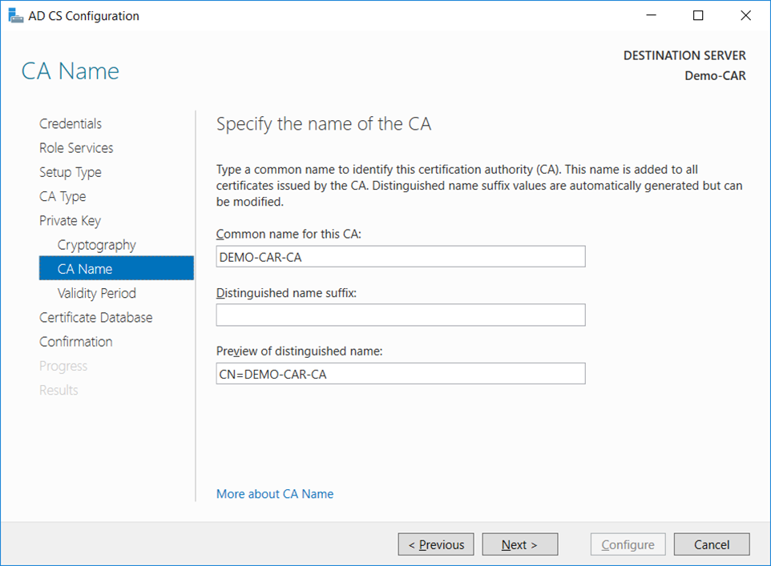

:::note
You should not use the name of the computer nor FQDN (consult TechNet Wiki article [Considerations for Certification Authority (CA) Names](http://aka.ms/caname))
:::

- On the **`Validity Period`** window, enter the number of years for the certificate to be valid and click **`Next`**.

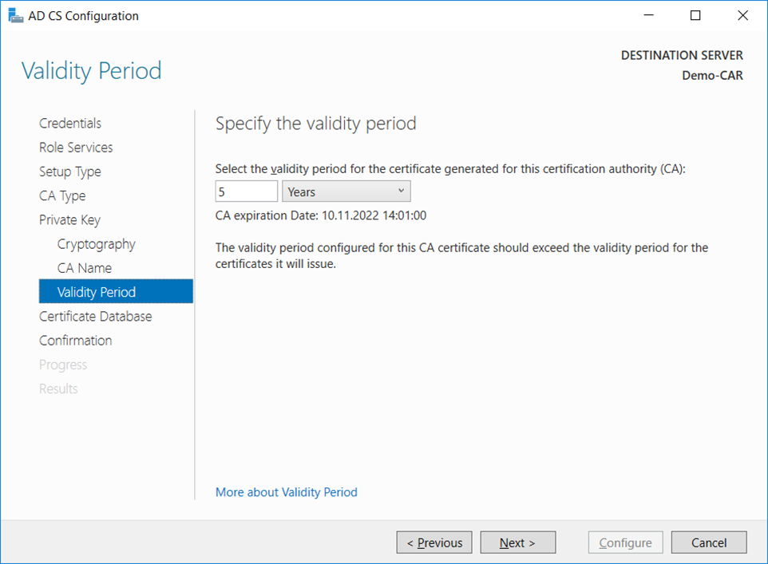

- On the **`CA Database`** window, leave the default locations for the database and database log files. Click **`Next`**.

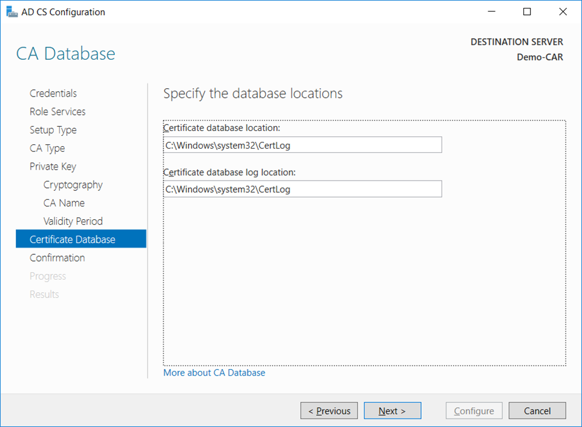

- On the **`Confirmation`** window, click **`Configure`**. 

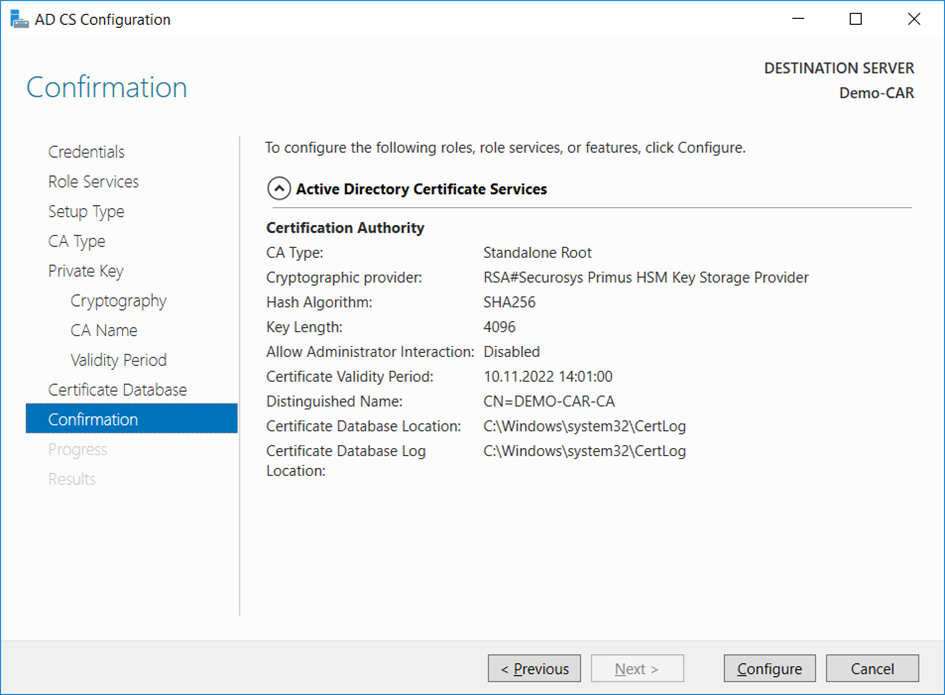

- The **`Progress`** window opens during the configuration processing, and then the **`Results`** window opens. Click **`Close`**. 
If the **`Installation progress`** window is still open, click **`Close`** on that window also.

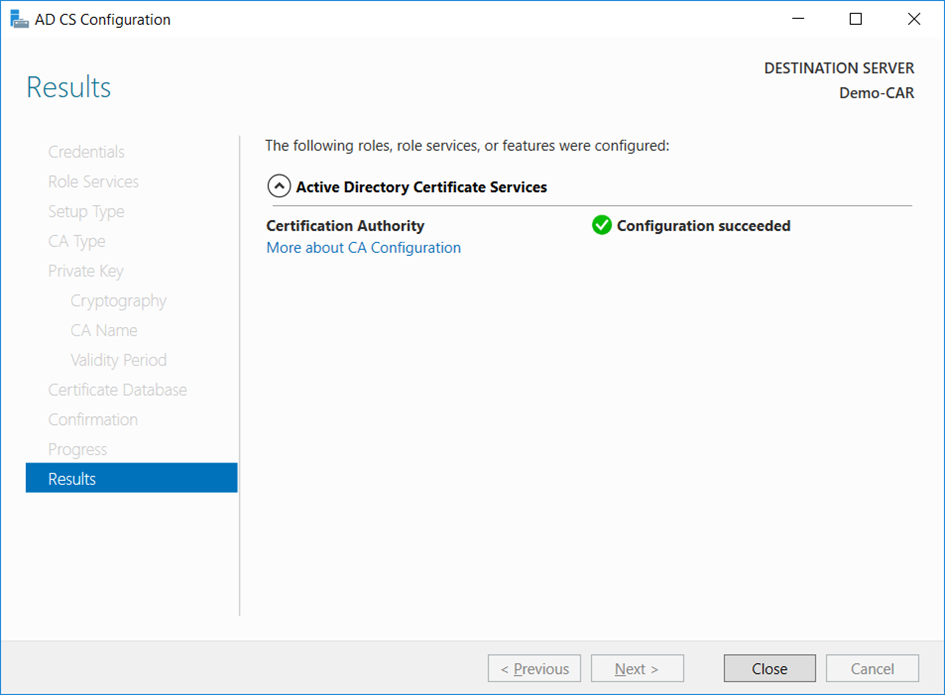

- Verify that the CA service has started successfully by running the following command on the command line. Use **`Windows key + R`** to open the Run dialog, and type **`cmd`** to open the command prompt. Run the command: 
```bash
sc query certsvc
```
