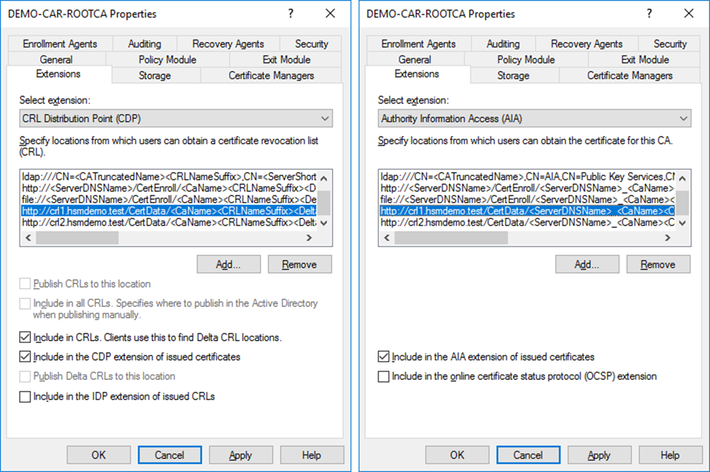
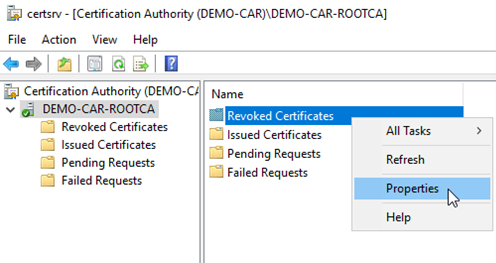
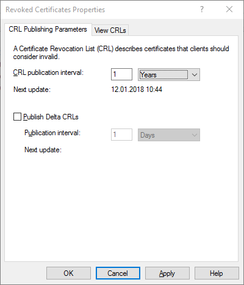
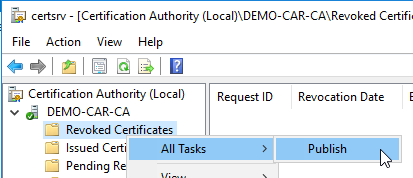
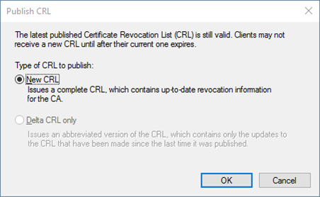
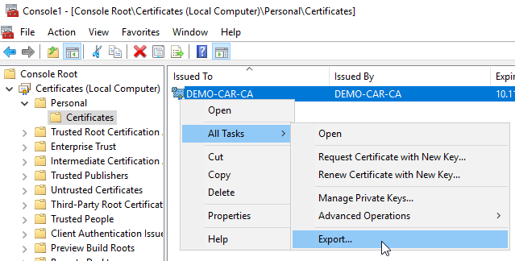
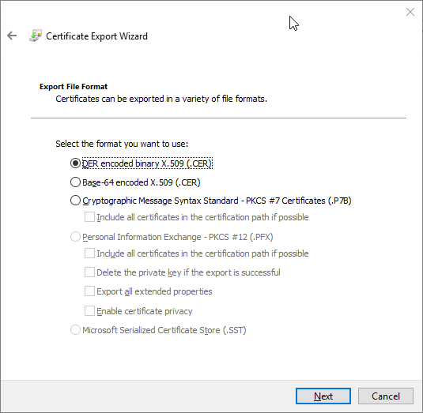
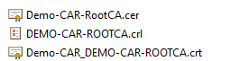

# Configuring CA Properties

Once the CA is created, we need to configure the CA properties with the information of the subordinate CA which will actually issue the certificates for our domain. This will include the certificate revocation list location and the authority information access location. 
The requirement that must be met in your design is determining URLs for:
- Certificate revocation list (CRLs) retrieval
- CA certificate retrieval
- Evt. Online Certificate Status Protocol (OCSP) responses

The certificate chaining engine can use the URLs stored in the CRL Distribution Point (CDP) (if CRL checking is being used) and Authority Information Access (AIA) extensions (if OCSP is being used) to determine a certificate’s revocation status.

At each CA in the hierarchy, you must define publication points for certificates issued by that CA. These publication points allow access to that CA’s certificate and CRL. The following protocols can be used when defining publication points:

- **Hypertext Transfer Protocol (HTTP) URLs** <br />
HTTP URLs are used for both internal and external publication points. The advantage of HTTP URLs is that there is little lag time between publication and availability. Once you publish an updated CRL or CA certificate to an HTTP URL, it is immediately available for download by PKI-enabled applications. In addition, HTTP URLs can typically be downloaded by clients behind firewalls and those who are not full AD DS clients, including those running an operating system earlier than Microsoft Windows 2000 and non-Microsoft clients.
- **Lightweight Directory Access Protocol (LDAP) URL** <br />
A CA certificate or CRL that is published to an LDAP URL is by default published into the configuration naming context of AD DS. This means that the CRL or CA certificate is available at all domain controllers in the forest. Although the default LDAP location references AD DS, you can publish a CA certificate or CRL to any LDAP directory, such as Active Directory Lightweight Directory Services. There are two disadvantages to using the default LDAP URL location:
- It can take some time for CRLs or CA certificates to fully replicate to all domain controllers in the forest. The actual time depends on your network’s replication latency, especially when the replication must take place between sites and not only between domain controllers in the same site.
- Non-support of the AD DS related LDAP URLs can lead to delays in CRL or CA certificate retrieval. If the default LDAP URL is the first URL in the URL listing, a non–AD DS enabled client will time out for ten seconds before it moves on to the next available URL.

The decision as to which protocols to implement for CRL or CA certificate publication points depends on the frequency at which you publish CRLs, the protocols allowed to traverse network firewalls, and your network’s operating systems. To ensure maximum availability, the URLs should be ordered so that the most common protocol used for CRL or CA certificate retrieval is listed first in the CDP extension. Other protocols are then listed in their order of usage.

There are different methods for configuring the Authority Information Access (AIA) and certificate revocation list distribution point (CDP) locations. You can use the user interface (in the Properties of the CA object), certutil, or directly edit the registry.

The AIA is used to point to the public key for the certification authority (CA). The CDP is where the certificate revocation list is maintained, which allows client computers to determine if a certificate has been revoked.

To be more flexible use DNS names, pointing to the Sub-CA, the IIS web-server and an external web-server. To adapt the publication points, follow the steps below:
- In **`Server Manager`**, on the Tools menu, click **`Certification Authority`**.
- In **`certsrv`**, in the Explorer pane, click our root CA, then in the Action menu, click **`Properties`**
- Click the **`Extensions tab`** and add a CDP pointing to the subordinate CA (or web server) which will be the one actually distributing certificates. In our case we use flexible URLs resolved via DNS. 
The following figure shows a target CDP with optional settings configured as the following:
```sh
http://Demo-CAS.hsmdemo.test/CertData/<CaName><CRLNameSuffix><DeltaCRLAllowed>.crl  or
http://crl1.hsmdemo.test/CertData/\<CaName><CRLNameSuffix><DeltaCRLAllowed>.crl
```
- Also add a new location for AIA pointing to our domain controller with an optional setting as:
```sh
http://Demo-DC01.hsmdemo.test/CertData/<ServerDNSName>\_<CaName><CertificateName>.crt  or
http://crl2.hsmdemo.test/CertData/<ServerDNSName>\_<CaName><CertificateName>.crt
```


- Press **`OK`** and **`confirm`** to restart the service.
- While Root CA is offline we will increase the CRL publication interval to 1 year for our example.




- After that we publish the revocation list.




In certificate manager, export the **`.cer`** file, i.e. without the private key DER encoded, and also copy the content of **`C:\windows\system32\certsrv\certenroll`** to an intended location to be copied to the subordinate CA and domain controller later.
- On the **`Start`** screen, type **`certificates`**, and then click **`Manage computer certificates`**. 
- In **certlm**, in the **`Explorer`** pane, expand **`Certificates – Local Computer, Personal, Certificates`**.
- Select the RootCA certificate, and the on the Action menu, click **`All Tasks, Export`**. <br />
On the **`Export Private Key`** page, ensure **`No, do not export the private key`** is selected, and then click **`Next`**. <br /> 
On the **`Export File Format`** page, click **`Next`** (depending on the usage).




- Copy this file together with the two files located under **`C:\Windows\System32\CertSrv\CertEnroll\`** to a USB stick to be used on the domain controller and sub CA. 



