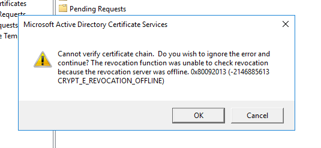
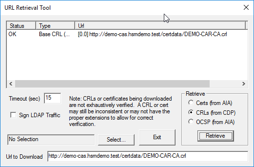

# Certificate Revocation List (CRL) Chain

Be default, a certificate is **invalid** if the CRL (Delta-CRL) verification fails. This can happen due to:
- CRL not retrievable (e.g. wrong configuration or CRL server not reachable)
- CRL or Delta-CRL not renewed/updated within the defined time frame



In case you get the above message, check if you can retrieve the certificate revocation lists from the known URL or the certificate itself with:
```sh
certutil -URL C:\issdemokey.cer #(filename of the IIS certificate) 
```
or
```sh
certutil -URL http://crlserver.hsmdemo.test/folder/caname.crl
```


