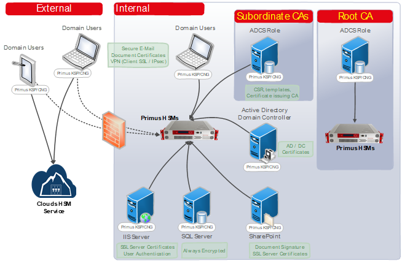

import Tabs from '@theme/Tabs';
import TabItem from '@theme/TabItem';

# Microsoft Active Directory Certificate Services (AD CS)
### HSM Integration Guide

This guide describes how to secure private keys used by the Microsoft PKI Active Directory Certificate Services (AD CS) by using the Securosys Primus HSM or CloudHSM service.  

Microsoft Active Directory Certificate Services (AD CS) provide customizable services for creating and managing public key infrastructure (PKI) certificates, used in software security systems. Applications supported by AD CS include secure e-mail (S/MIME), secure wireless networks, VPN connections (IPsec), Encrypting File System (EFS), smart card logon, Secure Socket Layer/Transport Layer Security (SSL/TLS), and digital signatures.  
AD CS is a certificate authority (CA) that issues, manages, and validates the digital identities used to verify an individual or a system. The trust of the entire system and validity of each issued certificate depends upon the protection of the CA key issuing the identities. In case the issuance process is using private keys stored in a local file, these keys are vulnerable to duplication and modification. Therefore, Microsoft best practices recommend storing private keys on an HSM.
The MS Cryptography Next Generation (CNG) API supports Cryptographic Algorithm Providers and Key Storage Providers (KSP) in software and hardware. This allows anybody to create and handle private keys and related cryptographic functions on Hardware Security Modules, thereby fulfilling compliance requirements (e.g. GDPR).

The Primus Hardware Security Modules (HSMs) from Securosys improve drastically the security of Microsoft Active Directory services, and all applications based on Microsoft CNG API. 
The Primus HSMs are built to securely generate and store true random cryptographic keys, providing a central, certified secure storage. They also control and regulate access to the keys and the related cryptographic functionality. The Primus HSM combined with AD CS meets or exceeds the best practice security requirements and is one step ahead of fulfilling your compliance demands by providing:
- Hardware-based secure generation of true random cryptographic keys
- Central and highly secure storage of cryptographic keys
- Load balancing and failover by clustering the HSMs
- Controlled and regulated access to the keys
- Hardware acceleration of cryptographic operations such as encryption, authentication, and digital signatures, relieving the host server of processor intensive computations
- Scalable performance at manageable cost
All certificate issuance and validation processes occur within the protected confines of the HSM. Private keys are never accessible outside the HSM.
The Primus HSM can easily be integrated in a Microsoft Windows system by installing the Primus CNG Provider. This enables all Windows servers and clients to generate and store their private keys and certificates securely in the HSMs, and perform all related cryptographic functionality, like signing or certificate validation, hardware accelerated on the Primus HSM.

## Target Audience

This document is intended for Securosys Primus HSM or CloudHSM administrators and IT professionals. Installation of the Securosys Primus CNG/KSP Provider requires that you are already familiar with Microsoft Windows Server administration. 

For on-premises HSM deployed operation administrative skills are required for Securosys Primus HSMs. For instructions on installing and configuring the Primus CNG/KSP Provider, please consult the [Primus CNG/KSP Provider](/mscng/overview).

## Support Contact

If you encounter a problem while installing/configuring the provider or
integrating the HSM with the plugins, make sure that you have read the
referenced documentation. If you cannot resolve the issue, please
contact Securosys Customer Support. For specific requests regarding
Securosys Docker Image Signing and Encryption plugins, please reach out to us on [Securosys
Support Portal](https://support.securosys.com).

## Get started with Microsoft AD CS & HSMs

For a smooth start with the Primus CNG/KSP Provider:
- Consult the [Quick Start Guide](/ms-pki-adcs/quickstart.md) for a comprehensive task listing.
- For detailed instructions, read and follow the [Installation guide](/ms-pki-adcs/category/installation).
- Initiate the usage and hardening by reading and following the [Tutorial](/ms-pki-adcs/category/tutorials) section.