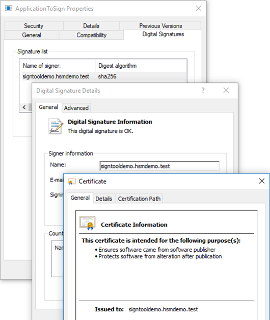

import Tabs from '@theme/Tabs';
import TabItem from '@theme/TabItem';

# How to Sign Files with Microsoft SignTool?

The `signtool.exe` is used to sign or timestamp codes, certificates, etc. Depending on the OS version the tool may be located in different folders (e.g. Windows 10/x64: `C:\Program Files (x86)\Windows Kits\10\bin\x64\signtool.exe`).

For more information on the tool location, please refer to the [Microsoft documentation](https://learn.microsoft.com/en-us/windows/win32/seccrypto/signtool).


Example – with certificate reference by subject name:
```bash
signtool.exe sign /v /fd sha256 /sm /n "signtooldemo.hsmdemo.test" Application-ToSign.exe

The following certificate was selected:
    Issued to: signtooldemo.hsmdemo.test
    Issued by: signtooldemo.hsmdemo.test
    Expires:   Thu Feb 14 16:31:30 2019
    SHA1 hash: CB1A55F6AB8CCACEDAB3FCD9DE48BD69BE16B88D

Done Adding Additional Store
Successfully signed: ApplicationToSign.exe

Number of files successfully Signed: 1
Number of warnings: 0
Number of errors: 0
```

Example – with certificate reference by SHA1 hash:
```bash
signtool.exe sign /v /fd sha256 /sm /sha1 "cb1a55f6ab8ccacedab3fcd9de48bd69be16b88d" ApplicationToSign.exe
```
:::warning
Take care, that the certificate references are unique, otherwise, the signing process could fail (subject name, or sha1 value of the certificate). Referencing the certificate by CSP (/csp) and key container (/kc) seems to fail (reason yet not known).
:::

For signing and verification options, please refer to `signtool.exe` help and the [Microsoft documentation](https://learn.microsoft.com/en-us/windows/win32/seccrypto/signtool).


## Verifying Signed File

The signature can be verified either on the command line or using the file properties dialog (Digital Signatures). The signature can be verified either via Graphical User Interface (GUI) or via Command line interface (CLI).

Here is an example for each case:

<Tabs groupId="device-setup">
  <TabItem value="ui" label="Graphical User Interface (GUI)" default>
Below is an example of how to verify using the file properties:
- Navigate to the **`properties`** of the signed file you would like to verify,
- Open the **`Digital Signatures`** tab,
- Double click the signature in the **`Signature list`**,
- On the **`General`** tab click on **`View Certificate`**,
- The certificate information is shown.


 </TabItem>
  <TabItem value="cli" label="Command Line Interface (CLI)" default>

Verification can also be done via CLI using `signtool.exe`. Example of how to verify the signature via CLI:
```bash
signtool.exe verify /pa /v ApplicationToSign.exe
Verifying: ApplicationToSign.exe
Signature Index: 0 (Primary Signature)
Hash of file (sha256): 02B5134F2AB32A9638284AC016BDFA528F963016D17885F9C009167108A1BC85

Signing Certificate Chain:
    Issued to: signtooldemo.hsmdemo.test
    Issued by: signtooldemo.hsmdemo.test
    Expires:   Thu Feb 14 16:31:30 2019
    SHA1 hash: CB1A55F6AB8CCACEDAB3FCD9DE48BD69BE16B88D

File is not timestamped.

Successfully verified: ApplicationToSign.exe

Number of files successfully Verified: 1
Number of warnings: 0
Number of errors: 0
```
  </TabItem>
</Tabs>

