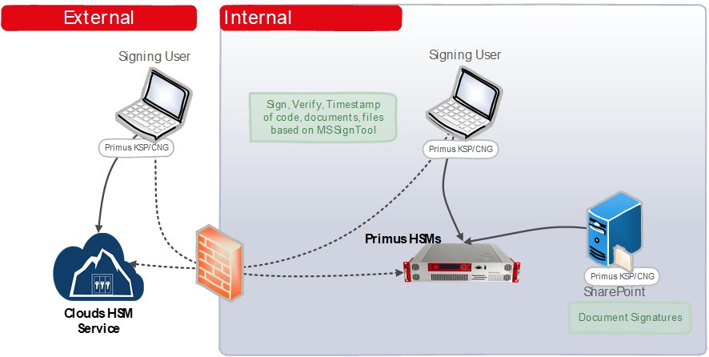

import Tabs from '@theme/Tabs';
import TabItem from '@theme/TabItem';

# Microsoft SignTool
### HSM Integration Guide

This document describes how to secure private keys used by the **Microsoft SignTool** by using the Securosys Primus HSM or Securosys CloudHSM service.

The [Microsoft SignTool](https://learn.microsoft.com/en-us/windows/win32/seccrypto/signtool) is a command-line CryptoAPI tool, used to digitally-sign, verify or timestamp files, codes, libraries and documents. It is part of the Microsoft Windows Software Development Kit (SDK) or of the Microsoft Visual Studio developer environment.

The Primus HSMs are built to securely generate and store true random cryptographic keys, providing a central, certified secure storage. They also control and regulate access to the keys and the related cryptographic functionality. The Primus HSM combined with SignTool meets or exceeds the best practice security requirements and is one step ahead of fulfilling your compliance demands by providing:
- Hardware-based secure generation of true random cryptographic keys,
- Central and highly secure storage of cryptographic keys,
- Load balancing and fail-over by clustering the HSMs,
- Controlled and regulated access to the keys,
- Hardware acceleration of cryptographic operations such as encryption, authentication, and digital signatures, relieving the host server of processor intensive computations,
- Scalable performance at manageable cost.

All certificate issuance and validation processes occur within the protected confines of the HSM. Private keys are never accessible outside the HSM.
The Primus HSM can easily be integrated in a Microsoft Windows system by installing the [Primus CNG Provider](../../mscng/overview). This enables all Windows servers and clients to generate and store their private keys and certificates securely in the HSMs, and perform all related cryptographic functionality, like signing or certificate validation, hardware accelerated on the Primus HSM.

## Target Audience

This document is intended for Securosys Primus HSM or Microsoft administrators and IT professionals in charge of the Microsoft Windows SDK signing tool administration. This guide requires that you are already familiar with Microsoft Windows Server administration.

For on-premises HSM deployed operation administrative skills are required for Securosys Primus HSMs.

## Support Contact

If you encounter a problem while installing/configuring the provider or
integrating the HSM with Microsoft SignTool, make sure that you have read the
referenced documentation. If you cannot resolve the issue, please
contact Securosys Customer Support. For specific requests regarding
Securosys integration, the Securosys
Support Portal is reachable under https://support.securosys.com.

## What's Next

For a smooth start integrating your Primus HSM with Microsoft SignTool using the Primus CNG/KSP Provider:
- Consult the [Quick Start Guide](./Quickstart.md) for a comprehensive task listing.
- For detailed instructions, read and follow the [Installation guide](/ms-signtool/Installation/Installation.md).
- Sign your files with Microsoft SignTool using CloudHSM or Primus HSM following the [Tutorial](/ms-signtool/Tutorials/Signing-files.md) section.