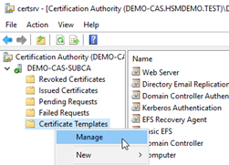
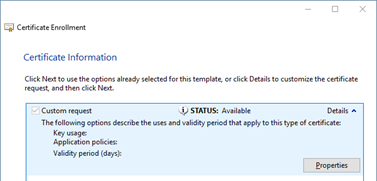

import Tabs from '@theme/Tabs';
import TabItem from '@theme/TabItem';

# Get your Digital Certificate
### HSM Integration Guide

Before configuring Microsoft S/MIME to work with Primus HSMs, it is required to obtain **digital certificates** containing the encryption and signing keys.

There are two ways to achieve that, either via:
- **MS PKI** (ADCS certificate enrollment)
- **Public CA**

In most cases, the MS PKI cannot issue public valid certificates (except if the MS CA is cross-signed), therefore such generated certificates are only valid within the company's internal domain. 

Additional MS PKI extensions (e.g. true-Xtender, Essendi XC) allow to sign and auto-enroll certificates via a public CA (e.g. SwissSign).


<Tabs groupId="Certificate-creation">
<TabItem value="Certificate 1" label="Via MS PKI" default>

##	Prepare the ADCS Templates
The procedures described below, assumes that the MS PKI environment is already setup and operational. For more information and an example setup of an MS AD CS see [Microsoft Active Directory Certificate Services (AD CS)](/ms-pki-adcs/overview).

To enroll certificates via MS AD CS, we have to generate and distribute the necessary certificate templates. We generate two new templates based on “Exchange Signature Only” for authentication and “Exchange User” for encryption (the “User” template is made for further things). For archive retrieval purposes we just need to archive the encryption certificates.

### Signing Template

- On the subordinate CA server, open the CA console (certsrv), right-click Certificate Templates and select Manage. 



To generate the new **authentication template**, select the **Exchange Signature Only** template, right-click and select **Duplicate Template**.
- Define the **Compatibility settings** and **General parameters**:
    - **Compatibility settings**: CNG requires compatibility settings for at least Windows Server 2008R2 or higher


    - Name the template, define validity period and publish certificate in AD


- Define the **Request Handling** and **Cryptography parameters**, defining that only the Primus KSP is used:


- Define how the **Subject Name** is derived and the Permissions:
    - Build certificate from *Active Directory information* (E-mail should be defined in AD)


- Add the following permissions (and user groups):
        - **Authenticated Users**:  Read, Enroll, Autoenroll
        - **Domain Users**:  Read, Enroll, Autoenroll
        - If there are any users in the domain you do not want to have autoenrolled, you can create a group in AD, add the user(s) to it, then add that group in the **Security** tab above, checking the **Deny** box for **Autoenroll** for that group.


- Define the **Issuance Requirements**, e.g. if the CA certificate manager should approve:
 


### Encryption Template

- On the subordinate CA server, open the CA console (certsrv), right-click Certificate Templates and select Manage.

For the new encryption template, select the **Exchange User** template, right-click and select 
**Duplicate Template**.
- Add all the settings as shown for the [Signing Template](#signing-template), and amend the following differences:
    - **Purpose**: Encryption, Include Symmetric Algorithms allowed by the subject


    - **Key Usage**: Allow key exchange only with key encryption (key encipherment), allow encryption of user data


### Publish Added Templates
- Publish the added templates for issuing certificates. This is done from **Certificate Templates** folder of CA console. 
Right-click **Certificate Templates**, click **Certificate Template to Issue** and select the templates to publish, then click **OK**. The steps are depicted below: 


 
## Request the Certificates
If auto-enrollment is not configured by AD Group Policy, the user can request a new certificate based on the defined templates, using the certificate manager. 
- Start the certificate manager, running `certmgr.msc`
- Select **Personal**,**All Tasks** and **Request New Certificate** to start the enrollment process:


- To use the **Active Directory pre-defined templates**, select **Active Directory Enrollment Policy** and click **Next**


- Select the two defined **SMIME templates** and click **Enroll**


- Wait for successful enrollment, then click **Finish**
- The two generated certificates should now be visible within the certificate manager and can be used by the Outlook e-mail application, see [Configure the Outlook Client](/ms-smime/Installation/using-certificates) for a walkthrough.


</TabItem>
<TabItem value="cli" label="Via Public CA" default>

##	Get your Digital Certificates from a Public CA
To have public valid certificates they are usually signed by a public Certification Authority. There are two ways to apply for such a certificate:
- Generate a Certificate Request at the CAs Registration Authority (RA), receive and import an encrypted PKCS#12 container comprising the private key, public certificate and certificate chain.
- Generate a private/public key pair, send the Certificate Signing Request (CSR) to the Registration Authority (RA), receive and import the signed public certificate.
In both cases the private key should be stored on the **Hardware Security Module** and not within the MS Software KSP. The import functions of the certificate manager (`certmgr.msc`) and Outlook do not support specifying the KSP during PKCS#12 import. But the import can be performed properly on the command-line using `certutil.exe`.

##	Import PKCS#12 Certificate from CA (containing private key)

Having a PKCS#12 container (p12/pfx) containing the private key should be imported on the command-line using `certutil.exe` (as certificate manager import does not yet support KSP selection):
```
certutil -f -user -p <password> -csp "Securosys Primus HSM Key Storage Provider" -importPFX <certFileToImport.p12>
```

After successful import, the certificate is visible within the certificate manager and can be configured for use by Microsoft Outlook. For more information see [Configure the Outlook Client](/ms-smime/Installation/using-certificates).

## Generate Key Pair Locally and Import Signed Public Certificate from CA
The CSR can be generated in two ways:

1. With the command-line tool `certreq.exe` using an input text file, see our [IIS Generating and Installing Certificate](/ms-iis/Installation/Installation-Overview) for more information.
2. Using the Certificate Manager (`certmgr.msc`), setting the right attributes, e.g. as shown below for the SMIME signing certificate:
- Start the certificate manager by running `certmgr.msc`
    - Select **Personal**, **All Tasks**, **Advanced Operations** and **Create Custom Request…** to create a private/public key pair on the HSM and generate the CSR to be signed by the CA.


- Select **Proceed without enrollment policy** and click **Next**.


- Click **Next** 


- Click on Customer Request **Details**, and then click on **Properties** 


- On the **General** tab define the certificates **Friendly name** and add a **Description**


- On tab **Subject** define the necessary parameters:
- **Subject**, containing values Common name, Email, Organization, Location, Country
- **Alternative name**, containing the value Email


- On the tab **Extensions** define the required key extensions, e.g. for email signing 
- **Key usage**, Digital signature, critical
- **Extended Key Usage**, Secure Email, critical


- On the tab **Private** Key define its properties 
- **Cryptographic Service Provider (CSP)**, choose one of the Securosys Primus HSM KSPs


- **Key Options (key size)**
- Select **Hash Algorithm**


- Click **OK** and **Next** 
- Define where to store the Certificate Signing Request (CSR) and click **Finish**


- Let the request file (CSR) validate and sign by your public CA (e.g. SwissSign).
## Install the Certificate

- Install the signed certificate, received from your public CA, via Windows Explorer (Install Certificate) or via command-line:
```
certreq.exe –accept -machine <certificateFilename.cer>
```
- After successful install, the certificate is visible within certificate manager and can be used within Microsoft Outlook. For more information see [Configure the Outlook Client](/ms-smime/Installation/using-certificates).
 </TabItem>
</Tabs>

:::tip need help ?
Contact our support team for further assistance:
+ [Create a ticket (login required)](https://support.securosys.com)
+ [Send an email](mailto:support@securosys.com)
:::