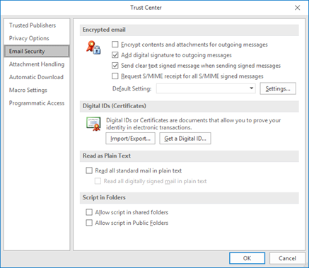
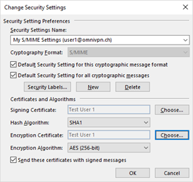
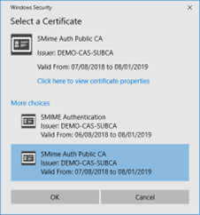
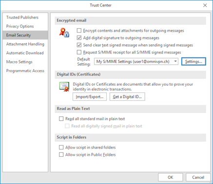
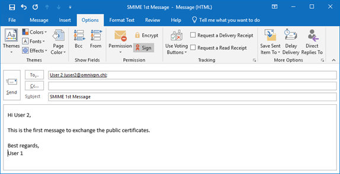

# Configure the Outlook Client
### HSM Integration Guide

Open the Outlook Client and navigate to **File**, **Options**, **Trust Center**, **Trust Center Settings…**, **Email Security**, and click on **Settings**.

- If there is only one matching certificate for e-mail signature and e-mail encryption, they are referenced automatically, otherwise choose the appropriate certificates, in our example the certificates shown in the image are used.

- Define your Encrypted email message defaults (signed, encrypted). The option **Send clear text signed messages…** should be checked to allow non-S/MIME capable mail clients to read signed messages in clear text. Then click **OK** and **OK** to close the Trust Center configuration:

##	Exchange of Public Keys
Using MS Enterprise CA with Exchange Server, newly issued certificates are automatically published in the Global Address List (GAL) for Microsoft Outlook.

Using a different or public CA for your certificates, you can easily publish your public certificates to the Exchange Global Address List (GAL) by clicking **Publish to GAL** on your **Trust Center Settings** under the tab **Email Security**. Please note, that this button may not be shown if you are using multiple Exchange Accounts (or Outlook for MAC).

For other scenarios, the easiest way for two users to exchange the public keys is to simply send signed messages to each other (whereby both public certificates are attached by default):

 
The user receiving the S/MIME-signed message will need to view and right-click on the sender's name (after **From:**) and select **Add to Outlook** contacts from the context menu, which either adds a new contact entry or updates an existing one. The certificates, required to send encrypted messages, are then associated with that particular contact entry.

:::note
Within a common Active Directory environment (users in the same forest or company), public user certificate distribution is done automatically via attributes in the user's Active Directory object.
:::

Another way of exchanging certificates is for each user to send their S/MIME certificate(s) as an attachment. 

## Limitations of Using S/MIME for Digital Signature
Using S/MIME protection has also its drawbacks. Some e-mail and webmail clients do not have built-in support for sending or receiving S/MIME messages. Additionally, Outlook clients with a Free license will not be notified that your emails are digitally signed even when they are.

##	Limitations of S/MIME Encryption
The content of encrypted messages is not only shielded from prying eyes, but also from software, as well. Therefore, malware scanners will not be able to detect malware and searching or indexing functionality of the OS may not work on these messages.
On the other hand, these “limitations” of S/MIME security may actually be seen as desirable depending on why you use secure mail.

An additional limitation of S/MIME Encryption is that your email threads cannot be grouped in to a conversation, as each thread has to be encrypted for every reply, which can grow exponentially and the Outlook client will begin to have performance issues. As such, Microsoft have disabled conversation when S/MIME encryption is in place.

:::tip need help ?
Contact our support team for further assistance:
+ [Create a ticket (login required)](https://support.securosys.com)
+ [Send an email](mailto:support@securosys.com)
:::