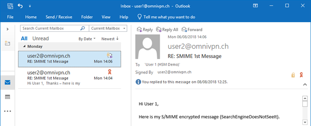
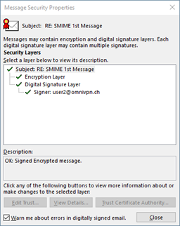
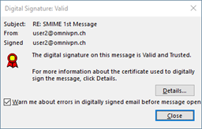

# S/MIME Email Protection

S/MIME protection is marked with icons within the Outlook client, indicating if the message is signed and/or encrypted.

The status of the certificates can be verified by clicking on the ribbon icon:

:::warning
Please take into consideration, that the content of S/MIME encrypted messages **cannot** be indexed, searched nor accessed by malware scanners or any other applications!
:::
