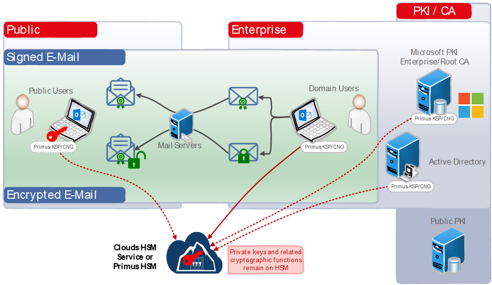

import Tabs from '@theme/Tabs';
import TabItem from '@theme/TabItem';

# Microsoft S/MIME
### HSM Integration guide

This guide describes how to secure the private keys, used by the **Microsoft Outlook** application for signing and encrypting e-mail messages based on the **S/MIME** standard, by using the **Securosys Primus HSM** or **CloudHSM** service. Although partial communication paths of e-mail systems are nowadays protected using TLS protocol, e-mail does inherently not provide end-to-end message security.

**S/MIME** (Secure/Multipurpose Internet Mail Extensions) is a widely accepted extension for sending digital-ly signed and encrypted messages to provide end-to-end security (authentication, nonrepudiation, data integrity and confidentiality). By default, the used private keys are stored within the certificate store on the local disc, making these keys vulnerable to duplication and modification.

The **MS Cryptography Next Generation** (CNG) API supports Cryptographic Algorithm Providers and Key Storage Providers (KSP) in software and hardware. This allows to create and handle the S/MIME private keys and related cryptographic functions on Hardware Security Modules, thereby fulfilling extended compliance requirements.

The **Primus Hardware Security Modules** (HSMs) from **Securosys** improve drastically the security of the Microsoft Certificate store, and all applications (e.g. Outlook) based on Microsoft CNG API. 

The Primus HSMs are built to securely generate and store true random cryptographic keys, providing a central, certified secure storage. They also control and regulate access to the keys and the related crypto-graphic functionality. The Primus HSM combined with AD CS meets or exceeds the best practice security requirements and is one step ahead of fulfilling your compliance demands by providing:
- Hardware-based secure generation of true random cryptographic keys
- Central and highly secure storage of cryptographic keys
- Load balancing and fail-over by clustering the HSMs
- Controlled and regulated access to the keys
- Hardware acceleration of cryptographic operations such as encryption, authentication, and digital signatures, relieving the host server of processor intensive computations
- Scalable performance at manageable cost. 

All certificate issuance and validation processes occur within the protected confines of the HSM. Private keys are never accessible outside the HSM.

The Primus HSM can easily be integrated in a Microsoft Windows system by installing the Primus CNG Provider. This enables all Windows servers and clients to generate and store their private keys and certificates securely in the HSMs, and perform all related cryptographic functionality, like signing or certificate validation, hardware accelerated on the Primus HSM.

## Target Audience

This document is intended for Securosys Primus HSM or Microsoft administrators and IT professionals in charge of the Microsoft Windows S/MIME administration. This guide requires that you are already familiar with Microsoft Windows Server administration.

For on-premises HSM deployed operation administrative skills are required for Securosys Primus HSMs.

## Support Contact

If you encounter a problem while installing/configuring the provider or
integrating the HSM with Microsoft S/MIME, make sure that you have read the
referenced documentation. If you cannot resolve the issue, please
contact Securosys Customer Support. For specific requests regarding
Securosys integration, the Securosys
Support Portal is reachable under https://support.securosys.com.

## What's Next

For a smooth start integrating your Primus HSM with Microsoft S/MIME using the Primus CNG/KSP Provider:
- Consult the [Quickstart](./Quickstart.md) for a comprehensive task listing.
- For detailed instructions, read and follow the [Installation](/ms-smime/Installation/prerequisites) guide.
- See Troubleshooting and other examples in the [Tutorial](/ms-smime/Tutorials/emails) section.