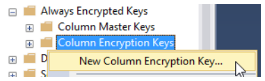

import Tabs from '@theme/Tabs';
import TabItem from '@theme/TabItem';

# Creating A Column Encryption Key (CEK)

There are two approaches to generate the Column Encryption Key (CEK):

1. Defining them explicitly within the `Security` folder where where the the CMK was defined, having the advantage to name them manually <br />
2.	Generating them automatically when protecting columns using the Always Encrypted wizard (manual naming not possible).

The following described procedure is based on variant **1**. 

<Tabs groupId="Column Encryption Key">
  <TabItem value="gui" label="Graphical User Interface Process" default>

Select `<Your_database>` `Security` `Always Encrypted Keys` `Column Encryption Keys`. Right click on `Column Encryption Keys` and select `New Column Encryption Key…`.




- Enter a meaningful name for the CEK in the `Name` field.
- Select your previously defined Column Master Key to protect the CEK.
- Click `OK` to finish the process.

Now you have a Column Encryption Key called `HSMDemoCCardCEK`, protected by the Column Master Key `HSMDemoCCardCMK`.
    </TabItem>
  <TabItem value="cli" label="Command Line Interface Process" default>

Once the Column Master Key (CMK) has been successfully generated create a Column Encryption Key (CEK) object in the database:
```
New-SqlColumnEncryptionKey -Name "AlwaysEncryptedCEK" -ColumnMasterKeyName "AlwaysEncryptedCMK" –Path SQLSERVER:\SQL\server_name\DEFAULT\Databases\your_database
```

The resulting CEK `AlwaysEncryptedCEK` is a 256-bit symmetric key protected by the CMK `AlwaysEncryptedCEK`.
    </TabItem>
</Tabs>
