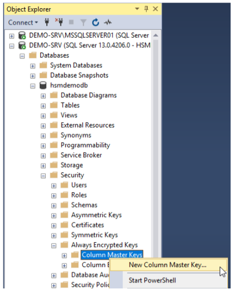
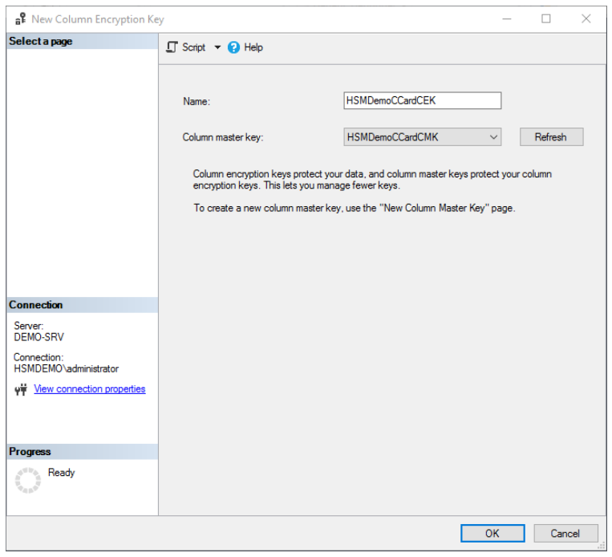

import Tabs from '@theme/Tabs';
import TabItem from '@theme/TabItem';

# Creating A Column Master Key (CMK)

1) Start the Microsoft SQL Server Management Studio (SSMS) and connect to the desired database to protect.
1) Create a Column Master Key (CMK) using the Primus HSM or CloudHSM. This key will encrypt all subsequent Column Encryption Keys (CEK). 

The examples below are shown with an on-premises Primus HSM.

<Tabs groupId="Column Encryption Key">
  <TabItem value="gui" label="Graphical User Interface Process" default>

Within the SSMS, use the Object Explorer and select the `Security` folder under the desired database (in this example `hsmdemodb`). Click to expand `Always Encrypted Keys`. Right click on `Column Master Keys` and select `New Column Master Key…`.



The `New Column Master Key` dialogue box will open.



- Enter a meaningful name for the CMK in the `Name` field.
- From the drop-down list select the `Key Storage Provider (CNG)` option and select the `Securosys Primus HSM Key Storage Provider`.
- Click `Generate Key` to generate a new key pair on the HSM.
- Click `OK`  to finish the process. 
On the HSM the key is named by default `Always-Encrypted-Auto1`, using RSA 2048 bit, not exportable, key usage for decrypt and signing.


Now you have a Column Master Key called `HSMDemoCCardCMK`, protected by the Primus HSM or CloudsHSM.

 </TabItem>
<TabItem value="cli" label="Command Line Interface Process" default>


Generate an RSA key pair via the Primus CNG/KSP provider, for use as a Column Master Key.

 The below example generates a 2048-bit RSA key pair named `AlwaysEncryptedCMK`, protected by the Primus HSM.
```
$cngProviderName = "Securosys Primus HSM Key Storage Provider" 
$cngAlgorithmName = "RSA"
$cngKeySize = 2048 # Recommended key size for Always Encrypted CMK
$cngKeyName = "AlwaysEncryptedCMK" #Name identifying your new key in the KSP 
$cngProvider = New-Object System.Security.Cryptography.CngProvider($cngProviderName)
$cngKeyParams = New-Object System.Security.Cryptography.CngKeyCreationParameters 
$cngKeyParams.provider = $cngProvider
$cngKeyParams.KeyCreationOptions = [System.Security.Cryptography.CngKeyCreationOptions]::OverwriteExistingKey
$keySizeProperty = New-Object System.Security.Cryptography.CngProperty("Length", [System.BitConverter]::GetBytes($cngKeySize), [System.Security.Cryptography.CngPropertyOptions]::None);
$cngKeyParams.Parameters.Add($keySizeProperty)
$cngAlgorithm = New-Object System.Security.Cryptography.CngAlgorithm($cngAlgorithmName)
$cngKey = [System.Security.Cryptography.CngKey]::Create($cngAlgorithm, $cngKeyName, $cngKeyParams)
```

Invoke the `New-SqlCngColumnMasterKeySettings` cmdlet to create a `SqlColumnMasterKeySettings` object, describing an asymmetric key stored in a key store supporting the CNG API:
```
## Specify the Column Master Key settings for importing into the database: 
$CmkSettings = New-SqlCngColumnMasterKeySettings -CngProviderName "Securosys Primus HSM Key Storage Provider" -KeyName "AlwaysEncryptedCMK"
```

Then create the Column Master Key object in the database:
```
New-SqlColumnMasterKey "AlwaysEncryptedCMK" -ColumnMasterKeySettings $CmkSettings -Path SQLSERVER:\SQL\server_name\DEFAULT\Databases\your_database
```

E.g. using our example database `hsmdemodb`:
```sh
New-SqlColumnMasterKey "AlwaysEncryptedCMK" -ColumnMasterKeySettings $CmkSettings -Path SQLSERVER:\SQL\DEMO-SRV\DEFAULT\Databases\hsmdemodb
```

    </TabItem>
</Tabs>
