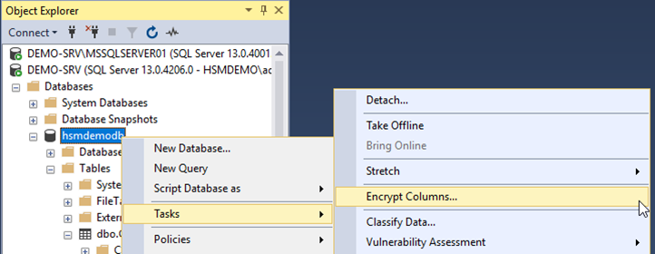
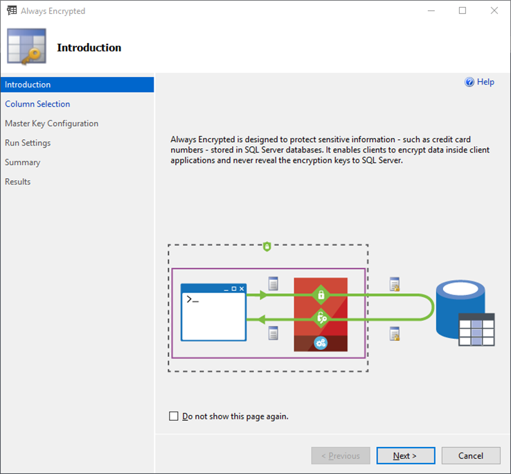
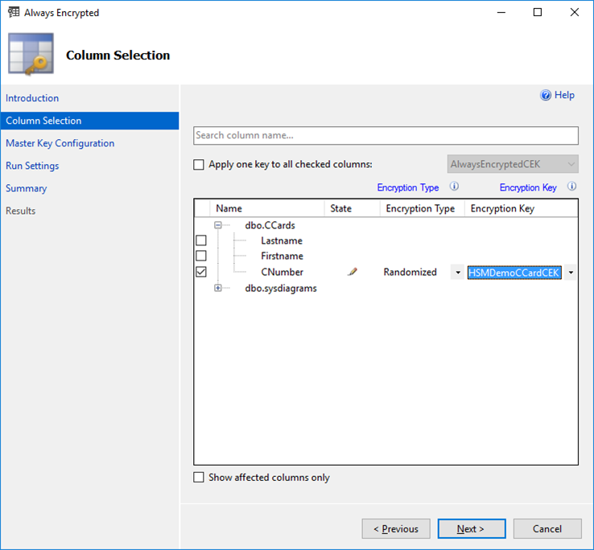
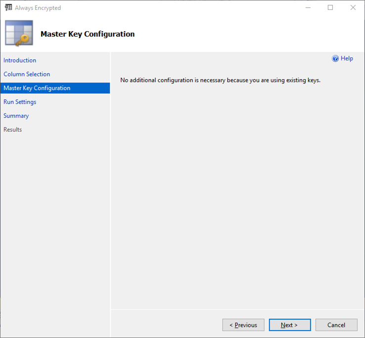
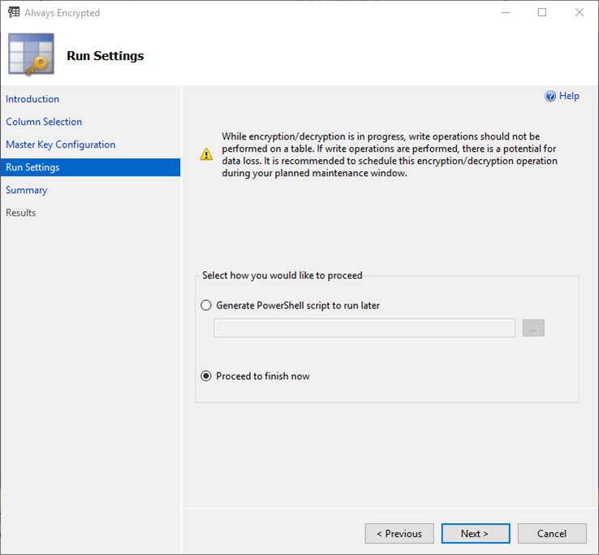
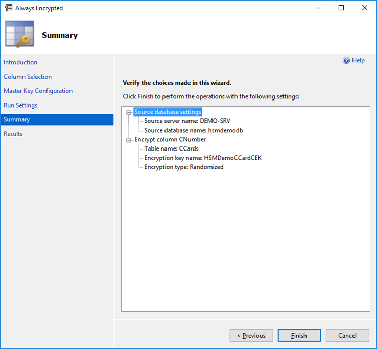
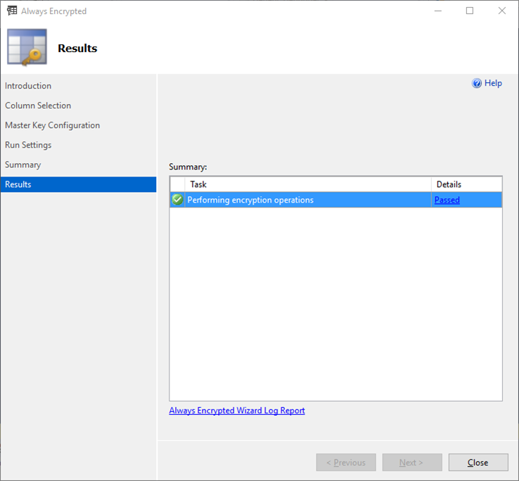
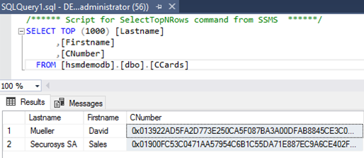
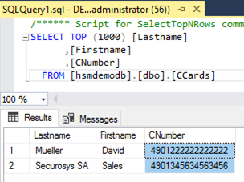

import Tabs from '@theme/Tabs';
import TabItem from '@theme/TabItem';

# Enable Column Encryption on the Database Table

To enable **Always Encrypted**, you can either use the Graphical User Interface (GUI) or the Command Line Interface (CLI) process, depending on your preference:

<Tabs groupId="Column Encryption Key">
  <TabItem value="gui" label="Graphical User Interface (GUI)" default>

1. To enable Always Encrypted (and generate a Column Encryption Key), right-click on the required database (`HSMDemoDB` in this example).
- Select ` Tasks ` -> ` Encrypt Columns…` to open the Always Encrypted wizard.



2. Click `Next >` to skip the Introduction page.



3. The Column Selection screen allows to specify the columns to encrypt, the encryption type and the Column Encryption Key.
- Under `Encryption Type` choose the encryption method from the drop-down box:
    - Deterministic <br/> “Uses a method which always generates the same encrypted value for any given plain text value. Using deterministic encryption allows grouping, filtering by equality, and joining tables based on encrypted values, but can also allow unauthorized users to guess information about encrypted values by examining patterns in the encrypted column. This weakness is increased when there is a small set of possible encrypted values, such as True/False, Yes/No etc. Deterministic encryption must use a column collation with a binary2 sort order for character columns.”
    - Randomized <br/> “Uses a method that encrypts data in a less predictable manner. Randomized encryption is more secure, but prevents equality searches, grouping, indexing, and joining on encrypted columns.”
    - Plaintext <br/> Only available to revert encrypted columns to an unencrypted state.
- Select your previously defined Column Encryption Key. If it was not pre-defined, then you can use an automatically named CEK (e.g. `CEK_Auto1 (New)`), generated in the next step.
- If all necessary columns are defined properly, click `Next >` to continue.



4. On the Master Key Configuration page:
    - Using existing CEK: no additional configuration necessary
    - Generating a new CEK: make sure that you select the proper CMK (e.g. generated using the Primus CNG/KSP Provider)
- Click `Next >` to continue.



5. The process of encrypting database records can take a considerable amount of time, depending on the size and quantity of data. To mitigate the possibility of data corruption occurring as records are encrypted whilst being updated, it is advisable to back up the database and to only perform this activity when the database is offline (schedule maintenance downtime). 
- In our case, we will continue and run the encryption straight away. Select the radio button, `Proceed to finish now` this will begin creating the CEK if necessary and using it to encrypt the specified columns in the database. 
- Click `Next >` to view the Summary page




6. This page allows you to verify your configuration choices.
- Click `Finish` to view the Results page.




7. Click `Close` to exit the Always Encrypted wizard.




8. If you now open the table by right-clicking on the database table and selecting `Select Top 1000 Rows` you will see that the columns selected for encryption now appear as ciphertext. 

Example column with encryption:



Example column without encryption:




 </TabItem>
<TabItem value="cli" label="Command Line Interface (CLI))" default>

Open a `PowerShell` (or `PowerShell ISE`) session with elevated permissions (right-click and select `Run as Administrator`) and run the following to encrypt a given column in the specified database. Adjust the highlighted values to those suitable for your database name and data columns that you want to encrypt. 

Remember, the `EncryptionType` values are one of either: Deterministic, Randomized, Plaintext.
```
# Import Module SqlServer 
Import-Module SqlServer 

# Set up connection and database SMO objects 
$sqlConnectionString = "Data Source=server_name;Initial Catalog=your_database;Integrated Security=True;MultipleActiveResultSets=False;Connect Timeout=30;Encrypt=False;TrustServerCertificate=False;Packet Size=4096;Application Name=`"Microsoft SQL Server Management Studio`"" 
$smoDatabase = Get-SqlDatabase -ConnectionString $sqlConnectionString 

# Change encryption schema 
$encryptionChanges = @() 

# Add changes for table [dbo].[DemoTable] 
$encryptionChanges += New-SqlColumnEncryptionSettings -ColumnName dbo.DemoTable.ColToEncrypt 
-EncryptionType Randomized -EncryptionKey "AlwaysEncryptedCEK"
Set-SqlColumnEncryption -ColumnEncryptionSettings $encryptionChanges -InputObject $smoDatabase
E.g. using our example database “hsmdemodb”:
# Import Module SqlServer
Import-Module SqlServer 

# Set up connection and database SMO objects 
$sqlConnectionString = "Data Source=DEMO-SRV;Initial Catalog=hsmdemodb;Integrated Security=True;MultipleActiveResultSets=False;Connect Timeout=30;Encrypt=False;TrustServerCertificate=False;Packet Size=4096;Application Name=`"Microsoft SQL Server Management Studio`"" 
$smoDatabase = Get-SqlDatabase -ConnectionString $sqlConnectionString 

# Change encryption schema 
$encryptionChanges = @() 

# Add changes for table [dbo].[hsmdemodb]
$encryptionChanges += New-SqlColumnEncryptionSettings -ColumnName dbo.CCards.CNumber -EncryptionType Randomized -EncryptionKey "AlwaysEncryptedCEK" 
Set-SqlColumnEncryption -ColumnEncryptionSettings $encryptionChanges -InputObject $smoDatabase
```

Example with our database `hsmdemodb`:
```
# Import Module SqlServer
Import-Module SqlServer 

# Set up connection and database SMO objects 
$sqlConnectionString = "Data Source=DEMO-SRV;Initial Catalog=hsmdemodb;Integrated Security=True;MultipleActiveResultSets=False;Connect Timeout=30;Encrypt=False;TrustServerCertificate=False;Packet Size=4096;Application Name=`"Microsoft SQL Server Management Studio`"" 
$smoDatabase = Get-SqlDatabase -ConnectionString $sqlConnectionString 

# Change encryption schema 
$encryptionChanges = @() 

# Add changes for table [dbo].[hsmdemodb]
$encryptionChanges += New-SqlColumnEncryptionSettings -ColumnName dbo.CCards.CNumber -EncryptionType Randomized -EncryptionKey "AlwaysEncryptedCEK" 
Set-SqlColumnEncryption -ColumnEncryptionSettings $encryptionChanges -InputObject $smoDatabase
```


    </TabItem>
</Tabs>
